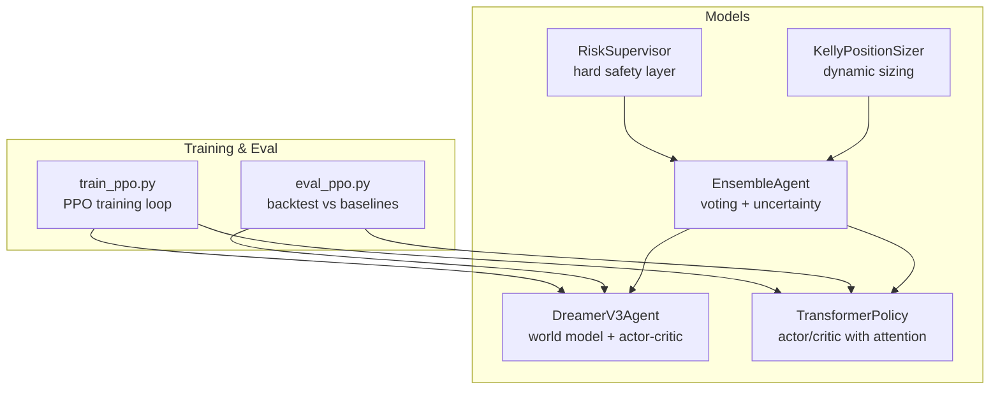
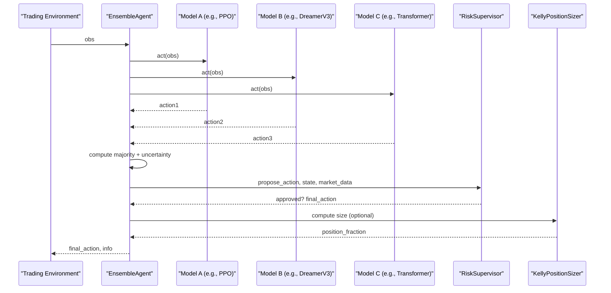
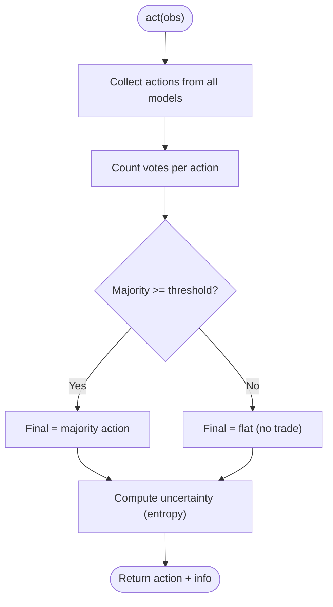
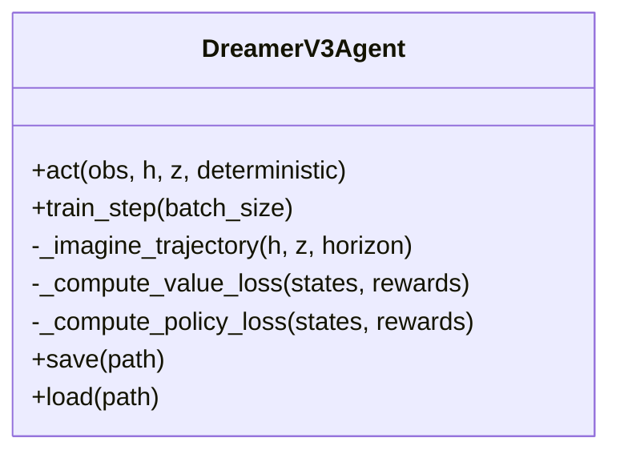
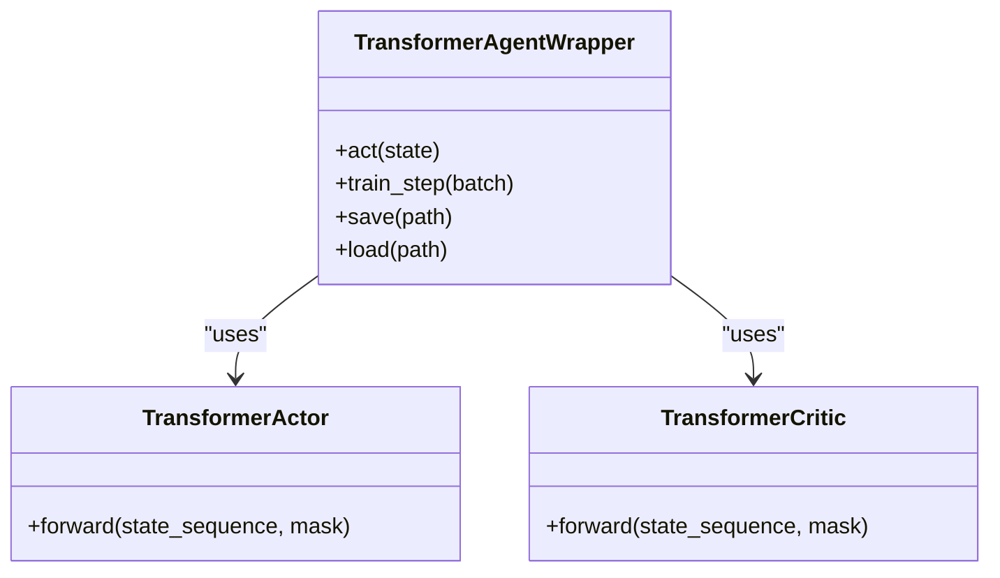
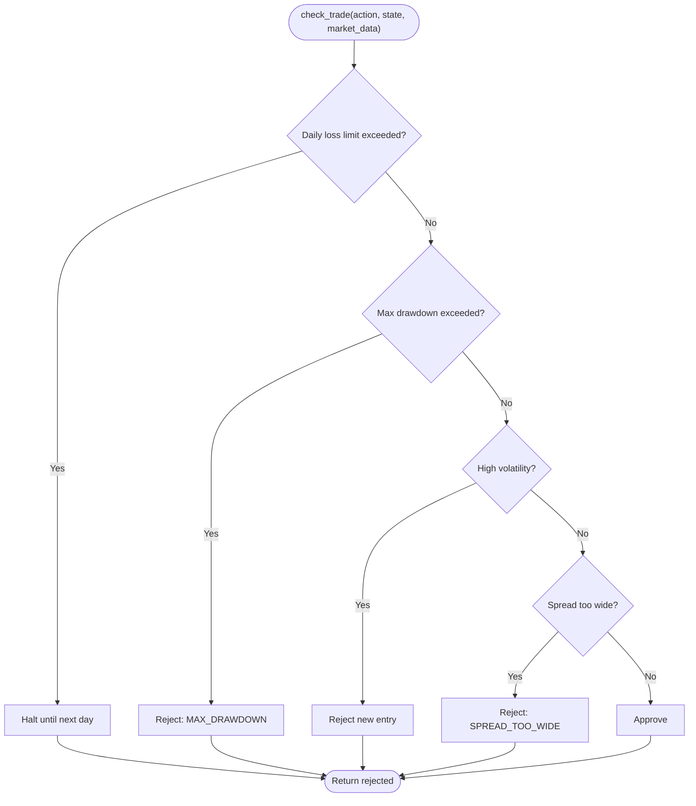
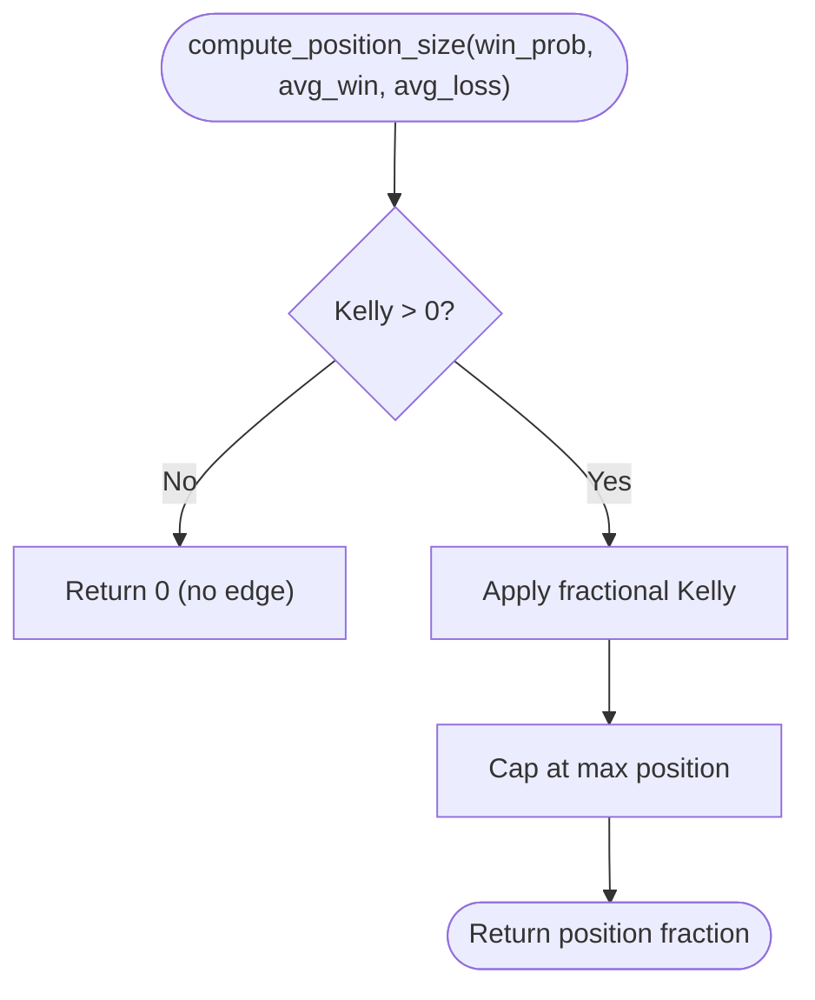
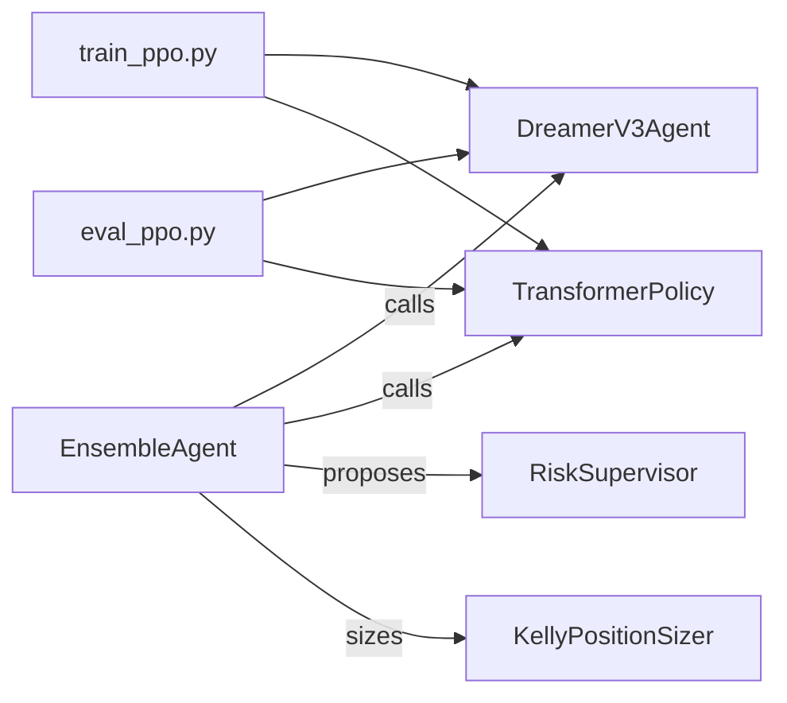

# Ensemble Methods and Model Combination

<cite>
**Referenced Files in This Document**
- [ensemble.py](file://models/ensemble.py)
- [dreamer_agent.py](file://models/dreamer_agent.py)
- [transformer_policy.py](file://models/transformer_policy.py)
- [risk_supervisor.py](file://models/risk_supervisor.py)
- [position_sizing.py](file://models/position_sizing.py)
- [train_ppo.py](file://train/train_ppo.py)
- [eval_ppo.py](file://eval/eval_ppo.py)
</cite>

## Table of Contents
1. [Introduction](#introduction)
2. [Project Structure](#project-structure)
3. [Core Components](#core-components)
4. [Architecture Overview](#architecture-overview)
5. [Detailed Component Analysis](#detailed-component-analysis)
6. [Dependency Analysis](#dependency-analysis)
7. [Performance Considerations](#performance-considerations)
8. [Troubleshooting Guide](#troubleshooting-guide)
9. [Conclusion](#conclusion)
10. [Appendices](#appendices)

## Introduction
This document explains how the system combines multiple trading models to improve accuracy, reduce variance, and adapt to changing market regimes. It covers:
- Ensemble strategies: majority voting with consensus thresholds, uncertainty estimation from disagreement, and a foundation for dynamic weight adaptation based on recent performance.
- Diversity through heterogeneous models: PPO (policy gradient), DreamerV3 (model-based RL with world model), and Transformer policies (attention over historical sequences).
- Online learning mechanisms: tracking recent performance to adjust influence or participation of models, and using risk controls to protect capital during regime shifts.
- Diversity metrics: entropy-based disagreement as a proxy for diversity and uncertainty.
- Practical outcomes: how ensembles can reduce drawdowns and improve risk-adjusted returns by avoiding trades when models disagree or when risk limits are breached.

## Project Structure
The ensemble-related logic is primarily implemented under models/, with training and evaluation scripts that demonstrate usage of individual models and serve as integration points for combining them.

**Diagram sources**
- [ensemble.py:27-130](file://models/ensemble.py#L27-L130)
- [dreamer_agent.py:84-188](file://models/dreamer_agent.py#L84-L188)
- [transformer_policy.py:67-153](file://models/transformer_policy.py#L67-L153)
- [risk_supervisor.py:18-174](file://models/risk_supervisor.py#L18-L174)
- [position_sizing.py:29-111](file://models/position_sizing.py#L29-L111)
- [train_ppo.py:25-67](file://train/train_ppo.py#L25-L67)
- [eval_ppo.py:16-81](file://eval/eval_ppo.py#L16-L81)

**Section sources**
- [ensemble.py:27-130](file://models/ensemble.py#L27-L130)
- [dreamer_agent.py:84-188](file://models/dreamer_agent.py#L84-L188)
- [transformer_policy.py:67-153](file://models/transformer_policy.py#L67-L153)
- [risk_supervisor.py:18-174](file://models/risk_supervisor.py#L18-L174)
- [position_sizing.py:29-111](file://models/position_sizing.py#L29-L111)
- [train_ppo.py:25-67](file://train/train_ppo.py#L25-L67)
- [eval_ppo.py:16-81](file://eval/eval_ppo.py#L16-L81)

## Core Components
- EnsembleAgent: Manages an ensemble of agents, collects actions, computes majority vote, enforces consensus threshold, and estimates uncertainty via disagreement entropy.
- DreamerV3Agent: Learns a world model and uses imagined trajectories to train actor-critic; provides act() compatible with ensemble interfaces.
- TransformerPolicy: Provides attention-based actor/critic that captures long-range dependencies in price history; also exposes act() for ensemble use.
- RiskSupervisor: Deterministic safety layer that can override ensemble decisions to prevent excessive drawdowns, high volatility entries, wide spreads, etc.
- KellyPositionSizer: Adjusts position sizes based on estimated win probability and risk/reward, integrating with ensemble outputs.

These components form a modular pipeline where the ensemble aggregates diverse predictions, while risk and sizing modules ensure robust execution.

**Section sources**
- [ensemble.py:27-130](file://models/ensemble.py#L27-L130)
- [dreamer_agent.py:84-188](file://models/dreamer_agent.py#L84-L188)
- [transformer_policy.py:67-153](file://models/transformer_policy.py#L67-L153)
- [risk_supervisor.py:18-174](file://models/risk_supervisor.py#L18-L174)
- [position_sizing.py:29-111](file://models/position_sizing.py#L29-L111)

## Architecture Overview
The ensemble orchestrates multiple heterogeneous models, measures agreement/disagreement, and applies risk controls before executing trades.

**Diagram sources**
- [ensemble.py:67-130](file://models/ensemble.py#L67-L130)
- [risk_supervisor.py:91-174](file://models/risk_supervisor.py#L91-L174)
- [position_sizing.py:66-111](file://models/position_sizing.py#L66-L111)

## Detailed Component Analysis

### EnsembleAgent: Voting, Consensus, and Uncertainty
- Aggregates actions from multiple models and counts votes per action.
- Enforces consensus threshold: if not met, defaults to flat (no trade) to avoid uncertain decisions.
- Computes uncertainty via entropy of action distribution across models; higher entropy indicates disagreement.
- Supports saving/loading all constituent models and training each independently.

**Diagram sources**
- [ensemble.py:67-130](file://models/ensemble.py#L67-L130)
- [ensemble.py:132-154](file://models/ensemble.py#L132-L154)

**Section sources**
- [ensemble.py:27-130](file://models/ensemble.py#L27-L130)
- [ensemble.py:132-154](file://models/ensemble.py#L132-L154)

### DreamerV3Agent: World Model and Actor-Critic
- Learns representation, dynamics, and reward prediction; trains actor-critic on imagined trajectories.
- Provides act() that maintains latent states and samples actions; supports deterministic mode for evaluation.
- Integrates with replay buffer for sequence sampling and multi-phase training (world model then policy/value).

**Diagram sources**
- [dreamer_agent.py:84-188](file://models/dreamer_agent.py#L84-L188)
- [dreamer_agent.py:190-403](file://models/dreamer_agent.py#L190-L403)

**Section sources**
- [dreamer_agent.py:84-188](file://models/dreamer_agent.py#L84-L188)
- [dreamer_agent.py:190-403](file://models/dreamer_agent.py#L190-L403)

### TransformerPolicy: Attention-Based Actor/Critic
- Uses positional encoding and transformer encoder layers to capture temporal patterns in sequences.
- Exposes act() that builds a sliding window of past states and produces action logits; critic estimates value.
- Designed to complement other models by leveraging long-range context that MLPs may miss.

**Diagram sources**
- [transformer_policy.py:67-153](file://models/transformer_policy.py#L67-L153)
- [transformer_policy.py:166-249](file://models/transformer_policy.py#L166-L249)
- [transformer_policy.py:252-347](file://models/transformer_policy.py#L252-L347)

**Section sources**
- [transformer_policy.py:67-153](file://models/transformer_policy.py#L67-L153)
- [transformer_policy.py:166-249](file://models/transformer_policy.py#L166-L249)
- [transformer_policy.py:252-347](file://models/transformer_policy.py#L252-L347)

### RiskSupervisor: Hard Safety Layer
- Implements circuit breakers: daily loss limit, max drawdown, volatility filters, spread checks, event risk, overtrading prevention.
- Overrides AI decisions to flat when unsafe conditions are detected; tracks statistics and reasons for rejections.

**Diagram sources**
- [risk_supervisor.py:91-174](file://models/risk_supervisor.py#L91-L174)

**Section sources**
- [risk_supervisor.py:18-174](file://models/risk_supervisor.py#L18-L174)
- [risk_supervisor.py:269-285](file://models/risk_supervisor.py#L269-L285)

### KellyPositionSizer: Dynamic Position Sizing
- Computes optimal fraction using Kelly criterion with fractional scaling for safety.
- Adapts sizing based on estimated win probability and average win/loss; caps at maximum position.
- Can be combined with ensemble confidence or uncertainty to modulate exposure.

**Diagram sources**
- [position_sizing.py:66-111](file://models/position_sizing.py#L66-L111)

**Section sources**
- [position_sizing.py:29-111](file://models/position_sizing.py#L29-L111)
- [position_sizing.py:113-187](file://models/position_sizing.py#L113-L187)

### PPO Training and Evaluation Context
- PPO training script sets up environment, parallel workers, and periodic checkpoints; useful as one of the models in an ensemble.
- Evaluation script runs backtests against baselines (buy-and-hold, moving average crossover) to compare performance.

**Section sources**
- [train_ppo.py:25-67](file://train/train_ppo.py#L25-L67)
- [eval_ppo.py:16-81](file://eval/eval_ppo.py#L16-L81)

## Dependency Analysis
- EnsembleAgent depends on any agent implementing act() (and optionally get_q_value()). In this codebase, it is designed to work with DreamerV3Agent and TransformerPolicy wrappers.
- RiskSupervisor sits after ensemble decision-making to enforce safety constraints.
- KellyPositionSizer can be used to scale positions based on ensemble confidence or model-specific signals.
- Training and evaluation scripts provide operational context for integrating these components into live workflows.

**Diagram sources**
- [ensemble.py:27-130](file://models/ensemble.py#L27-L130)
- [dreamer_agent.py:84-188](file://models/dreamer_agent.py#L84-L188)
- [transformer_policy.py:252-347](file://models/transformer_policy.py#L252-L347)
- [risk_supervisor.py:91-174](file://models/risk_supervisor.py#L91-L174)
- [position_sizing.py:66-111](file://models/position_sizing.py#L66-L111)
- [train_ppo.py:25-67](file://train/train_ppo.py#L25-L67)
- [eval_ppo.py:16-81](file://eval/eval_ppo.py#L16-L81)

**Section sources**
- [ensemble.py:27-130](file://models/ensemble.py#L27-L130)
- [dreamer_agent.py:84-188](file://models/dreamer_agent.py#L84-L188)
- [transformer_policy.py:252-347](file://models/transformer_policy.py#L252-L347)
- [risk_supervisor.py:91-174](file://models/risk_supervisor.py#L91-L174)
- [position_sizing.py:66-111](file://models/position_sizing.py#L66-L111)
- [train_ppo.py:25-67](file://train/train_ppo.py#L25-L67)
- [eval_ppo.py:16-81](file://eval/eval_ppo.py#L16-L81)

## Performance Considerations
- Consensus threshold reduces false positives by avoiding trades when models disagree; this can lower turnover and mitigate regime-induced errors.
- Uncertainty estimation (entropy) enables adaptive behavior: reduce exposure or stay flat when disagreement is high.
- Risk supervisor prevents catastrophic losses during extreme events or adverse market conditions, improving risk-adjusted returns.
- Position sizing via Kelly criterion balances growth and drawdowns; fractional Kelly reduces volatility of equity curves.
- Heterogeneous models (PPO, DreamerV3, Transformer) bring complementary strengths: policy gradients for direct optimization, model-based imagination for planning, and attention for long-range pattern recognition.

[No sources needed since this section provides general guidance]

## Troubleshooting Guide
- If ensemble rarely trades, check consensus_threshold and number of models; lowering threshold or increasing model count may increase activity.
- High uncertainty often indicates conflicting signals; consider tightening risk controls or waiting for clearer regimes.
- Frequent rejections by RiskSupervisor suggest market conditions (volatility, spread, drawdown) are unfavorable; review thresholds and market data inputs.
- For DreamerV3, ensure sufficient replay buffer content before training steps; otherwise, training may return None.
- For TransformerPolicy, verify sequence length and padding; insufficient history can degrade attention quality.

**Section sources**
- [ensemble.py:67-130](file://models/ensemble.py#L67-L130)
- [risk_supervisor.py:91-174](file://models/risk_supervisor.py#L91-L174)
- [dreamer_agent.py:190-201](file://models/dreamer_agent.py#L190-L201)
- [transformer_policy.py:297-347](file://models/transformer_policy.py#L297-L347)

## Conclusion
The ensemble framework leverages diverse models and robust decision rules to improve trading stability and performance. By requiring consensus, measuring disagreement, and enforcing hard risk controls, the system avoids risky trades during uncertain or volatile periods. Combined with dynamic position sizing, this approach aims to reduce drawdowns and enhance risk-adjusted returns relative to individual models.

[No sources needed since this section summarizes without analyzing specific files]

## Appendices

### Practical Examples: Reducing Drawdowns and Improving Risk-Adjusted Returns
- During regime changes, models may diverge; ensemble consensus avoids entering positions when disagreement is high, reducing drawdown spikes.
- Risk supervisor halts trading when daily loss or drawdown limits are approached, protecting capital and enabling recovery.
- Position sizing adapts to current conditions and model confidence, preventing overexposure in turbulent markets.

[No sources needed since this section provides conceptual examples grounded in the analyzed components]