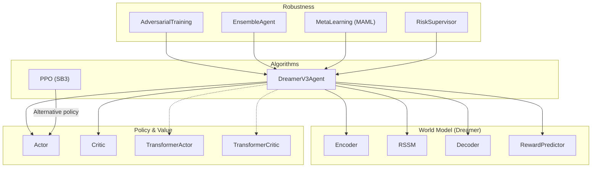
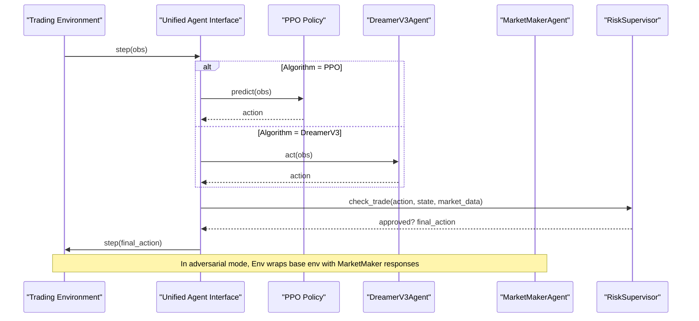
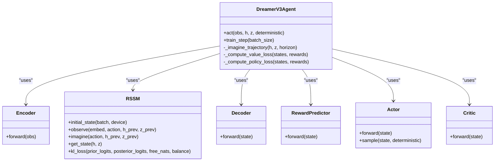
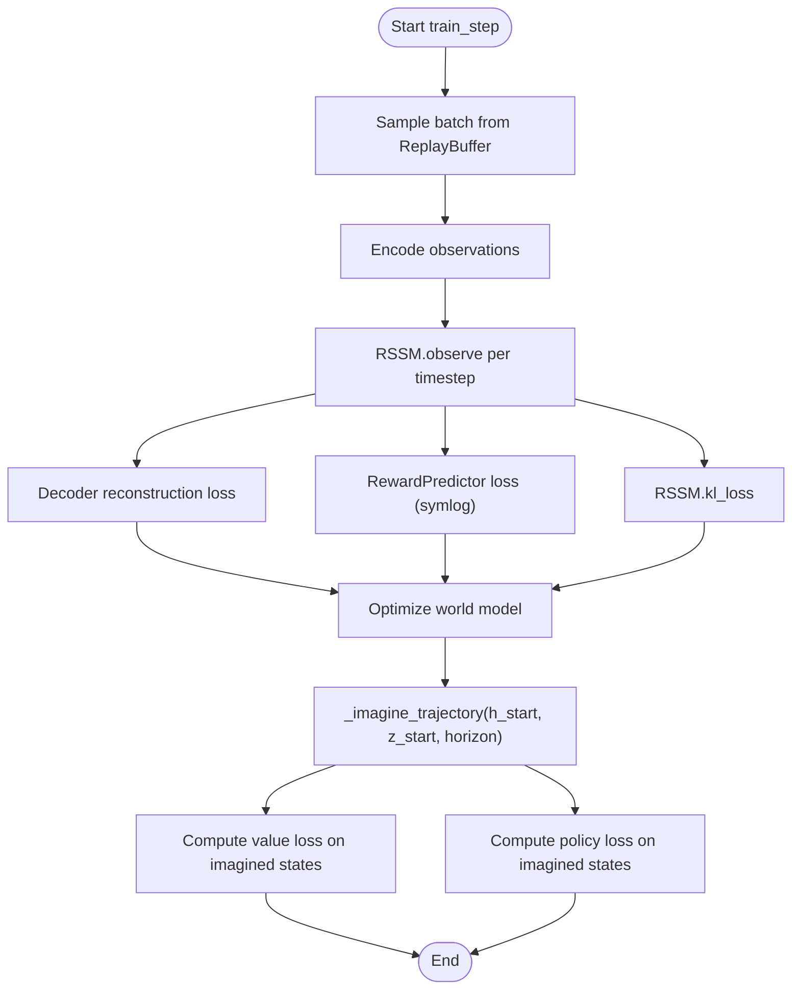
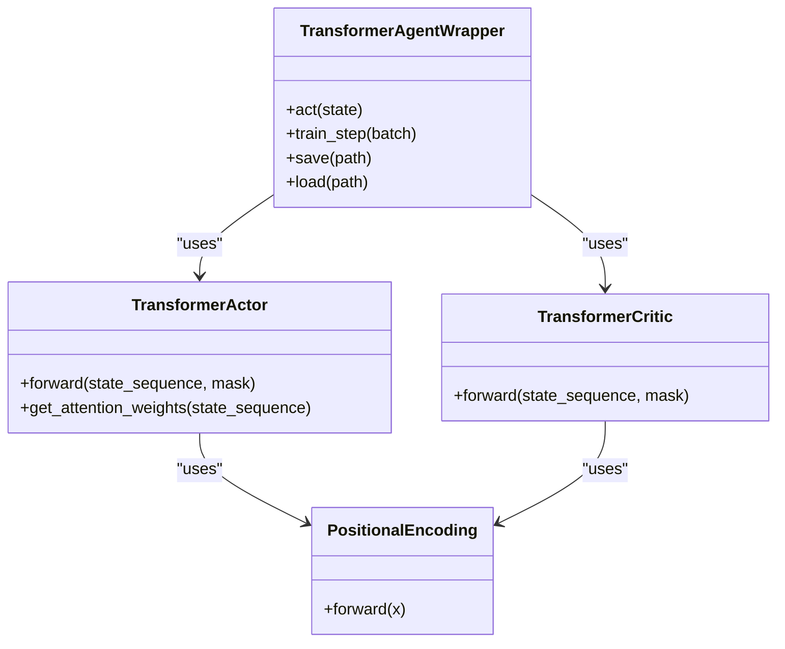
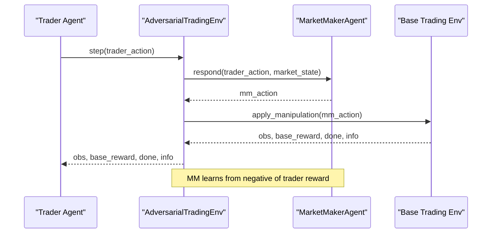
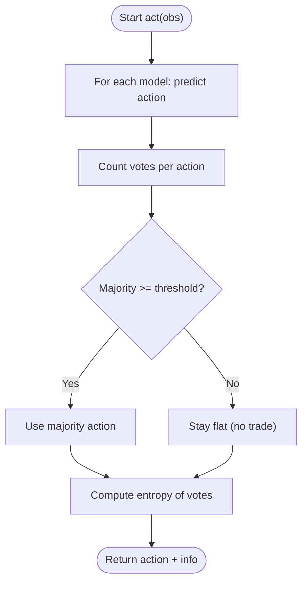
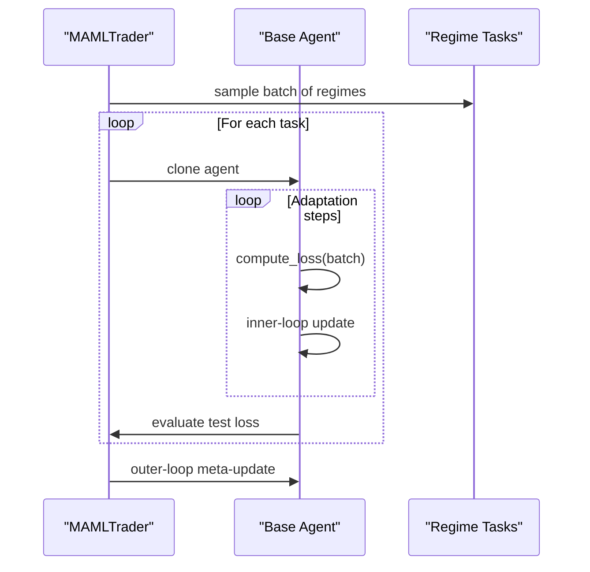
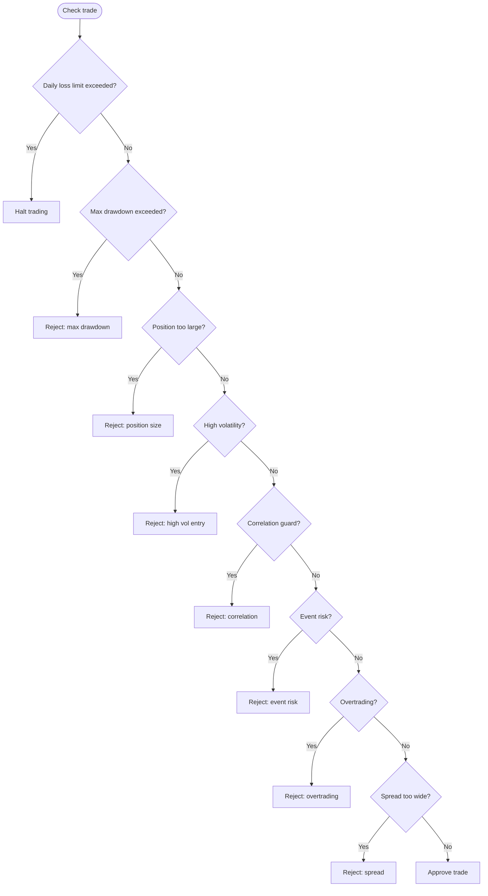
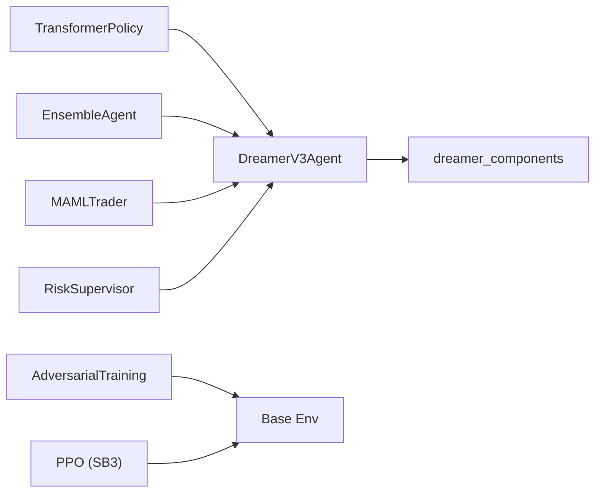

# Model Architecture

<cite>
**Referenced Files in This Document**
- [dreamer_agent.py](file://models/dreamer_agent.py)
- [dreamer_components.py](file://models/dreamer_components.py)
- [transformer_policy.py](file://models/transformer_policy.py)
- [adversarial_training.py](file://models/adversarial_training.py)
- [ensemble.py](file://models/ensemble.py)
- [meta_learning.py](file://models/meta_learning.py)
- [risk_supervisor.py](file://models/risk_supervisor.py)
- [train_ppo.py](file://train/train_ppo.py)
</cite>

## Table of Contents
1. [Introduction](#introduction)
2. [Project Structure](#project-structure)
3. [Core Components](#core-components)
4. [Architecture Overview](#architecture-overview)
5. [Detailed Component Analysis](#detailed-component-analysis)
6. [Dependency Analysis](#dependency-analysis)
7. [Performance Considerations](#performance-considerations)
8. [Troubleshooting Guide](#troubleshooting-guide)
9. [Conclusion](#conclusion)
10. [Appendices](#appendices)

## Introduction
This document describes the dual-algorithm model system that supports both PPO and Dreamer V3 approaches for autonomous trading, with a focus on the Dreamer V3 world model architecture (RSSM, encoder, dynamics, decoder, reward predictor, actor, critic), an imagination-based planning loop, a transformer-based policy network for enhanced temporal modeling, an adversarial training framework to improve robustness against market regime changes, ensemble methods for improved accuracy, and a model abstraction layer that provides a unified interface regardless of the underlying algorithm choice.

## Project Structure
The model system is organized into modular components:
- Dreamer V3 agent and components implement the world model and actor-critic learning via imagination.
- Transformer-based policy networks provide attention-driven temporal modeling for actor/critic.
- Adversarial training introduces a Market Maker agent to stress-test the trader.
- Ensemble methods aggregate multiple models to reduce variance and estimate uncertainty.
- Meta-learning enables fast adaptation to new regimes.
- Risk supervision enforces hard safety constraints over any agent’s decisions.
- PPO training script demonstrates integration with a standard RL library.

**Diagram sources**
- [dreamer_agent.py:84-147](file://models/dreamer_agent.py#L84-L147)
- [dreamer_components.py:71-295](file://models/dreamer_components.py#L71-L295)
- [transformer_policy.py:67-249](file://models/transformer_policy.py#L67-L249)
- [adversarial_training.py:35-356](file://models/adversarial_training.py#L35-L356)
- [ensemble.py:27-180](file://models/ensemble.py#L27-L180)
- [meta_learning.py:32-171](file://models/meta_learning.py#L32-L171)
- [risk_supervisor.py:18-387](file://models/risk_supervisor.py#L18-L387)
- [train_ppo.py:25-93](file://train/train_ppo.py#L25-L93)

**Section sources**
- [dreamer_agent.py:84-147](file://models/dreamer_agent.py#L84-L147)
- [dreamer_components.py:71-295](file://models/dreamer_components.py#L71-L295)
- [transformer_policy.py:67-249](file://models/transformer_policy.py#L67-L249)
- [adversarial_training.py:35-356](file://models/adversarial_training.py#L35-L356)
- [ensemble.py:27-180](file://models/ensemble.py#L27-L180)
- [meta_learning.py:32-171](file://models/meta_learning.py#L32-L171)
- [risk_supervisor.py:18-387](file://models/risk_supervisor.py#L18-L387)
- [train_ppo.py:25-93](file://train/train_ppo.py#L25-L93)

## Core Components
- Dreamer V3 Agent: Orchestrates world model learning and behavior learning via imagination; maintains replay buffer and optimizers for separate phases.
- World Model Components: Encoder compresses observations; RSSM learns latent dynamics with deterministic and stochastic states; Decoder reconstructs observations; RewardPredictor predicts rewards in symlog space; Actor outputs action distribution; Critic estimates values.
- Transformer Policy: Attention-based actor and critic that capture long-range temporal dependencies across sequences.
- Adversarial Training: Self-play between Trader and Market Maker to improve robustness under manipulation-like conditions.
- Ensemble: Aggregates multiple agents with consensus voting and uncertainty estimation.
- Meta-Learning: MAML wrapper enabling rapid adaptation to new regimes with few steps.
- Risk Supervisor: Deterministic safety layer that can override AI actions based on hard constraints.

**Section sources**
- [dreamer_agent.py:84-147](file://models/dreamer_agent.py#L84-L147)
- [dreamer_components.py:71-295](file://models/dreamer_components.py#L71-L295)
- [transformer_policy.py:67-249](file://models/transformer_policy.py#L67-L249)
- [adversarial_training.py:35-356](file://models/adversarial_training.py#L35-L356)
- [ensemble.py:27-180](file://models/ensemble.py#L27-L180)
- [meta_learning.py:32-171](file://models/meta_learning.py#L32-L171)
- [risk_supervisor.py:18-387](file://models/risk_supervisor.py#L18-L387)

## Architecture Overview
The system supports two algorithms at the top level:
- PPO: Trained via Stable Baselines 3 with vectorized environments.
- Dreamer V3: Learns a world model and improves policy by imagining trajectories.

At runtime, a unified interface abstracts away the algorithm choice so higher-level code can call act() and train_step() consistently.

**Diagram sources**
- [train_ppo.py:25-93](file://train/train_ppo.py#L25-L93)
- [dreamer_agent.py:148-188](file://models/dreamer_agent.py#L148-L188)
- [adversarial_training.py:223-356](file://models/adversarial_training.py#L223-L356)
- [risk_supervisor.py:289-387](file://models/risk_supervisor.py#L289-L387)

## Detailed Component Analysis

### Dreamer V3 World Model and Imagination-Based Planning
- Encoder maps raw observations to embeddings using RMSNorm and SiLU activations.
- RSSM maintains:
  - Deterministic hidden state h (GRU cell).
  - Stochastic latent z (categorical over stoch_dim x num_categories).
  - Prior p(z|h) and posterior q(z|h,e) for KL regularization.
- Decoder reconstructs observations from concatenated latent state (h,z).
- RewardPredictor outputs symlog-transformed rewards.
- Actor outputs categorical action logits; Critic estimates values.
- Training loop:
  - Phase 1: Train world model (reconstruction + reward prediction + KL).
  - Phase 2: Imagine H-step trajectories using RSSM and policy; train critic and actor on imagined returns.

**Diagram sources**
- [dreamer_agent.py:84-147](file://models/dreamer_agent.py#L84-L147)
- [dreamer_components.py:71-295](file://models/dreamer_components.py#L71-L295)

**Diagram sources**
- [dreamer_agent.py:190-304](file://models/dreamer_agent.py#L190-L304)
- [dreamer_agent.py:306-403](file://models/dreamer_agent.py#L306-L403)
- [dreamer_components.py:92-205](file://models/dreamer_components.py#L92-L205)

**Section sources**
- [dreamer_agent.py:84-403](file://models/dreamer_agent.py#L84-L403)
- [dreamer_components.py:71-295](file://models/dreamer_components.py#L71-L295)

### Transformer-Based Policy Network
- PositionalEncoding adds sinusoidal encodings to preserve sequence order.
- TransformerActor uses multi-head self-attention over state sequences to produce action logits.
- TransformerCritic similarly processes sequences to estimate values.
- TransformerAgentWrapper maintains a sliding window of recent states and produces actions deterministically or probabilistically.

**Diagram sources**
- [transformer_policy.py:34-163](file://models/transformer_policy.py#L34-L163)
- [transformer_policy.py:166-249](file://models/transformer_policy.py#L166-L249)
- [transformer_policy.py:252-373](file://models/transformer_policy.py#L252-L373)

**Section sources**
- [transformer_policy.py:34-373](file://models/transformer_policy.py#L34-L373)

### Adversarial Training Framework
- MarketMakerAgent detects trader patterns and chooses manipulations (e.g., widen spread, fake breakout, stop hunt).
- AdversarialTradingEnv wraps a base environment, applies manipulations, and returns zero-sum rewards to the MM.
- SelfPlayTrainer alternates training phases for Trader and MM to evolve robust policies.

**Diagram sources**
- [adversarial_training.py:35-221](file://models/adversarial_training.py#L35-L221)
- [adversarial_training.py:223-356](file://models/adversarial_training.py#L223-L356)
- [adversarial_training.py:358-484](file://models/adversarial_training.py#L358-L484)

**Section sources**
- [adversarial_training.py:35-484](file://models/adversarial_training.py#L35-L484)

### Ensemble Methods
- EnsembleAgent creates multiple instances of a base agent with varied seeds and slight architectural differences.
- Voting mechanism selects majority action; if consensus threshold not met, stays flat.
- Uncertainty measured via entropy of vote distribution.

**Diagram sources**
- [ensemble.py:27-180](file://models/ensemble.py#L27-L180)

**Section sources**
- [ensemble.py:27-180](file://models/ensemble.py#L27-L180)

### Meta-Learning for Regime Adaptation
- MAMLTrader wraps a base agent and performs meta-training across multiple market regimes.
- Fast adaptation updates parameters with few gradient steps when encountering a new regime.

**Diagram sources**
- [meta_learning.py:32-171](file://models/meta_learning.py#L32-L171)

**Section sources**
- [meta_learning.py:32-171](file://models/meta_learning.py#L32-L171)

### Risk Supervisor Layer
- RiskSupervisor enforces hard constraints: daily loss limits, drawdown protection, position sizing, volatility filters, correlation guards, event risk filters, overtrading prevention, spread filters, and market hours checks.
- SafeTradingAgent wraps any AI agent to approve/reject trades deterministically.

**Diagram sources**
- [risk_supervisor.py:91-174](file://models/risk_supervisor.py#L91-L174)
- [risk_supervisor.py:289-387](file://models/risk_supervisor.py#L289-L387)

**Section sources**
- [risk_supervisor.py:91-387](file://models/risk_supervisor.py#L91-L387)

### PPO Integration
- PPO training uses Stable Baselines 3 with vectorized environments and chunked learning schedules.
- Demonstrates how a standard RL baseline integrates with the same environment used by Dreamer V3.

**Section sources**
- [train_ppo.py:25-93](file://train/train_ppo.py#L25-L93)

## Dependency Analysis
- DreamerV3Agent depends on dreamer_components for all neural modules and implements optimization loops.
- TransformerPolicy provides alternative actor/critic architectures that can be swapped into the Dreamer pipeline via wrappers.
- AdversarialTraining depends on a base environment and can wrap it to introduce manipulations.
- Ensemble depends on any agent implementing act(), save(), load().
- MetaLearning depends on a base agent exposing compute_loss() and parameters.
- RiskSupervisor is independent and can wrap any agent.

**Diagram sources**
- [dreamer_agent.py:84-147](file://models/dreamer_agent.py#L84-L147)
- [dreamer_components.py:71-295](file://models/dreamer_components.py#L71-L295)
- [transformer_policy.py:252-373](file://models/transformer_policy.py#L252-L373)
- [adversarial_training.py:223-356](file://models/adversarial_training.py#L223-L356)
- [ensemble.py:27-180](file://models/ensemble.py#L27-L180)
- [meta_learning.py:32-171](file://models/meta_learning.py#L32-L171)
- [risk_supervisor.py:289-387](file://models/risk_supervisor.py#L289-L387)
- [train_ppo.py:25-93](file://train/train_ppo.py#L25-L93)

**Section sources**
- [dreamer_agent.py:84-147](file://models/dreamer_agent.py#L84-L147)
- [dreamer_components.py:71-295](file://models/dreamer_components.py#L71-L295)
- [transformer_policy.py:252-373](file://models/transformer_policy.py#L252-L373)
- [adversarial_training.py:223-356](file://models/adversarial_training.py#L223-L356)
- [ensemble.py:27-180](file://models/ensemble.py#L27-L180)
- [meta_learning.py:32-171](file://models/meta_learning.py#L32-L171)
- [risk_supervisor.py:289-387](file://models/risk_supervisor.py#L289-L387)
- [train_ppo.py:25-93](file://train/train_ppo.py#L25-L93)

## Performance Considerations
- World model training uses sequence unrolling; ensure sufficient replay buffer capacity and appropriate sequence length to capture market dynamics without excessive memory usage.
- Gradient clipping is applied to stabilize training across world model and actor-critic components.
- Symlog/symexp transformations help stabilize reward/value magnitudes.
- Transformer-based policies increase computational cost due to attention; tune hidden dimensions, number of heads/layers, and sequence length accordingly.
- Adversarial training may require careful balancing of update frequencies between trader and market maker to avoid instability.
- Ensemble inference scales linearly with number of models; consider caching or selective evaluation for latency-sensitive scenarios.
- Risk supervisor runs deterministically and should be lightweight; integrate early in the decision pipeline to prevent costly mistakes.

[No sources needed since this section provides general guidance]

## Troubleshooting Guide
- Replay buffer empty: Ensure enough transitions are added before calling train_step; otherwise sampling returns None.
- NaN losses: Check gradient clipping thresholds and symlog/symexp usage; verify input ranges and normalization.
- Posterior collapse: Adjust KL balancing and free nats to encourage informative stochastic latents.
- Instability in adversarial training: Tune learning rates and update cadence for trader vs market maker; monitor zero-sum balance.
- High uncertainty in ensemble: Review consensus threshold; consider increasing diversity or reducing disagreement via better features.
- Frequent rejections by risk supervisor: Inspect thresholds (daily loss, drawdown, volatility, spread); adjust to match live market conditions.

**Section sources**
- [dreamer_agent.py:190-304](file://models/dreamer_agent.py#L190-L304)
- [dreamer_components.py:188-205](file://models/dreamer_components.py#L188-L205)
- [adversarial_training.py:396-484](file://models/adversarial_training.py#L396-L484)
- [ensemble.py:67-154](file://models/ensemble.py#L67-L154)
- [risk_supervisor.py:91-174](file://models/risk_supervisor.py#L91-L174)

## Conclusion
The dual-algorithm system offers a flexible foundation for autonomous trading:
- Dreamer V3 provides a powerful world model with RSSM, enabling planning through imagination and robust policy improvement.
- Transformer-based policies enhance temporal modeling for complex market sequences.
- Adversarial training builds resilience against manipulative behaviors and regime shifts.
- Ensembles improve reliability and provide uncertainty signals.
- Meta-learning enables rapid adaptation to new regimes.
- Risk supervision ensures safe operation with hard constraints.
A unified interface abstracts algorithm-specific details, allowing seamless switching between PPO and Dreamer V3 while maintaining consistent training and inference workflows.

[No sources needed since this section summarizes without analyzing specific files]

## Appendices
- Configuration tips:
  - Tune RSSM stoch_dim and num_categories to balance expressiveness and stability.
  - Adjust horizon for imagination to match typical market persistence.
  - Set transformer sequence length to capture relevant historical context without excessive computation.
  - Calibrate ensemble consensus threshold based on desired conservatism.
  - Configure risk supervisor thresholds according to account size and risk tolerance.

[No sources needed since this section provides general guidance]