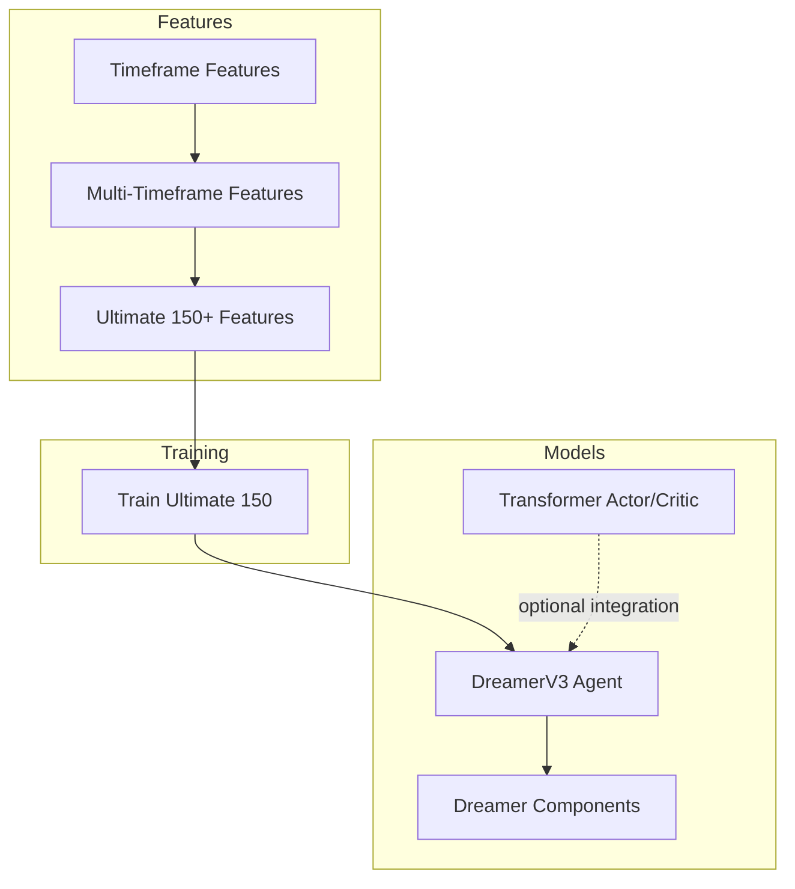
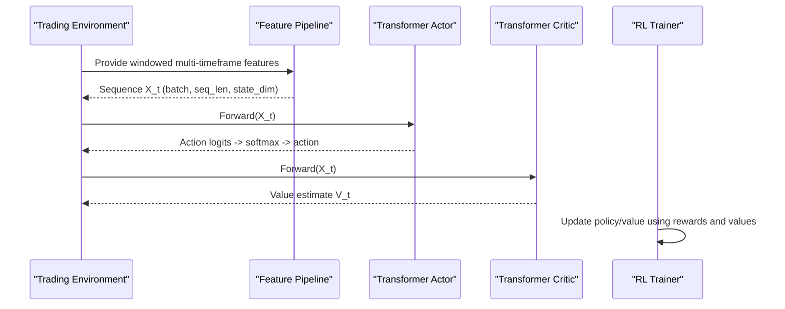
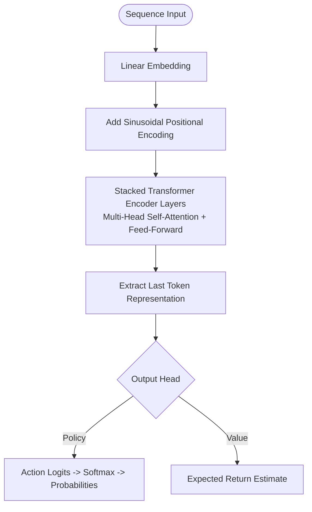
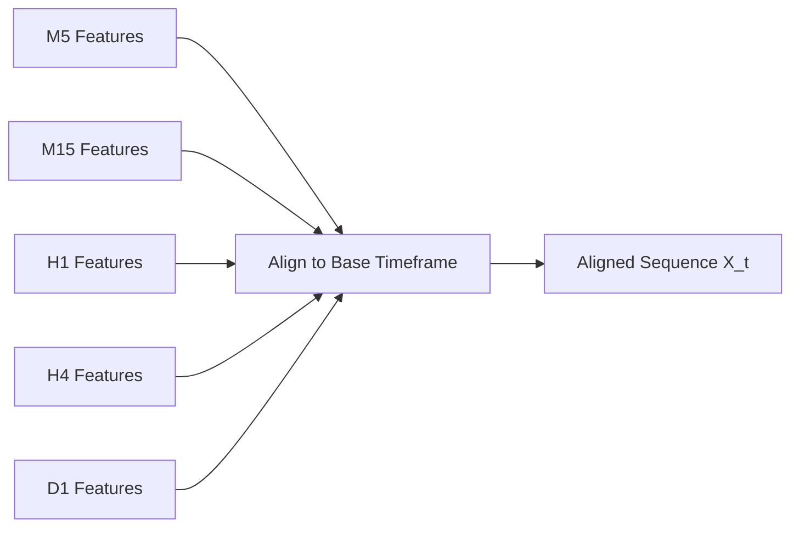
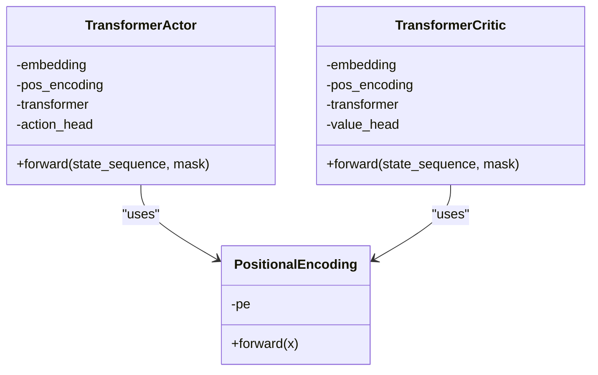
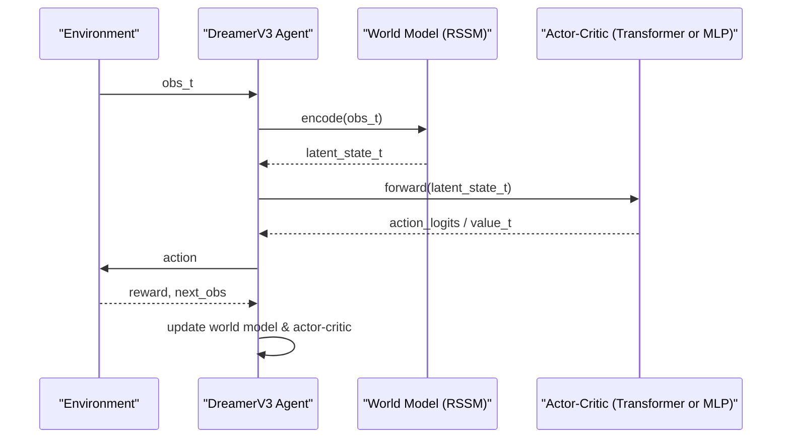
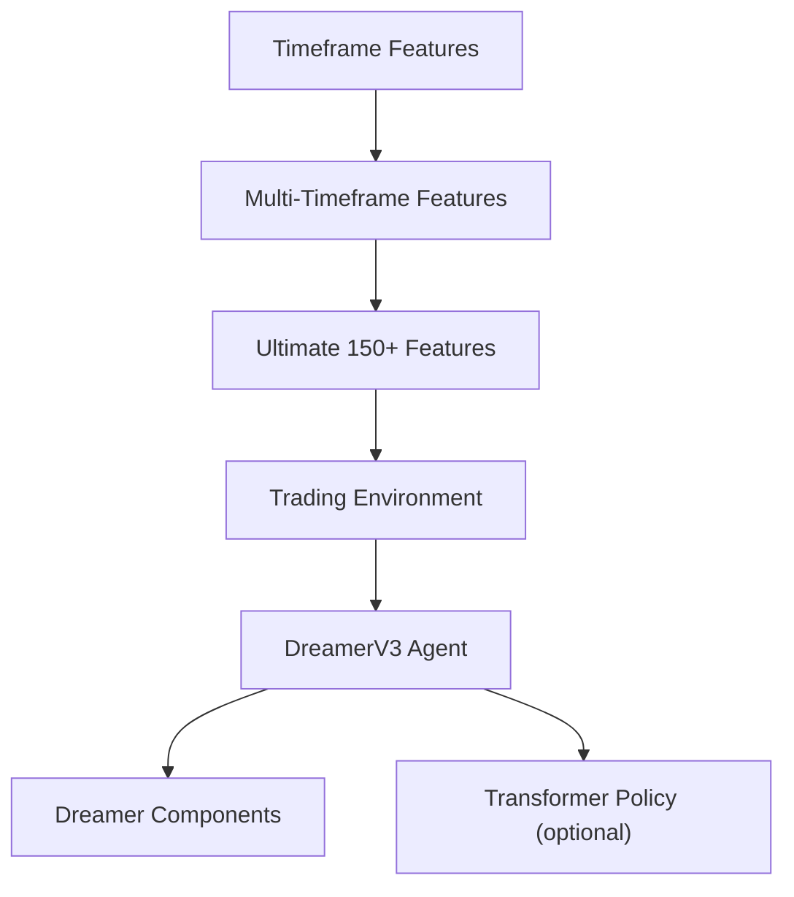

# Transformer-Based Policy Network

<cite>
**Referenced Files in This Document**
- [transformer_policy.py](file://models/transformer_policy.py)
- [multi_timeframe.py](file://features/multi_timeframe.py)
- [timeframe_features.py](file://features/timeframe_features.py)
- [ultimate_150_features.py](file://features/ultimate_150_features.py)
- [dreamer_agent.py](file://models/dreamer_agent.py)
- [dreamer_components.py](file://models/dreamer_components.py)
- [train_ultimate_150.py](file://train/train_ultimate_150.py)
</cite>

## Table of Contents
1. [Introduction](#introduction)
2. [Project Structure](#project-structure)
3. [Core Components](#core-components)
4. [Architecture Overview](#architecture-overview)
5. [Detailed Component Analysis](#detailed-component-analysis)
6. [Dependency Analysis](#dependency-analysis)
7. [Performance Considerations](#performance-considerations)
8. [Troubleshooting Guide](#troubleshooting-guide)
9. [Conclusion](#conclusion)
10. [Appendices](#appendices)

## Introduction
This document explains the transformer-based policy network architecture designed for enhanced temporal modeling in trading decisions. It focuses on how the transformer encoder processes multi-timeframe feature sequences to capture long-range dependencies, how attention mechanisms weigh different time periods and features, and how the policy and value heads produce action probabilities and expected returns. It also covers positional encoding for temporal ordering, layer normalization for training stability, and dropout for regularization. Finally, it provides examples of how the model captures complex market patterns across multiple timeframes and integrates them into coherent trading strategies.

## Project Structure
The repository implements a comprehensive trading system with:
- A transformer-based actor-critic module that models sequential market data using self-attention.
- Multi-timeframe feature engineering that constructs rich, aligned inputs across M5, M15, H1, H4, D1 (and optionally W1).
- An alternative DreamerV3 agent that uses a recurrent state space model; the transformer policy can be integrated as a replacement for MLP-based components.
- Training scripts that orchestrate environment interaction, replay buffering, and optimization.

**Diagram sources**
- [timeframe_features.py:22-99](file://features/timeframe_features.py#L22-L99)
- [multi_timeframe.py:32-96](file://features/multi_timeframe.py#L32-L96)
- [ultimate_150_features.py:27-226](file://features/ultimate_150_features.py#L27-L226)
- [dreamer_agent.py:84-144](file://models/dreamer_agent.py#L84-L144)
- [dreamer_components.py:71-294](file://models/dreamer_components.py#L71-L294)
- [train_ultimate_150.py:49-151](file://train/train_ultimate_150.py#L49-L151)

**Section sources**
- [timeframe_features.py:22-99](file://features/timeframe_features.py#L22-L99)
- [multi_timeframe.py:32-96](file://features/multi_timeframe.py#L32-L96)
- [ultimate_150_features.py:27-226](file://features/ultimate_150_features.py#L27-L226)
- [dreamer_agent.py:84-144](file://models/dreamer_agent.py#L84-L144)
- [dreamer_components.py:71-294](file://models/dreamer_components.py#L71-L294)
- [train_ultimate_150.py:49-151](file://train/train_ultimate_150.py#L49-L151)

## Core Components
- Transformer Actor: Maps sequences of multi-timeframe features to action logits via a transformer encoder and an output head. Uses positional encoding, multi-head attention, feed-forward layers, GELU activations, and dropout.
- Transformer Critic: Estimates expected returns from the same sequence representation by pooling the last token and passing through a value head.
- Positional Encoding: Sinusoidal encodings added to embeddings to preserve temporal order.
- Multi-Timeframe Features: Constructs aligned features across multiple timeframes and computes cross-timeframe indicators to enrich context.
- DreamerV3 Integration: The transformer policy can replace MLP-based actor/critic within the DreamerV3 framework, leveraging its world model and imagination loop.

**Section sources**
- [transformer_policy.py:34-152](file://models/transformer_policy.py#L34-L152)
- [transformer_policy.py:166-249](file://models/transformer_policy.py#L166-L249)
- [multi_timeframe.py:32-96](file://features/multi_timeframe.py#L32-L96)
- [timeframe_features.py:22-99](file://features/timeframe_features.py#L22-L99)
- [dreamer_agent.py:84-144](file://models/dreamer_agent.py#L84-L144)

## Architecture Overview
The transformer-based policy network processes sequences of multi-timeframe features to learn long-range dependencies in market data. Each timestep contains a vector of engineered features (e.g., returns, volatility, momentum, moving averages, RSI, ATR, Bollinger Band position, volume ratios, distances to recent highs/lows, cross-timeframe alignment, macro and calendar signals). The transformer encoder applies self-attention across timesteps to identify relevant historical patterns and aggregate information into a contextual representation. The last token’s representation is used to compute:
- Action probabilities via the policy head (softmax over actions).
- Expected return estimates via the value head.

**Diagram sources**
- [transformer_policy.py:125-152](file://models/transformer_policy.py#L125-L152)
- [transformer_policy.py:222-249](file://models/transformer_policy.py#L222-L249)
- [train_ultimate_150.py:49-151](file://train/train_ultimate_150.py#L49-L151)

## Detailed Component Analysis

### Transformer Encoder and Attention Mechanisms
- Input Embedding: Linear projection maps raw features to hidden dimension.
- Positional Encoding: Sinusoidal encodings are added to preserve sequence order.
- Transformer Encoder: Stacked encoder layers with multi-head self-attention and feed-forward networks. Attention weights allow the model to focus on relevant historical timesteps and features when making decisions.
- Pooling: The last token representation aggregates temporal context for decision-making.
- Dropout: Applied within the encoder layers and heads to regularize training.

**Diagram sources**
- [transformer_policy.py:34-64](file://models/transformer_policy.py#L34-L64)
- [transformer_policy.py:67-152](file://models/transformer_policy.py#L67-L152)
- [transformer_policy.py:166-249](file://models/transformer_policy.py#L166-L249)

**Section sources**
- [transformer_policy.py:34-64](file://models/transformer_policy.py#L34-L64)
- [transformer_policy.py:67-152](file://models/transformer_policy.py#L67-L152)
- [transformer_policy.py:166-249](file://models/transformer_policy.py#L166-L249)

### Multi-Timeframe Feature Sequences
- Timeframe Features: For each timeframe (M5, M15, H1, H4, D1), compute price action, trend indicators, technical indicators, and volume/support-resistance metrics.
- Cross-Timeframe Features: Compute alignment scores, momentum cascades, volatility regimes, and support/resistance confluence across timeframes.
- Alignment: All features are aligned to a base timeframe (e.g., M5) so sequences are temporally consistent for the transformer.

**Diagram sources**
- [timeframe_features.py:22-99](file://features/timeframe_features.py#L22-L99)
- [multi_timeframe.py:32-96](file://features/multi_timeframe.py#L32-L96)
- [ultimate_150_features.py:47-154](file://features/ultimate_150_features.py#L47-L154)

**Section sources**
- [timeframe_features.py:22-99](file://features/timeframe_features.py#L22-L99)
- [multi_timeframe.py:32-96](file://features/multi_timeframe.py#L32-L96)
- [ultimate_150_features.py:47-154](file://features/ultimate_150_features.py#L47-L154)

### Policy Head and Value Head
- Policy Head: Takes the last token representation and outputs action logits, which are converted to probabilities via softmax. Supports discrete actions such as flat/long or buy/hold/sell depending on configuration.
- Value Head: Produces scalar expected return estimates for the current state sequence, used for bootstrapping and advantage computation during training.

**Diagram sources**
- [transformer_policy.py:34-64](file://models/transformer_policy.py#L34-L64)
- [transformer_policy.py:67-152](file://models/transformer_policy.py#L67-L152)
- [transformer_policy.py:166-249](file://models/transformer_policy.py#L166-L249)

**Section sources**
- [transformer_policy.py:67-152](file://models/transformer_policy.py#L67-L152)
- [transformer_policy.py:166-249](file://models/transformer_policy.py#L166-L249)

### Integration with DreamerV3
- The DreamerV3 agent learns a world model (encoder, RSSM, decoder, reward predictor) and trains actor-critic policies in imagined trajectories.
- The transformer-based actor/critic can replace MLP-based components to leverage explicit temporal modeling and attention over sequences.
- The training script orchestrates environment interaction, replay buffer management, and optimization steps.

**Diagram sources**
- [dreamer_agent.py:84-144](file://models/dreamer_agent.py#L84-L144)
- [dreamer_agent.py:190-304](file://models/dreamer_agent.py#L190-L304)
- [dreamer_components.py:71-294](file://models/dreamer_components.py#L71-L294)
- [train_ultimate_150.py:218-317](file://train/train_ultimate_150.py#L218-L317)

**Section sources**
- [dreamer_agent.py:84-144](file://models/dreamer_agent.py#L84-L144)
- [dreamer_agent.py:190-304](file://models/dreamer_agent.py#L190-L304)
- [dreamer_components.py:71-294](file://models/dreamer_components.py#L71-L294)
- [train_ultimate_150.py:218-317](file://train/train_ultimate_150.py#L218-L317)

### Examples of Capturing Complex Market Patterns
- Trend Alignment Across Timeframes: When M5, H1, and D1 trends align, the attention mechanism can assign higher weights to those timesteps, reinforcing strong directional signals.
- Momentum Cascade: Higher timeframe momentum filtering to lower timeframes allows the model to strengthen short-term signals when supported by longer-term trends.
- Volatility Regime Shifts: Changes in volatility regimes across timeframes inform risk-aware decisions; attention can adapt to emphasize recent volatility spikes.
- Support/Resistance Confluence: When price approaches support/resistance levels across multiple timeframes, attention highlights these critical regions for entry/exit timing.

These behaviors emerge from the combination of multi-timeframe features and the transformer’s ability to attend to relevant historical contexts.

[No sources needed since this section synthesizes conceptual behavior grounded in the analyzed files]

## Dependency Analysis
- Feature pipeline dependencies:
  - Timeframe features generate standardized indicators per timeframe.
  - Multi-timeframe features combine and align these indicators, adding cross-timeframe metrics.
  - Ultimate 150+ features integrate timeframe, cross-timeframe, macro, calendar, and microstructure features into a unified dataset.
- Model dependencies:
  - Transformer policy depends on aligned sequences and uses positional encoding, attention, and dropout.
  - DreamerV3 agent coordinates world model learning and policy/value updates; transformer components can be substituted for MLP-based ones.
- Training dependencies:
  - Training script manages environment interactions, replay buffer sampling, and optimization loops.

**Diagram sources**
- [timeframe_features.py:22-99](file://features/timeframe_features.py#L22-L99)
- [multi_timeframe.py:32-96](file://features/multi_timeframe.py#L32-L96)
- [ultimate_150_features.py:47-154](file://features/ultimate_150_features.py#L47-L154)
- [dreamer_agent.py:84-144](file://models/dreamer_agent.py#L84-L144)
- [dreamer_components.py:71-294](file://models/dreamer_components.py#L71-L294)

**Section sources**
- [timeframe_features.py:22-99](file://features/timeframe_features.py#L22-L99)
- [multi_timeframe.py:32-96](file://features/multi_timeframe.py#L32-L96)
- [ultimate_150_features.py:47-154](file://features/ultimate_150_features.py#L47-L154)
- [dreamer_agent.py:84-144](file://models/dreamer_agent.py#L84-L144)
- [dreamer_components.py:71-294](file://models/dreamer_components.py#L71-L294)

## Performance Considerations
- Sequence Length: Longer sequences enable capturing more history but increase computational cost; choose based on hardware constraints and market dynamics.
- Number of Heads and Layers: More heads/layers improve representational capacity but require more data and careful regularization.
- Dropout Rate: Adjust to balance underfitting and overfitting; typical values around 0.1–0.2 work well.
- Normalization: RMSNorm in Dreamer components and standard normalization in transformers help stabilize training.
- Batch Size: Larger batches improve gradient estimates but may reduce exploration diversity; tune based on memory and convergence speed.
- Learning Rates: Separate optimizers for actor and critic with appropriate rates (e.g., 3e-4) aid stable training.

[No sources needed since this section provides general guidance]

## Troubleshooting Guide
- NaN/Inf in Features: Ensure proper handling of missing values and infinities in feature pipelines; fill NaNs and replace inf with zeros where necessary.
- Gradient Issues: Use gradient clipping and appropriate learning rates; monitor loss curves for instability.
- Attention Overfitting: Increase dropout or reduce model capacity if attention weights become too peaked or unstable.
- Alignment Errors: Verify that all timeframes are correctly aligned to the base timeframe before feeding into the transformer.
- Replay Buffer Underflow: Ensure sufficient prefill steps to sample valid sequences for training.

**Section sources**
- [ultimate_150_features.py:156-182](file://features/ultimate_150_features.py#L156-L182)
- [dreamer_agent.py:190-304](file://models/dreamer_agent.py#L190-L304)
- [train_ultimate_150.py:236-256](file://train/train_ultimate_150.py#L236-L256)

## Conclusion
The transformer-based policy network leverages multi-timeframe features and self-attention to model long-range dependencies in market data effectively. Positional encoding preserves temporal order, while attention mechanisms dynamically weigh relevant historical patterns for decision-making. The policy head outputs action probabilities, and the value head estimates expected returns, enabling robust reinforcement learning. Integration with DreamerV3 allows world model learning and imagination-based planning, enhancing adaptability to changing market conditions. Proper feature engineering, normalization, and regularization ensure stable and effective training.

[No sources needed since this section summarizes without analyzing specific files]

## Appendices
- Configuration Tips:
  - Tune sequence length, number of heads/layers, and dropout based on dataset size and performance goals.
  - Use separate learning rates for actor and critic to balance policy and value updates.
- Monitoring:
  - Track attention weights (if accessible) to interpret model focus over timeframes and features.
  - Monitor losses and returns to detect overfitting or instability.

[No sources needed since this section provides general guidance]