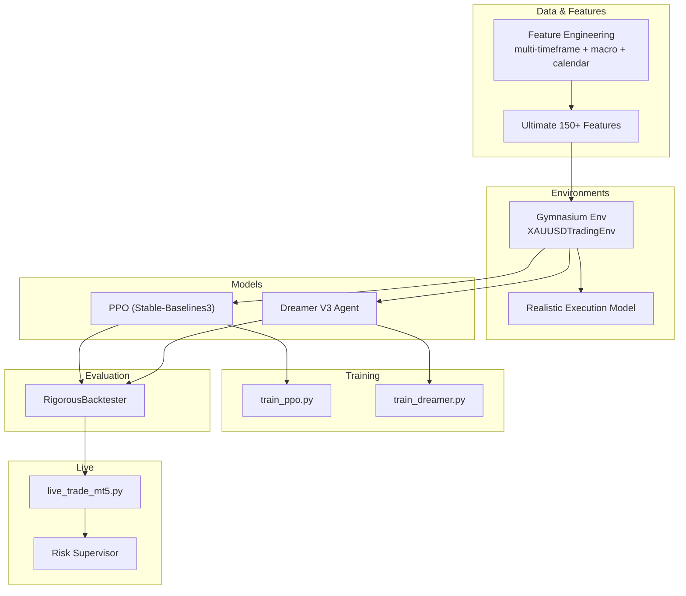
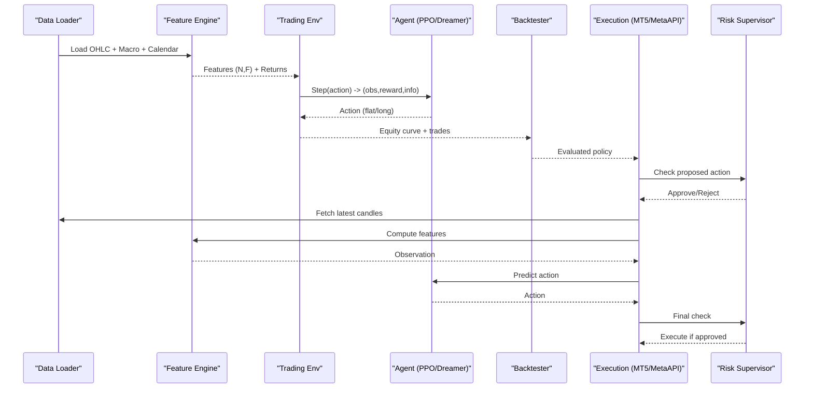
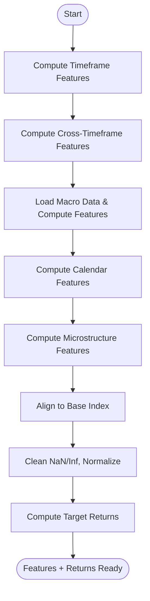
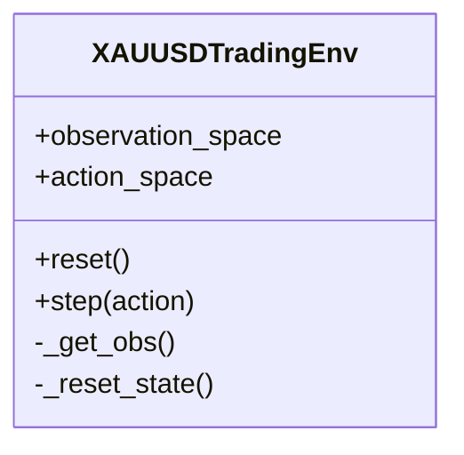
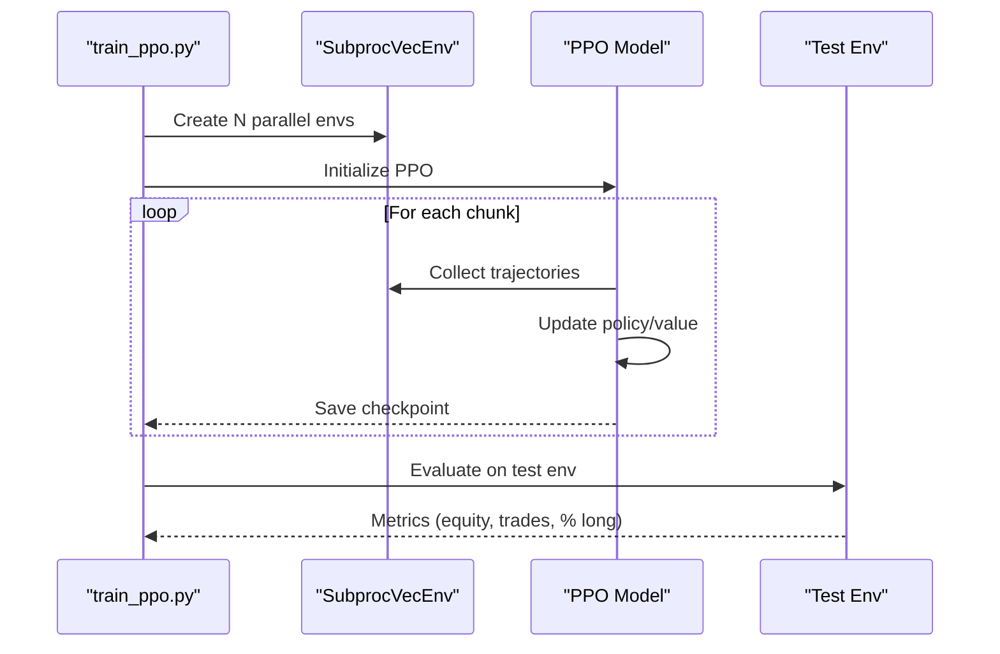
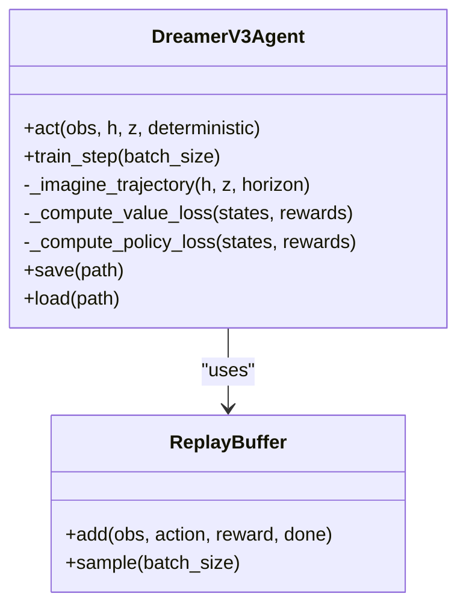
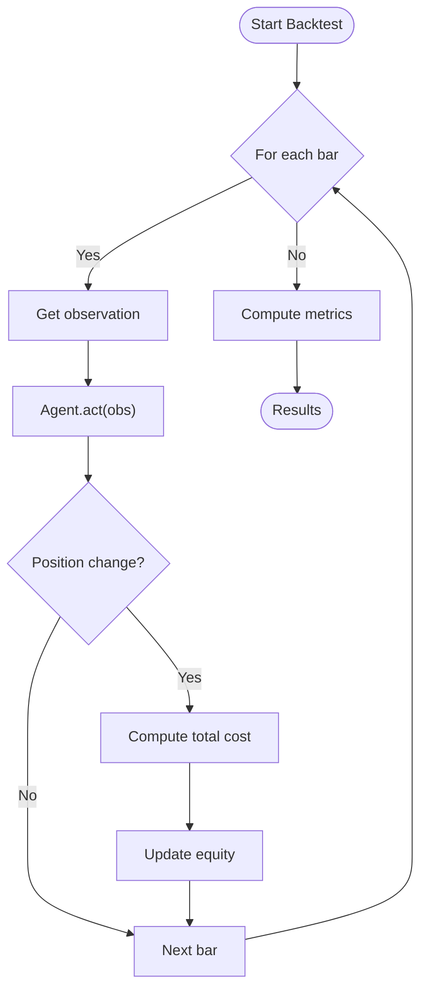
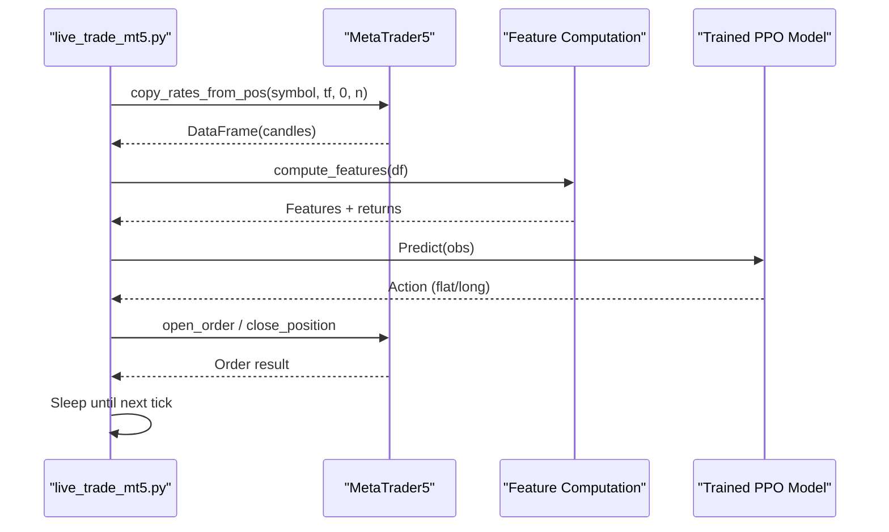
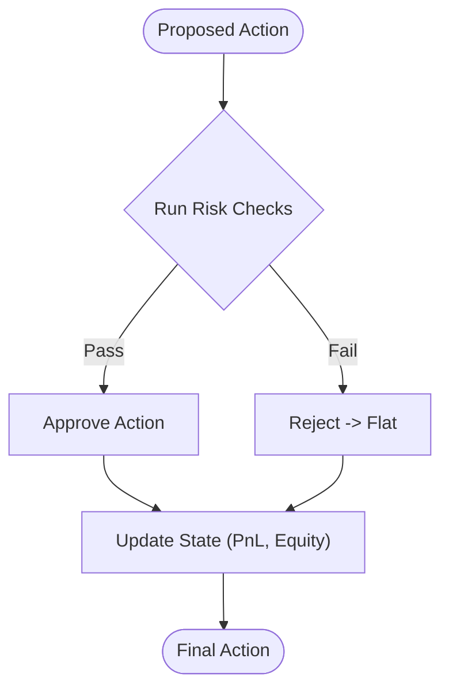
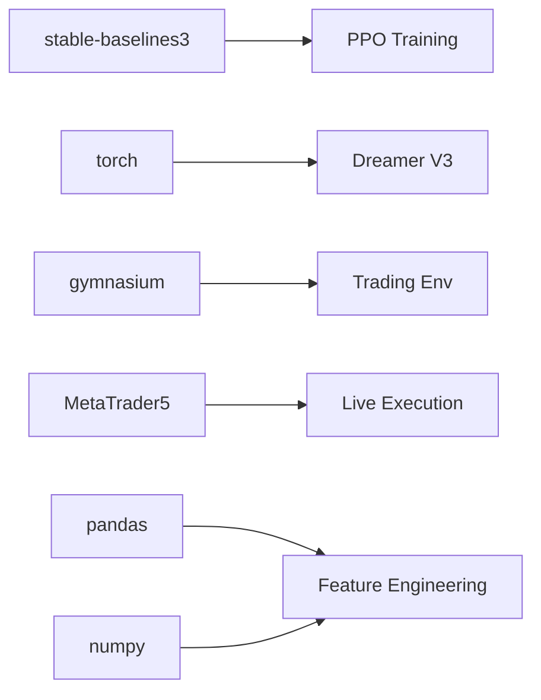

# System Architecture

<cite>
**Referenced Files in This Document**
- [README.md](file://README.md)
- [requirements.txt](file://requirements.txt)
- [env/xauusd_env.py](file://env/xauusd_env.py)
- [features/ultimate_150_features.py](file://features/ultimate_150_features.py)
- [features/make_features.py](file://features/make_features.py)
- [models/dreamer_agent.py](file://models/dreamer_agent.py)
- [train/train_ppo.py](file://train/train_ppo.py)
- [train/train_dreamer.py](file://train/train_dreamer.py)
- [live/live_trade_mt5.py](file://live/live_trade_mt5.py)
- [backtest/backtest_engine.py](file://backtest/backtest_engine.py)
- [models/risk_supervisor.py](file://models/risk_supervisor.py)
- [env/realistic_execution.py](file://env/realistic_execution.py)
- [DEPLOYMENT_GUIDE.md](file://DEPLOYMENT_GUIDE.md)
</cite>

## Table of Contents
1. Introduction
2. Project Structure
3. Core Components
4. Architecture Overview
5. Detailed Component Analysis
6. Dependency Analysis
7. Performance Considerations
8. Troubleshooting Guide
9. Conclusion
10. Appendices

## Introduction
This document describes the architecture of an autonomous trading system for XAUUSD that uses deep reinforcement learning to learn trading policies from market data. The system is organized into modular layers: data ingestion and feature engineering, Gymnasium-based RL environments, model training (PPO and Dreamer V3), evaluation/backtesting, and live execution via MetaTrader 5 or cloud brokers. It explains how raw market data flows through feature extraction into a standardized environment, then to model training and deployment, while integrating risk management, monitoring, and disaster recovery safeguards.

## Project Structure
The repository is organized by functional modules:
- Data and features: scripts to fetch macro data, compute economic calendar events, and build multi-timeframe and macro-aware features.
- Environments: Gymnasium-compliant trading environments with realistic cost modeling.
- Models: PPO via Stable-Baselines3 and a custom Dreamer V3 agent with world-model components.
- Training: Scripts to train PPO and Dreamer V3 on historical data.
- Evaluation: Backtesting engine with conservative costs and metrics.
- Live execution: MT5 and MetaAPI integrations for paper/live trading.
- Risk and safety: Deterministic risk supervisor and realistic execution cost models.

**Diagram sources**
- [features/ultimate_150_features.py:27-226](file://features/ultimate_150_features.py#L27-L226)
- [env/xauusd_env.py:7-118](file://env/xauusd_env.py#L7-L118)
- [env/realistic_execution.py:24-229](file://env/realistic_execution.py#L24-L229)
- [train/train_ppo.py:25-93](file://train/train_ppo.py#L25-L93)
- [train/train_dreamer.py:36-126](file://train/train_dreamer.py#L36-L126)
- [backtest/backtest_engine.py:24-146](file://backtest/backtest_engine.py#L24-L146)
- [live/live_trade_mt5.py:111-174](file://live/live_trade_mt5.py#L111-L174)
- [models/risk_supervisor.py:18-174](file://models/risk_supervisor.py#L18-L174)

**Section sources**
- [README.md:418-471](file://README.md#L418-L471)

## Core Components
- Feature pipeline: Multi-timeframe indicators, cross-timeframe signals, macro correlations, economic calendar events, and microstructure features are combined into a unified observation vector.
- Environment: A Gymnasium environment that exposes observations, actions (flat/long), and rewards based on returns, turnover penalties, and transaction costs.
- Algorithms:
  - PPO: On-policy actor-critic trained with parallel environments using Stable-Baselines3.
  - Dreamer V3: Model-based RL with a world model (RSSM), latent imagination, and actor-critic trained in latent space.
- Backtesting: Conservative backtester with spread, slippage, commission, walk-forward validation, and comprehensive metrics.
- Live execution: MT5 integration loop fetching candles, computing features, inferring actions, and executing orders; optional MetaAPI path.
- Risk management: Deterministic supervisor enforcing daily loss limits, drawdown caps, volatility filters, event windows, spread checks, and trade frequency controls.

**Section sources**
- [features/ultimate_150_features.py:27-226](file://features/ultimate_150_features.py#L27-L226)
- [env/xauusd_env.py:7-118](file://env/xauusd_env.py#L7-L118)
- [train/train_ppo.py:25-93](file://train/train_ppo.py#L25-L93)
- [models/dreamer_agent.py:84-147](file://models/dreamer_agent.py#L84-L147)
- [backtest/backtest_engine.py:24-146](file://backtest/backtest_engine.py#L24-L146)
- [live/live_trade_mt5.py:111-174](file://live/live_trade_mt5.py#L111-L174)
- [models/risk_supervisor.py:18-174](file://models/risk_supervisor.py#L18-L174)

## Architecture Overview
The system follows a layered design:
- Data layer: Market data and macro series are loaded and transformed into features across multiple timeframes and aligned to a base index.
- Feature layer: Aggregates technical, macro, calendar, and microstructure features into a single observation matrix.
- Environment layer: Wraps features and returns into a Gymnasium environment with realistic cost modeling and reward shaping.
- Model layer: Trains either PPO or Dreamer V3 agents against the environment.
- Evaluation layer: Runs rigorous backtests with conservative assumptions and walk-forward validation.
- Execution layer: Deploys trained models to MT5/MetaAPI with deterministic risk controls and monitoring.

**Diagram sources**
- [features/ultimate_150_features.py:27-226](file://features/ultimate_150_features.py#L27-L226)
- [env/xauusd_env.py:7-118](file://env/xauusd_env.py#L7-L118)
- [train/train_ppo.py:25-93](file://train/train_ppo.py#L25-L93)
- [train/train_dreamer.py:36-126](file://train/train_dreamer.py#L36-L126)
- [backtest/backtest_engine.py:24-146](file://backtest/backtest_engine.py#L24-L146)
- [live/live_trade_mt5.py:111-174](file://live/live_trade_mt5.py#L111-L174)
- [models/risk_supervisor.py:18-174](file://models/risk_supervisor.py#L18-L174)

## Detailed Component Analysis

### Feature Engineering Pipeline
- Multi-timeframe computation: Indicators computed across M5/M15/H1/H4/D1/W1 and aligned to a base timeframe.
- Cross-timeframe features: Derived signals comparing trends/momentum across timeframes.
- Macro features: Correlations and returns from DXY, SPX, US10Y, etc., integrated with gold returns.
- Calendar features: Event windows around high-impact economic releases.
- Microstructure features: Spread, volatility regime, order flow proxies.
- Output: Unified feature matrix and target returns for training.

**Diagram sources**
- [features/ultimate_150_features.py:27-226](file://features/ultimate_150_features.py#L27-L226)

**Section sources**
- [features/ultimate_150_features.py:27-226](file://features/ultimate_150_features.py#L27-L226)
- [features/make_features.py:18-83](file://features/make_features.py#L18-L83)

### Gymnasium Environment and Reward Design
- Observation: Rolling window of features concatenated with current position state.
- Actions: Discrete {Flat, Long}.
- Reward: PnL from holding previous position minus transaction costs, turnover penalty, flat penalty, plus hold bonus for stability.
- Info: Tracks equity, position, and trade costs per step.

**Diagram sources**
- [env/xauusd_env.py:7-118](file://env/xauusd_env.py#L7-L118)

**Section sources**
- [env/xauusd_env.py:7-118](file://env/xauusd_env.py#L7-L118)

### PPO Training Workflow
- Data preparation: Build features and returns; split train/test by date.
- Parallel environments: SubprocVecEnv runs multiple env instances for efficient sampling.
- Training loop: Learns in chunks, saves checkpoints, and performs quick evaluation on test set.

**Diagram sources**
- [train/train_ppo.py:25-93](file://train/train_ppo.py#L25-L93)
- [env/xauusd_env.py:7-118](file://env/xauusd_env.py#L7-L118)

**Section sources**
- [train/train_ppo.py:25-93](file://train/train_ppo.py#L25-L93)

### Dreamer V3 Agent and Training
- World model: Encoder, RSSM, decoder, and reward predictor learn representation, dynamics, and reward prediction.
- Imagination: Policy improves by planning over imagined trajectories in latent space.
- Replay buffer: Stores sequences for batched updates.
- Training phases: Prefill buffer with random exploration, then alternate world model and actor-critic updates.

**Diagram sources**
- [models/dreamer_agent.py:24-147](file://models/dreamer_agent.py#L24-L147)
- [models/dreamer_agent.py:190-304](file://models/dreamer_agent.py#L190-L304)
- [models/dreamer_agent.py:306-403](file://models/dreamer_agent.py#L306-L403)

**Section sources**
- [models/dreamer_agent.py:84-147](file://models/dreamer_agent.py#L84-L147)
- [train/train_dreamer.py:128-331](file://train/train_dreamer.py#L128-L331)

### Backtesting and Evaluation
- Realistic costs: Spread widening, slippage, commissions, market impact, adverse selection.
- Walk-forward validation: Rolling train/test windows to assess robustness.
- Metrics: Return, Sharpe, Sortino, Calmar, drawdown, win rate, profit factor, duration, total costs.

**Diagram sources**
- [backtest/backtest_engine.py:73-146](file://backtest/backtest_engine.py#L73-L146)
- [backtest/backtest_engine.py:219-360](file://backtest/backtest_engine.py#L219-L360)

**Section sources**
- [backtest/backtest_engine.py:24-146](file://backtest/backtest_engine.py#L24-L146)
- [backtest/backtest_engine.py:219-360](file://backtest/backtest_engine.py#L219-L360)

### Live Trading Execution Flow
- Data fetch: Pull recent candles from MT5.
- Feature computation: Compute features and construct observation.
- Inference: Load trained PPO model and predict action deterministically.
- Execution: Open/close positions based on action vs current position; handle errors and retries.
- Monitoring: Log timestamps, actions, and outcomes.

**Diagram sources**
- [live/live_trade_mt5.py:21-174](file://live/live_trade_mt5.py#L21-L174)

**Section sources**
- [live/live_trade_mt5.py:111-174](file://live/live_trade_mt5.py#L111-L174)

### Risk Management Integration
- Deterministic rules: Daily loss limit, max drawdown, position size cap, volatility filter, correlation guard, event risk filter, trade frequency control, spread filter, market hours check.
- State tracking: Daily PnL, peak equity, consecutive losses, last trade time, trade history.
- Safe wrapper: Combines AI agent with risk supervisor to approve/reject actions and override to flat when necessary.

**Diagram sources**
- [models/risk_supervisor.py:91-174](file://models/risk_supervisor.py#L91-L174)
- [models/risk_supervisor.py:176-241](file://models/risk_supervisor.py#L176-L241)

**Section sources**
- [models/risk_supervisor.py:18-174](file://models/risk_supervisor.py#L18-L174)
- [models/risk_supervisor.py:288-339](file://models/risk_supervisor.py#L288-L339)

### Realistic Execution Modeling
- Cost components: Spread widening under volatility/events, slippage scaling, commissions, market impact for large orders, adverse selection.
- Simulation: Adjust fill price based on side and total cost; track statistics and breakdowns.
- Use cases: Train with realistic costs to avoid overfitting to optimistic backtests.

**Section sources**
- [env/realistic_execution.py:24-229](file://env/realistic_execution.py#L24-L229)

## Dependency Analysis
Key dependencies and their roles:
- stable-baselines3: Provides PPO implementation and utilities for vectorized environments.
- torch: Powers Dreamer V3 networks and training loops.
- gymnasium: Standardizes RL environment interface for consistent training and evaluation.
- MetaTrader5: Enables live trading via MT5 platform.
- pandas/numpy: Data processing and numerical computations.
- Optional libraries: yfinance/requests for data fetching; matplotlib/seaborn for visualization; scikit-learn/scipy for advanced features.

**Diagram sources**
- [requirements.txt:1-29](file://requirements.txt#L1-L29)
- [train/train_ppo.py:1-93](file://train/train_ppo.py#L1-L93)
- [models/dreamer_agent.py:1-460](file://models/dreamer_agent.py#L1-L460)
- [env/xauusd_env.py:1-118](file://env/xauusd_env.py#L1-L118)
- [live/live_trade_mt5.py:1-174](file://live/live_trade_mt5.py#L1-L174)

**Section sources**
- [requirements.txt:1-29](file://requirements.txt#L1-L29)

## Performance Considerations
- Hardware options: CPU, Apple MPS (M1/M2/M3), NVIDIA CUDA GPUs; Google Colab recommended for fast training.
- Memory usage: Large feature matrices (150+ features) require sufficient RAM; float32 conversion reduces memory footprint.
- GPU acceleration: Use CUDA or MPS for faster training; adjust batch sizes accordingly.
- Throughput: Parallel environments increase sample efficiency; tune n_envs and batch_size for your hardware.
- Latency: Live trading loop sleeps between ticks; ensure low-latency network and broker connectivity.

[No sources needed since this section provides general guidance]

## Troubleshooting Guide
Common issues and resolutions:
- Data loading failures: Ensure OHLC CSV files exist and have correct columns; verify macro data availability.
- Feature alignment: Handle NaN/Inf values; align multi-timeframe features to base index before concatenation.
- Environment errors: Validate observation shapes and window sizes; confirm returns length matches features.
- Training instability: Reduce learning rates; clip gradients; use larger batch sizes on GPU; monitor loss curves.
- Live execution errors: Check MT5 initialization and symbol availability; handle order send failures and reconnect logic.
- Risk overrides: Review rejection reasons; adjust thresholds for volatility, spread, and event windows.

**Section sources**
- [features/ultimate_150_features.py:156-174](file://features/ultimate_150_features.py#L156-L174)
- [env/xauusd_env.py:33-57](file://env/xauusd_env.py#L33-L57)
- [models/dreamer_agent.py:256-263](file://models/dreamer_agent.py#L256-L263)
- [live/live_trade_mt5.py:112-131](file://live/live_trade_mt5.py#L112-L131)
- [models/risk_supervisor.py:104-174](file://models/risk_supervisor.py#L104-L174)

## Conclusion
The system combines a rich feature pipeline, standardized Gymnasium environments, and two complementary RL algorithms (PPO and Dreamer V3) to learn robust trading strategies for XAUUSD. Conservative backtesting and deterministic risk management ensure safer deployment. The modular architecture supports extensibility through plugin-like feature modules and clear separation of concerns across data, environments, models, evaluation, and execution layers. Infrastructure flexibility allows training on CPU, MPS, or CUDA, with practical deployment options for 24/7 operation.

[No sources needed since this section summarizes without analyzing specific files]

## Appendices

### Infrastructure Requirements
- Python version: 3.12+
- Dependencies: stable-baselines3, torch, gymnasium, MetaTrader5, pandas, numpy, tqdm, python-dotenv; optional yfinance, requests, matplotlib, seaborn, scikit-learn, scipy.
- Storage: ~10 GB free disk for historical data and features.
- Runtime: Local machine or cloud VM; GPU recommended for training.

**Section sources**
- [README.md:221-227](file://README.md#L221-L227)
- [requirements.txt:1-29](file://requirements.txt#L1-L29)
- [DEPLOYMENT_GUIDE.md:162-192](file://DEPLOYMENT_GUIDE.md#L162-L192)

### Disaster Recovery Procedures
- Circuit breakers: Daily loss limits and maximum drawdown protection halt trading automatically.
- Emergency shutdown: Force halt with manual restart required to prevent further losses.
- Logging and monitoring: Track approval/rejection statistics, equity curves, and trade histories for post-mortem analysis.
- Reconnection: Live execution includes retry logic for data fetches and order sends.

**Section sources**
- [models/risk_supervisor.py:104-174](file://models/risk_supervisor.py#L104-L174)
- [models/risk_supervisor.py:231-241](file://models/risk_supervisor.py#L231-L241)
- [live/live_trade_mt5.py:124-131](file://live/live_trade_mt5.py#L124-L131)