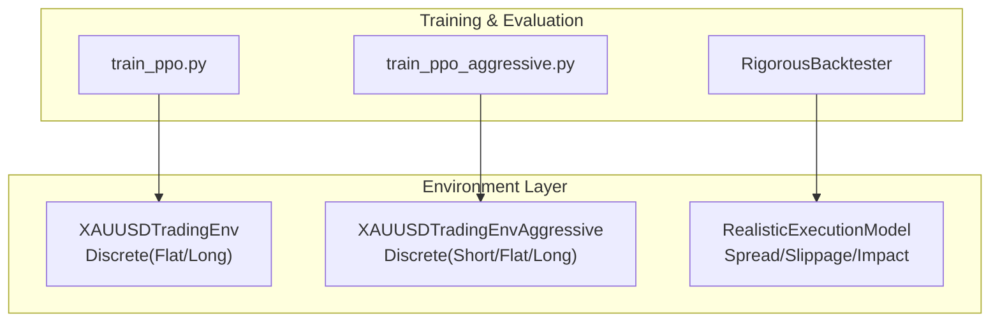
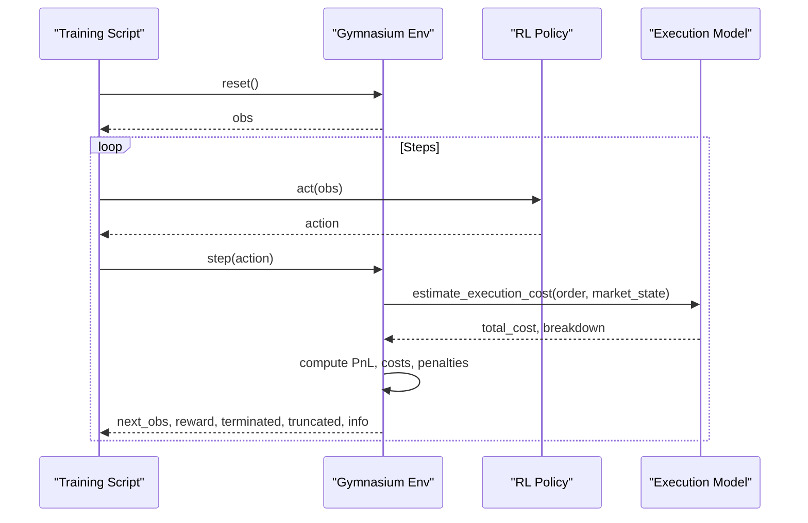
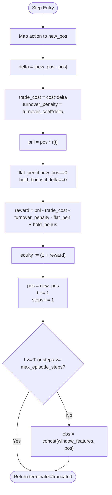
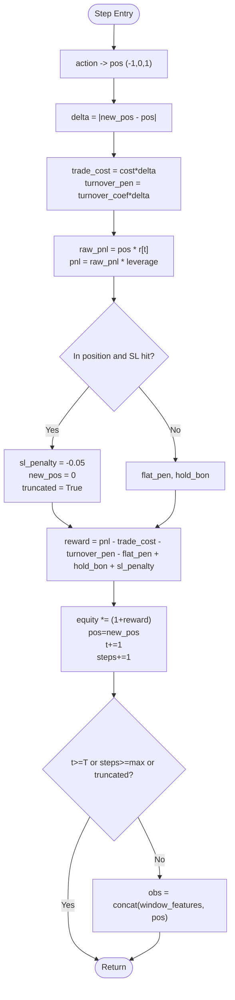
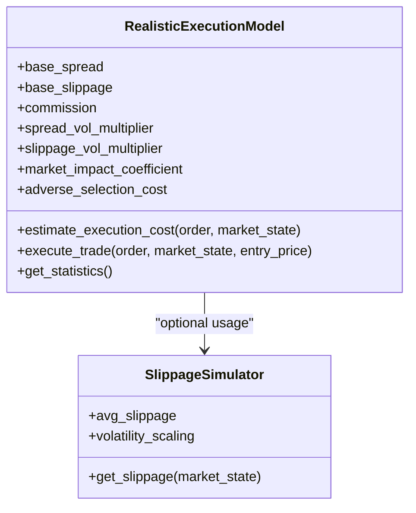
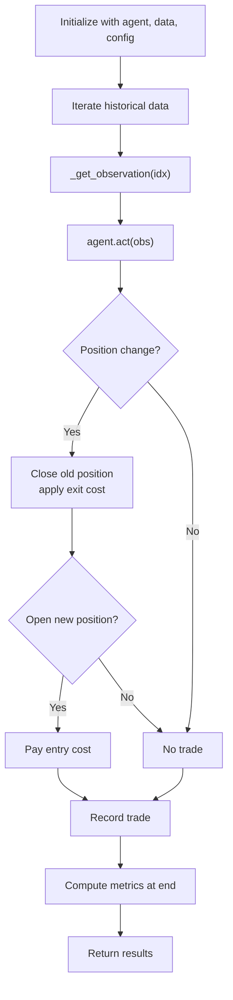
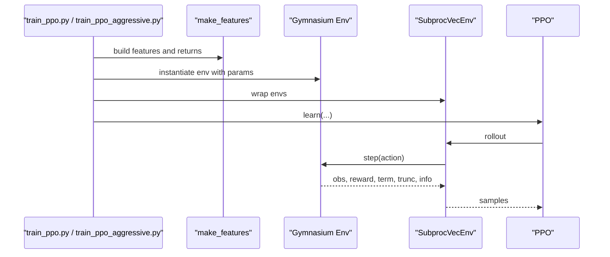
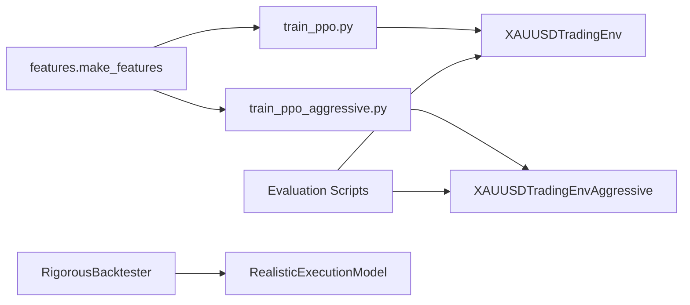

# Trading Environment Architecture

<cite>
**Referenced Files in This Document**
- [xauusd_env.py](file://env/xauusd_env.py)
- [xauusd_env_aggressive.py](file://env/xauusd_env_aggressive.py)
- [realistic_execution.py](file://env/realistic_execution.py)
- [backtest_engine.py](file://backtest/backtest_engine.py)
- [train_ppo.py](file://train/train_ppo.py)
- [train_ppo_aggressive.py](file://train/train_ppo_aggressive.py)
- [README.md](file://README.md)
</cite>

## Table of Contents
1. [Introduction](#introduction)
2. [Project Structure](#project-structure)
3. [Core Components](#core-components)
4. [Architecture Overview](#architecture-overview)
5. [Detailed Component Analysis](#detailed-component-analysis)
6. [Dependency Analysis](#dependency-analysis)
7. [Performance Considerations](#performance-considerations)
8. [Troubleshooting Guide](#troubleshooting-guide)
9. [Conclusion](#conclusion)

## Introduction
This document describes the Gymnasium-compatible trading environment system that standardizes reinforcement learning interactions for XAUUSD trading strategies. It covers:
- Discrete action spaces (flat/long and smart aggressive with short/flat/long)
- Observation space construction using windowed feature matrices plus current position
- Reward architecture combining PnL, transaction costs, turnover penalties, flat penalties, stability bonuses, and stop-loss penalties
- State management including position tracking, equity compounding, and episode termination conditions
- A realistic execution layer modeling spread widening, slippage, commissions, market impact, adverse selection, and event-driven cost spikes
- Configuration options for different trading styles (conservative vs aggressive)
- How the environment abstracts market complexity into a clean RL interface

## Project Structure
The trading environment lives under env/, with two Gymnasium environments and an execution model. Training scripts demonstrate how to configure and run each environment. A backtesting engine provides additional realistic cost assumptions and metrics.

**Diagram sources**
- [xauusd_env.py:7-57](file://env/xauusd_env.py#L7-L57)
- [xauusd_env_aggressive.py:6-64](file://env/xauusd_env_aggressive.py#L6-L64)
- [realistic_execution.py:24-86](file://env/realistic_execution.py#L24-L86)
- [train_ppo.py:25-44](file://train/train_ppo.py#L25-L44)
- [train_ppo_aggressive.py:25-48](file://train/train_ppo_aggressive.py#L25-L48)
- [backtest_engine.py:24-71](file://backtest/backtest_engine.py#L24-L71)

**Section sources**
- [README.md:418-470](file://README.md#L418-L470)

## Core Components
- XAUUSDTradingEnv: A discrete long-only environment with actions Flat/Long, windowed observations, and a reward that includes PnL, trade costs, turnover penalty, flat penalty, and hold bonus.
- XAUUSDTradingEnvAggressive: A “smart aggressive” environment supporting Short/Flat/Long, wider observation windows, leverage, and stop-loss truncation.
- RealisticExecutionModel: A module estimating execution costs (spread, slippage, commission, market impact, adverse selection) and adjusting fill prices accordingly.
- RigorousBacktester: A backtesting framework applying conservative cost assumptions and computing comprehensive performance metrics.

Key responsibilities:
- Standardize RL interaction via reset(), step(), and info dictionaries
- Provide consistent observation shapes across strategies
- Encapsulate realistic costs and risk controls
- Expose configuration knobs for trading style tuning

**Section sources**
- [xauusd_env.py:7-118](file://env/xauusd_env.py#L7-L118)
- [xauusd_env_aggressive.py:6-144](file://env/xauusd_env_aggressive.py#L6-L144)
- [realistic_execution.py:24-229](file://env/realistic_execution.py#L24-L229)
- [backtest_engine.py:24-254](file://backtest/backtest_engine.py#L24-L254)

## Architecture Overview
The system exposes a clean Gymnasium interface while hiding market complexity behind well-defined state transitions and rewards. Training scripts instantiate environments with strategy-specific parameters and train policies that output discrete actions. The execution model can be used during evaluation or integrated into custom environments to simulate realistic fills.

**Diagram sources**
- [train_ppo.py:25-44](file://train/train_ppo.py#L25-L44)
- [train_ppo_aggressive.py:25-48](file://train/train_ppo_aggressive.py#L25-L48)
- [xauusd_env.py:70-118](file://env/xauusd_env.py#L70-L118)
- [xauusd_env_aggressive.py:81-144](file://env/xauusd_env_aggressive.py#L81-L144)
- [realistic_execution.py:88-199](file://env/realistic_execution.py#L88-L199)

## Detailed Component Analysis

### XAUUSDTradingEnv (Conservative, Long-Only)
- Action space: Discrete {0=Flat, 1=Long}
- Observation space: Box of shape (window * features + 1), where the last element is the current position
- State variables: time index t, position pos ∈ {0,1}, steps, equity
- Reward components:
  - PnL from previous position over current return
  - Trade cost proportional to position change
  - Turnover penalty proportional to position change
  - Flat penalty when new position is 0
  - Hold bonus when no position change
- Equity updates multiplicatively by (1 + reward)
- Episode termination: natural end at T or truncation after max_episode_steps

**Diagram sources**
- [xauusd_env.py:75-118](file://env/xauusd_env.py#L75-L118)

**Section sources**
- [xauusd_env.py:21-68](file://env/xauusd_env.py#L21-L68)
- [xauusd_env.py:70-118](file://env/xauusd_env.py#L70-L118)

### XAUUSDTradingEnvAggressive (Smart Aggressive)
- Action space: Discrete {0=Short, 1=Flat, 2=Long} mapped to positions {-1, 0, 1}
- Observation space: Box of shape (window * features + 1), last element is current position
- Additional state: entry_price (virtual), leverage, stop_loss_pct
- Reward components:
  - PnL scaled by leverage
  - Trade cost and optional turnover penalty
  - Optional flat penalty and hold bonus
  - Stop-loss penalty and forced close with truncation when SL hit
- Episode termination: natural end at T, truncation on SL hit or max_episode_steps

**Diagram sources**
- [xauusd_env_aggressive.py:86-144](file://env/xauusd_env_aggressive.py#L86-L144)

**Section sources**
- [xauusd_env_aggressive.py:20-79](file://env/xauusd_env_aggressive.py#L20-L79)
- [xauusd_env_aggressive.py:81-144](file://env/xauusd_env_aggressive.py#L81-L144)

### Realistic Execution Model
- Models spread widening under volatility and events
- Adds slippage with volatility scaling and order-type effects
- Includes commission, market impact for large orders, and adverse selection
- Provides statistics tracking and per-trade cost breakdowns
- Adjusts fill price based on side and total cost

**Diagram sources**
- [realistic_execution.py:24-229](file://env/realistic_execution.py#L24-L229)
- [realistic_execution.py:232-275](file://env/realistic_execution.py#L232-L275)

**Section sources**
- [realistic_execution.py:35-86](file://env/realistic_execution.py#L35-L86)
- [realistic_execution.py:88-199](file://env/realistic_execution.py#L88-L199)
- [realistic_execution.py:211-229](file://env/realistic_execution.py#L211-L229)

### Backtesting Engine
- Applies conservative cost assumptions (spread multiplier, slippage, commission)
- Tracks trades, equity curve, and computes comprehensive metrics (returns, drawdown, Sharpe, Sortino, Calmar, win rate, profit factor)
- Supports walk-forward validation for robust evaluation

**Diagram sources**
- [backtest_engine.py:73-146](file://backtest/backtest_engine.py#L73-L146)
- [backtest_engine.py:202-254](file://backtest/backtest_engine.py#L202-L254)

**Section sources**
- [backtest_engine.py:32-71](file://backtest/backtest_engine.py#L32-L71)
- [backtest_engine.py:73-146](file://backtest/backtest_engine.py#L73-L146)
- [backtest_engine.py:219-254](file://backtest/backtest_engine.py#L219-L254)

### Training Integration
- Conservative training uses XAUUSDTradingEnv with a moderate window and explicit cost parameterization
- Aggressive training uses XAUUSDTradingEnvAggressive with a longer window, macro-aware features, and configurable leverage/SL
- Both use parallel environments and save checkpoints periodically

**Diagram sources**
- [train_ppo.py:25-44](file://train/train_ppo.py#L25-L44)
- [train_ppo_aggressive.py:25-48](file://train/train_ppo_aggressive.py#L25-L48)

**Section sources**
- [train_ppo.py:25-93](file://train/train_ppo.py#L25-L93)
- [train_ppo_aggressive.py:25-124](file://train/train_ppo_aggressive.py#L25-L124)

## Dependency Analysis
- Training scripts depend on feature generation and environment instantiation
- Environments are independent of models; they expose standardized interfaces
- Execution model is decoupled and can be used in evaluation or extended into environments
- Backtester depends on agent interface and data; it does not require the RL environment directly

**Diagram sources**
- [train_ppo.py:8-9](file://train/train_ppo.py#L8-L9)
- [train_ppo_aggressive.py:8-9](file://train/train_ppo_aggressive.py#L8-L9)
- [backtest_engine.py:24-71](file://backtest/backtest_engine.py#L24-L71)

**Section sources**
- [train_ppo.py:8-44](file://train/train_ppo.py#L8-L44)
- [train_ppo_aggressive.py:8-48](file://train/train_ppo_aggressive.py#L8-L48)
- [backtest_engine.py:24-71](file://backtest/backtest_engine.py#L24-L71)

## Performance Considerations
- Window size affects memory and temporal context; larger windows provide more history but increase observation dimensionality
- Leverage amplifies both returns and risks; ensure stop-loss and truncation logic align with risk tolerance
- Transaction cost modeling should match expected live conditions; underestimating costs leads to overfitting in simulation
- Parallel environment count balances throughput and resource constraints
- Use conservative backtest assumptions to avoid optimistic bias

[No sources needed since this section provides general guidance]

## Troubleshooting Guide
- Observation shape mismatch: Ensure features matrix has correct dimensions and window slicing indices are valid
- Unexpected truncation: Check stop-loss thresholds and max_episode_steps settings in aggressive mode
- Low reward variance: Tune turnover penalty, flat penalty, and hold bonus to encourage meaningful exploration
- Execution cost discrepancies: Validate market_state inputs (volatility, spread, liquidity, event flags) passed to execution model
- Training instability: Reduce learning rate, adjust batch size, or reduce n_steps per update

**Section sources**
- [xauusd_env.py:49-68](file://env/xauusd_env.py#L49-L68)
- [xauusd_env_aggressive.py:55-79](file://env/xauusd_env_aggressive.py#L55-L79)
- [realistic_execution.py:88-199](file://env/realistic_execution.py#L88-L199)

## Conclusion
The trading environment system provides a clean, Gymnasium-standard interface for RL-based XAUUSD trading strategies. It offers two distinct environments:
- A conservative, long-only setup with explicit cost and stability incentives
- An aggressive, multi-directional setup with leverage and stop-loss safeguards

Both share consistent observation and state management patterns, enabling direct comparison across strategies. The realistic execution model adds practical cost realism for evaluation and deployment readiness. Configuration knobs allow tailoring behavior to different trading styles while keeping the RL interface stable and predictable.

[No sources needed since this section summarizes without analyzing specific files]