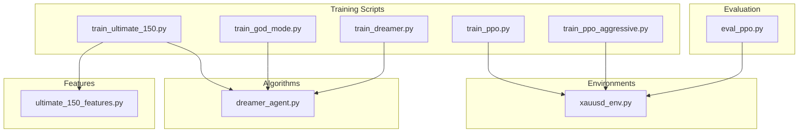
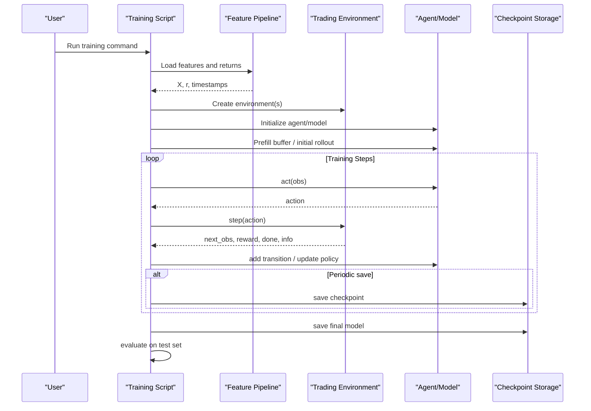
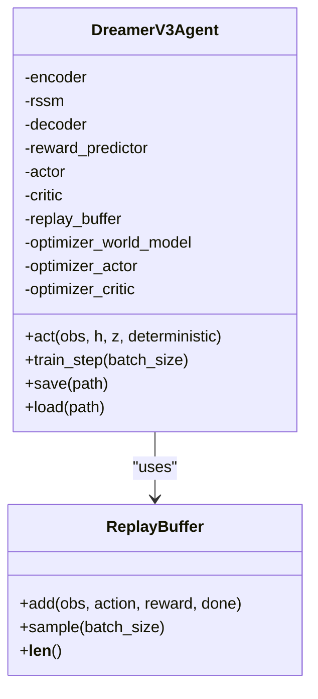
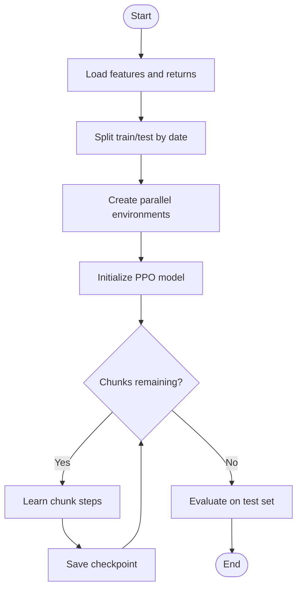
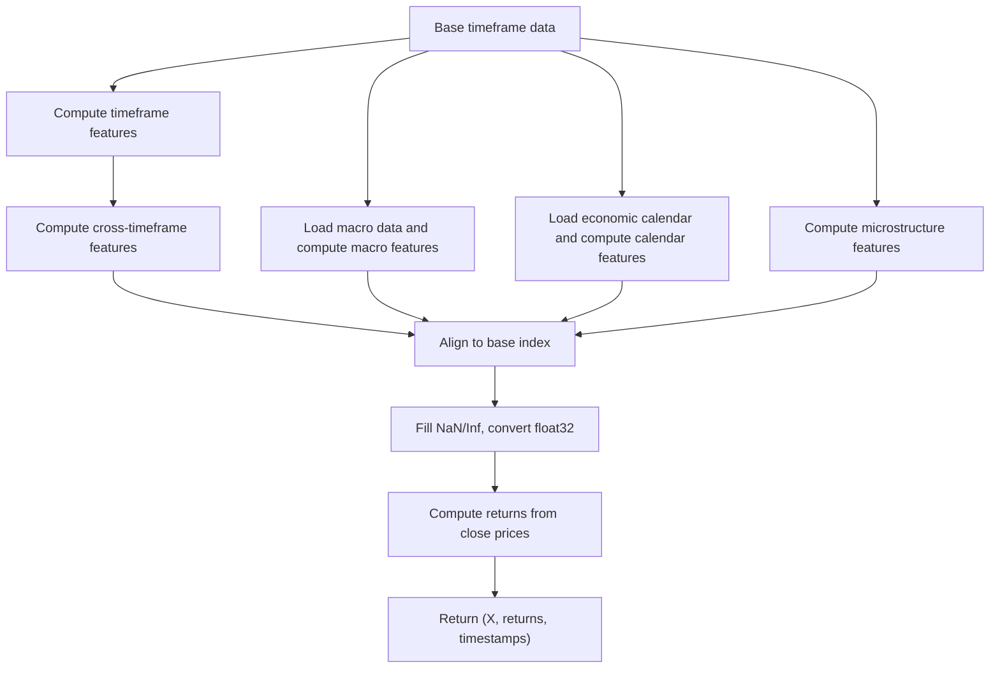
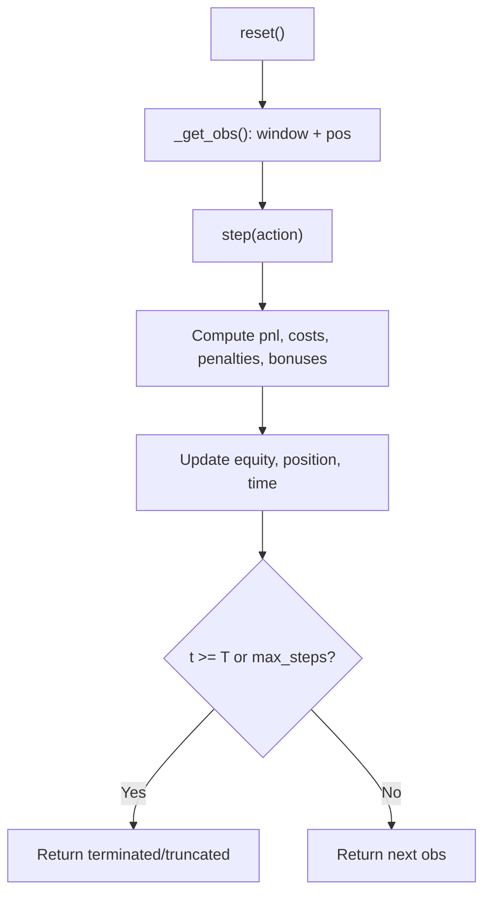
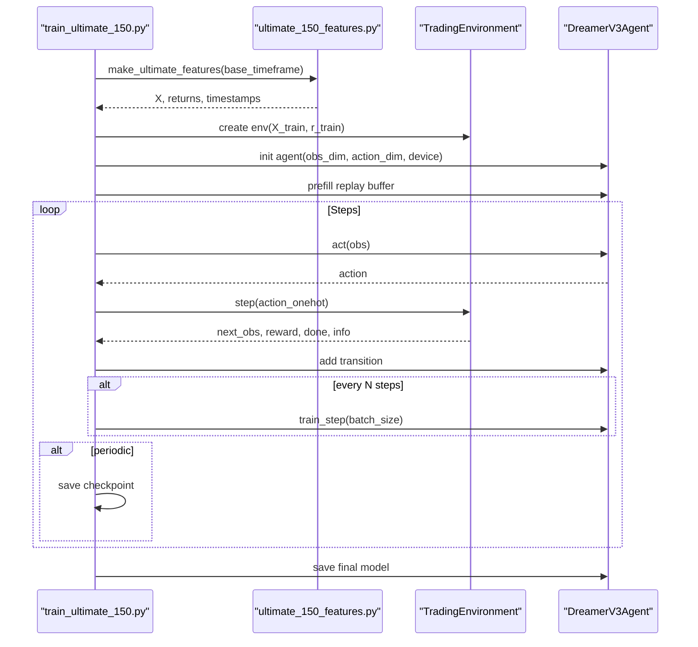
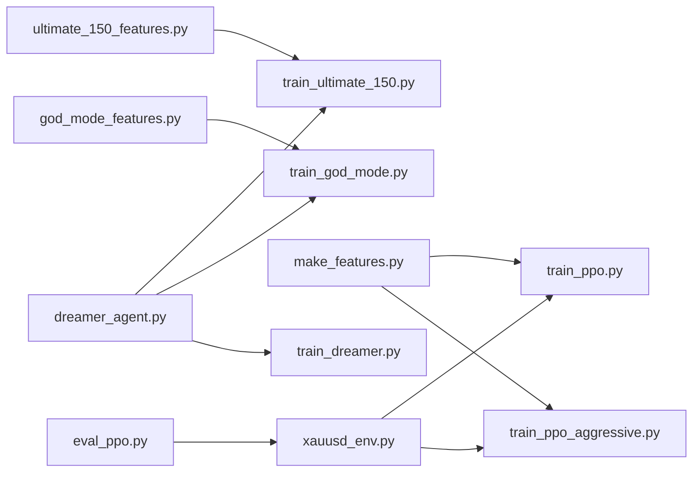

# Training Pipeline Architecture

<cite>
**Referenced Files in This Document**
- [README.md](file://README.md)
- [train/train_ultimate_150.py](file://train/train_ultimate_150.py)
- [train/train_god_mode.py](file://train/train_god_mode.py)
- [train/train_dreamer.py](file://train/train_dreamer.py)
- [train/train_ppo.py](file://train/train_ppo.py)
- [train/train_ppo_aggressive.py](file://train/train_ppo_aggressive.py)
- [models/dreamer_agent.py](file://models/dreamer_agent.py)
- [features/ultimate_150_features.py](file://features/ultimate_150_features.py)
- [env/xauusd_env.py](file://env/xauusd_env.py)
- [eval/eval_ppo.py](file://eval/eval_ppo.py)
</cite>

## Table of Contents
1. Introduction
2. Project Structure
3. Core Components
4. Architecture Overview
5. Detailed Component Analysis
6. Dependency Analysis
7. Performance Considerations
8. Troubleshooting Guide
9. Conclusion
10. Appendices

## Introduction
This document describes the training pipeline architecture that orchestrates model training across multiple algorithms (PPO and DreamerV3) and feature sets (Ultimate 150+, God Mode, standard). It explains the standardized training interface used by each strategy, the hyperparameter configuration approach, checkpoint management, experiment tracking via logs, distributed training with parallel environments, GPU acceleration options, validation loops to prevent overfitting and monitor convergence, and monitoring/logging infrastructure for visualization.

The system supports switching between strategies:
- Ultimate 150: maximum feature set (timeframes, macro, calendar, microstructure)
- God Mode: integrated multi-timeframe + macro features
- PPO: stable baseline using Stable-Baselines3
- Dreamer: world-model-based RL with imagination and actor-critic training

## Project Structure
At a high level:
- train/: entry points per strategy (Dreamer variants and PPO variants)
- models/: algorithm implementations (DreamerV3 agent and components)
- features/: feature engineering pipelines producing observation vectors
- env/: trading environments implementing Gym-style interfaces
- eval/: evaluation scripts for post-training analysis

**Diagram sources**
- [train/train_ultimate_150.py:1-331](file://train/train_ultimate_150.py#L1-L331)
- [train/train_god_mode.py:1-393](file://train/train_god_mode.py#L1-L393)
- [train/train_dreamer.py:1-331](file://train/train_dreamer.py#L1-L331)
- [train/train_ppo.py:1-93](file://train/train_ppo.py#L1-L93)
- [train/train_ppo_aggressive.py:1-124](file://train/train_ppo_aggressive.py#L1-L124)
- [models/dreamer_agent.py:1-460](file://models/dreamer_agent.py#L1-L460)
- [features/ultimate_150_features.py:1-294](file://features/ultimate_150_features.py#L1-L294)
- [env/xauusd_env.py:1-118](file://env/xauusd_env.py#L1-L118)
- [eval/eval_ppo.py:1-94](file://eval/eval_ppo.py#L1-L94)

**Section sources**
- [README.md:418-471](file://README.md#L418-L471)

## Core Components
- Standardized training loop pattern:
  - Load features and returns
  - Split into train/test by date
  - Build environment(s)
  - Initialize agent/model
  - Prefill replay buffer or collect initial rollouts
  - Iterate steps: act, step env, store transitions, periodic training updates
  - Save checkpoints periodically and final model
  - Evaluate on test set

- Feature systems:
  - Ultimate 150+: combines timeframe, cross-timeframe, macro, calendar, microstructure features into a unified observation vector
  - God Mode: integrates multi-timeframe and macro features for richer context

- Environments:
  - Gymnasium-based discrete long-only environment with cost-aware rewards and optional truncation
  - Custom lightweight environments for Dreamer scripts returning flat numpy arrays

- Algorithms:
  - PPO via Stable-Baselines3 with parallel environments for sample efficiency
  - DreamerV3 agent with world model learning, reward prediction, and actor-critic trained in imagined trajectories

**Section sources**
- [train/train_ultimate_150.py:154-331](file://train/train_ultimate_150.py#L154-L331)
- [train/train_god_mode.py:134-393](file://train/train_god_mode.py#L134-L393)
- [train/train_dreamer.py:128-331](file://train/train_dreamer.py#L128-L331)
- [train/train_ppo.py:25-93](file://train/train_ppo.py#L25-L93)
- [train/train_ppo_aggressive.py:25-124](file://train/train_ppo_aggressive.py#L25-L124)
- [features/ultimate_150_features.py:27-226](file://features/ultimate_150_features.py#L27-L226)
- [env/xauusd_env.py:7-118](file://env/xauusd_env.py#L7-L118)
- [models/dreamer_agent.py:84-460](file://models/dreamer_agent.py#L84-L460)

## Architecture Overview
The training pipeline abstracts algorithm-specific details behind a consistent workflow while allowing customization through configuration flags and environment parameters.

**Diagram sources**
- [train/train_ultimate_150.py:172-331](file://train/train_ultimate_150.py#L172-L331)
- [train/train_god_mode.py:182-393](file://train/train_god_mode.py#L182-L393)
- [train/train_dreamer.py:168-331](file://train/train_dreamer.py#L168-L331)
- [train/train_ppo.py:28-93](file://train/train_ppo.py#L28-L93)
- [models/dreamer_agent.py:148-460](file://models/dreamer_agent.py#L148-L460)

## Detailed Component Analysis

### DreamerV3 Agent
The DreamerV3 agent implements:
- World model learning: encoder, RSSM dynamics, decoder reconstruction, reward predictor
- Actor-critic training in imagined trajectories
- Replay buffer for sequence sampling
- Checkpointing and loading

**Diagram sources**
- [models/dreamer_agent.py:24-82](file://models/dreamer_agent.py#L24-L82)
- [models/dreamer_agent.py:84-460](file://models/dreamer_agent.py#L84-L460)

Key behaviors:
- Act: encode observation, update latent state via RSSM, sample action from actor
- Train step: optimize world model losses (reconstruction, reward prediction, KL), imagine trajectories, optimize value and policy losses
- Checkpoints: save/load all component states and training step counter

**Section sources**
- [models/dreamer_agent.py:148-460](file://models/dreamer_agent.py#L148-L460)

### PPO Training
PPO training uses:
- Parallel environments via SubprocVecEnv for efficient data collection
- Chunked learning schedule with periodic checkpointing
- Simple evaluation on out-of-sample data

**Diagram sources**
- [train/train_ppo.py:25-93](file://train/train_ppo.py#L25-L93)
- [train/train_ppo_aggressive.py:25-124](file://train/train_ppo_aggressive.py#L25-L124)

**Section sources**
- [train/train_ppo.py:25-93](file://train/train_ppo.py#L25-L93)
- [train/train_ppo_aggressive.py:25-124](file://train/train_ppo_aggressive.py#L25-L124)

### Feature Engineering (Ultimate 150+)
The Ultimate 150+ feature system composes:
- Timeframe features across multiple time horizons
- Cross-timeframe interactions
- Macro correlations (DXY, SPX, US10Y, etc.)
- Economic calendar awareness
- Market microstructure signals

It aligns all feature sets to a base index, cleans NaN/inf values, computes target returns, and outputs a unified feature matrix ready for training.

**Diagram sources**
- [features/ultimate_150_features.py:27-226](file://features/ultimate_150_features.py#L27-L226)

**Section sources**
- [features/ultimate_150_features.py:27-226](file://features/ultimate_150_features.py#L27-L226)

### Trading Environment
The Gymnasium environment provides:
- Discrete actions (flat/long)
- Cost-aware reward function including trade costs, turnover penalties, flat penalty, and hold bonus
- Observation construction from rolling window of features plus current position
- Episode termination/truncation controls

**Diagram sources**
- [env/xauusd_env.py:7-118](file://env/xauusd_env.py#L7-L118)

**Section sources**
- [env/xauusd_env.py:7-118](file://env/xauusd_env.py#L7-L118)

### Strategy-Specific Pipelines

#### Ultimate 150 Training (DreamerV3)
- Loads Ultimate 150+ features
- Creates custom environment with windowed observations
- Initializes DreamerV3 agent with device auto-detection
- Prefills replay buffer with random exploration
- Trains with periodic updates and saves checkpoints/final model
- Tracks best episode reward

**Diagram sources**
- [train/train_ultimate_150.py:172-331](file://train/train_ultimate_150.py#L172-L331)
- [features/ultimate_150_features.py:27-226](file://features/ultimate_150_features.py#L27-L226)
- [models/dreamer_agent.py:148-460](file://models/dreamer_agent.py#L148-L460)

**Section sources**
- [train/train_ultimate_150.py:154-331](file://train/train_ultimate_150.py#L154-L331)

#### God Mode Training (DreamerV3)
- Uses God Mode features combining multi-timeframe and macro data
- Similar training flow with explicit logging of world model losses
- Includes test set evaluation and metrics reporting

**Section sources**
- [train/train_god_mode.py:134-393](file://train/train_god_mode.py#L134-L393)

#### Standard Dreamer Training
- Simplified environment returning flat numpy arrays
- Auto-detects device (CUDA/MPS/CPU)
- Prefills replay buffer, trains periodically, saves checkpoints/final model
- Evaluates on test set and prints metrics

**Section sources**
- [train/train_dreamer.py:128-331](file://train/train_dreamer.py#L128-L331)

#### PPO Training
- Uses Stable-Baselines3 PPO with parallel environments
- Chunked learning schedule with periodic checkpoints
- Quick evaluation on out-of-sample data

**Section sources**
- [train/train_ppo.py:25-93](file://train/train_ppo.py#L25-L93)
- [train/train_ppo_aggressive.py:25-124](file://train/train_ppo_aggressive.py#L25-L124)

## Dependency Analysis
- Training scripts depend on:
  - Feature modules to produce observation vectors
  - Environment modules to simulate market dynamics
  - Algorithm modules to implement learning logic
- Evaluation depends on trained models and environments for post-training analysis

**Diagram sources**
- [train/train_ultimate_150.py:172-331](file://train/train_ultimate_150.py#L172-L331)
- [train/train_god_mode.py:182-393](file://train/train_god_mode.py#L182-L393)
- [train/train_dreamer.py:168-331](file://train/train_dreamer.py#L168-L331)
- [train/train_ppo.py:28-93](file://train/train_ppo.py#L28-L93)
- [train/train_ppo_aggressive.py:28-124](file://train/train_ppo_aggressive.py#L28-L124)
- [features/ultimate_150_features.py:27-226](file://features/ultimate_150_features.py#L27-L226)
- [env/xauusd_env.py:7-118](file://env/xauusd_env.py#L7-L118)
- [eval/eval_ppo.py:16-94](file://eval/eval_ppo.py#L16-L94)

**Section sources**
- [README.md:418-471](file://README.md#L418-L471)

## Performance Considerations
- Hardware acceleration:
  - CUDA (NVIDIA GPUs) and MPS (Apple Silicon) are supported with auto-detection in training scripts
  - CPU fallback is available but slower
- Distributed training:
  - PPO uses parallel environments via SubprocVecEnv to increase throughput
  - Dreamer training leverages replay buffers and batched updates; scaling can be achieved by increasing batch size and parallelism where supported
- Memory and compute:
  - Ultimate 150+ features increase observation dimensionality; ensure sufficient memory for larger batches
  - Window size affects observation shape and computational load

[No sources needed since this section provides general guidance]

## Troubleshooting Guide
Common issues and resolutions:
- Missing data files:
  - Ensure required CSV files exist (e.g., xauusd_1h_macro.csv) before running God Mode training
  - Verify column names match expectations (time, open, high, low, close, volume, dxy_close, spx_close, us10y_close)
- Device selection:
  - Use --device auto to automatically select CUDA/MPS/CPU based on availability
- Overfitting indicators:
  - Monitor test set performance during/after training; significant drop vs train suggests overfitting
  - Adjust training steps, batch size, or regularization (e.g., KL balance in Dreamer)
- Convergence problems:
  - Tune learning rates and batch sizes
  - Increase prefill steps to improve replay buffer quality
- Logging and visibility:
  - Inspect printed logs for loss breakdowns and episode metrics
  - Use evaluation scripts to compare against baselines (buy-and-hold, moving average)

**Section sources**
- [train/train_god_mode.py:182-209](file://train/train_god_mode.py#L182-L209)
- [train/train_dreamer.py:142-158](file://train/train_dreamer.py#L142-L158)
- [eval/eval_ppo.py:45-94](file://eval/eval_ppo.py#L45-L94)

## Conclusion
The training pipeline provides a flexible, standardized framework for training trading agents across multiple algorithms and feature sets. It balances simplicity (consistent training loops) with flexibility (configurable environments, feature pipelines, and algorithm parameters). The system supports GPU acceleration, parallel environments for PPO, robust checkpointing, and evaluation workflows to validate performance and guard against overfitting.

[No sources needed since this section summarizes without analyzing specific files]

## Appendices

### Hyperparameter Configuration Summary
- DreamerV3:
  - Embedding and hidden dimensions, stochastic dimensions, number of categories
  - Learning rates for world model, actor, critic
  - Discount factor, GAE lambda, imagination horizon
  - Batch size, prefill steps, training frequency, save frequency
- PPO:
  - Number of parallel environments, n_steps, batch size, gamma, learning rate, entropy coefficient
  - Chunked training schedule with periodic checkpoints

**Section sources**
- [models/dreamer_agent.py:91-147](file://models/dreamer_agent.py#L91-L147)
- [train/train_dreamer.py:25-34](file://train/train_dreamer.py#L25-L34)
- [train/train_ppo.py:11-23](file://train/train_ppo.py#L11-L23)
- [train/train_ppo_aggressive.py:11-23](file://train/train_ppo_aggressive.py#L11-L23)

### Monitoring and Logging Infrastructure
- Training scripts log:
  - Feature loading status and shapes
  - Device selection and hardware capabilities
  - Replay buffer fill progress
  - Loss breakdowns (world model, value, policy) at intervals
  - Checkpoint save events and best episode rewards
- Evaluation scripts:
  - Compare model equity curves against baselines
  - Plot positions and equity over time

**Section sources**
- [train/train_ultimate_150.py:163-170](file://train/train_ultimate_150.py#L163-L170)
- [train/train_god_mode.py:164-180](file://train/train_god_mode.py#L164-L180)
- [train/train_dreamer.py:274-281](file://train/train_dreamer.py#L274-L281)
- [eval/eval_ppo.py:64-94](file://eval/eval_ppo.py#L64-L94)