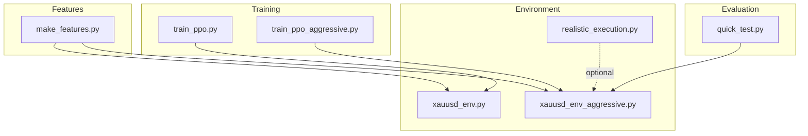
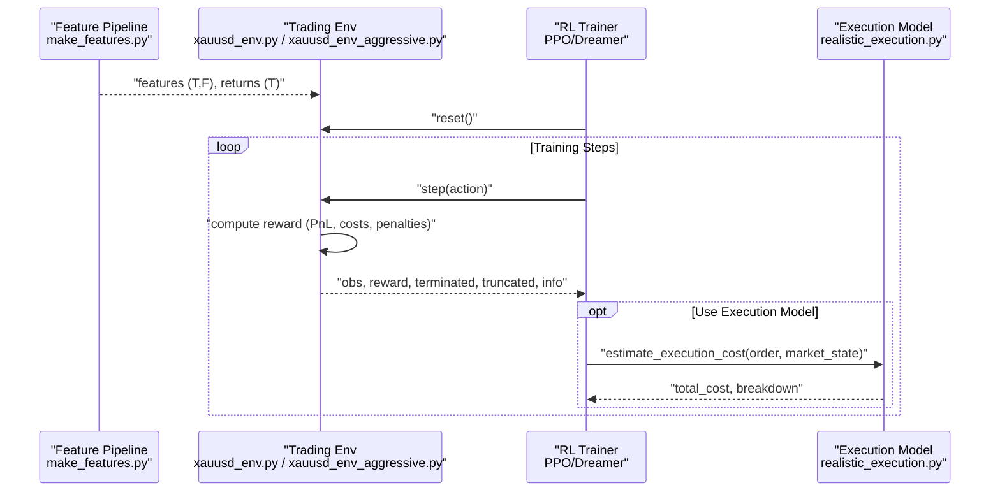
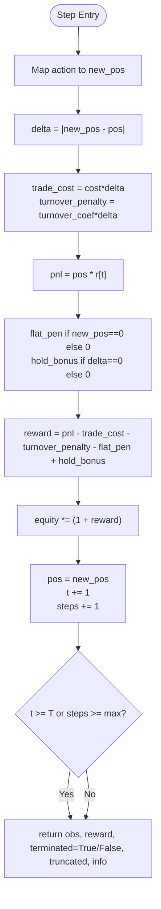
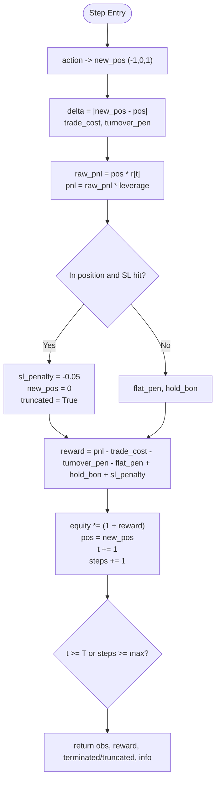
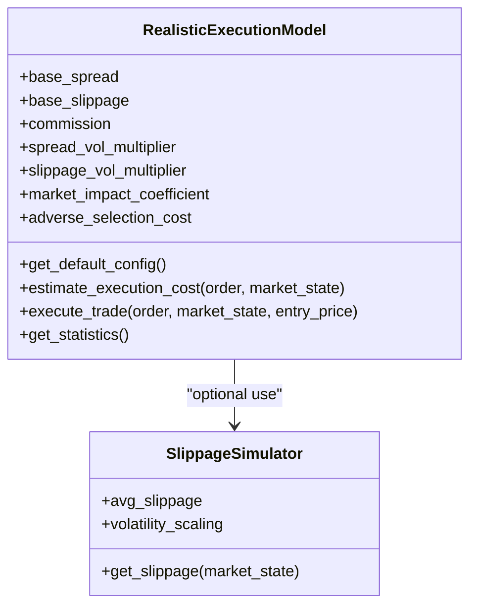
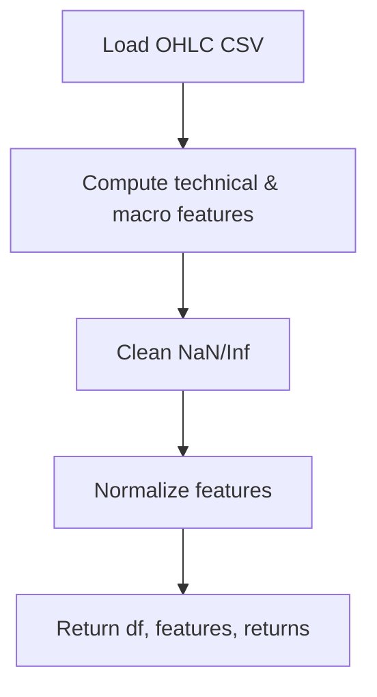
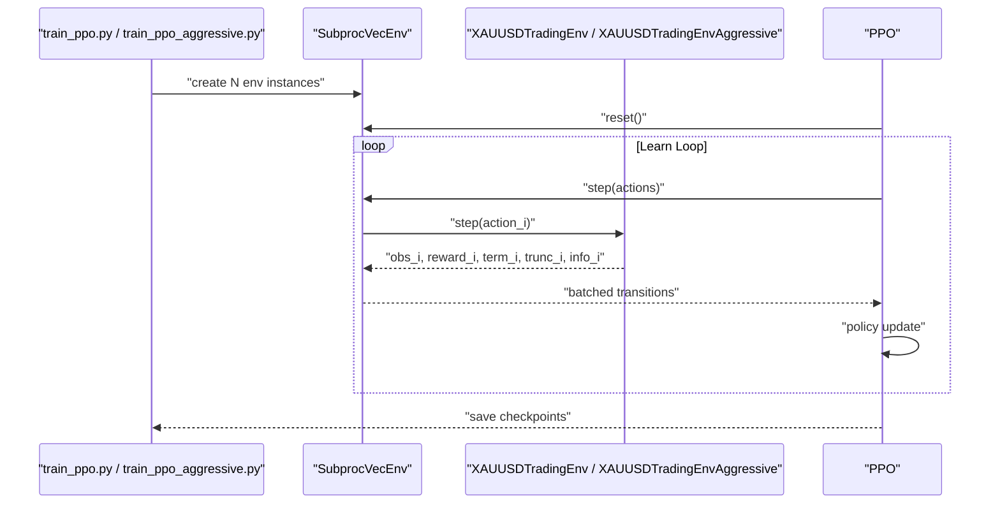
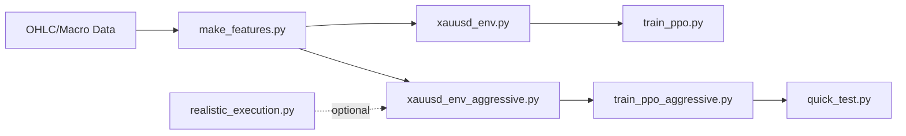

# Trading Environments

<cite>
**Referenced Files in This Document**
- [xauusd_env.py](file://env/xauusd_env.py)
- [xauusd_env_aggressive.py](file://env/xauusd_env_aggressive.py)
- [realistic_execution.py](file://env/realistic_execution.py)
- [make_features.py](file://features/make_features.py)
- [train_ppo.py](file://train/train_ppo.py)
- [train_ppo_aggressive.py](file://train/train_ppo_aggressive.py)
- [quick_test.py](file://eval/quick_test.py)
</cite>

## Table of Contents
1. [Introduction](#introduction)
2. [Project Structure](#project-structure)
3. [Core Components](#core-components)
4. [Architecture Overview](#architecture-overview)
5. [Detailed Component Analysis](#detailed-component-analysis)
6. [Dependency Analysis](#dependency-analysis)
7. [Performance Considerations](#performance-considerations)
8. [Troubleshooting Guide](#troubleshooting-guide)
9. [Conclusion](#conclusion)
10. [Appendices](#appendices)

## Introduction
This document explains the Gymnasium-compatible trading environments for XAUUSD, including:
- Action spaces (flat-only and long/short), observation spaces with windowed temporal context, and reward design that balances profit/loss, turnover penalties, flat penalties, and stability bonuses.
- Realistic cost modeling via a dedicated execution model covering spread, slippage, commissions, market impact, adverse selection, and event-driven volatility effects.
- Differences between standard and aggressive environments, configuration options for risk parameters, and integration with reinforcement learning algorithms such as PPO and Dreamer V3.
- Practical examples for environment initialization, step/reset usage, and creating custom environments.
- Performance guidance for parallel training, memory management for large datasets, and debugging techniques.

## Project Structure
The trading environments live under env/, with feature engineering under features/ and training scripts under train/. Evaluation utilities are under eval/. The key files used by this documentation are listed below.

**Diagram sources**
- [xauusd_env.py:1-118](file://env/xauusd_env.py#L1-L118)
- [xauusd_env_aggressive.py:1-144](file://env/xauusd_env_aggressive.py#L1-L144)
- [realistic_execution.py:1-356](file://env/realistic_execution.py#L1-L356)
- [make_features.py:1-83](file://features/make_features.py#L1-L83)
- [train_ppo.py:1-93](file://train/train_ppo.py#L1-L93)
- [train_ppo_aggressive.py:1-124](file://train/train_ppo_aggressive.py#L1-L124)
- [quick_test.py:1-69](file://eval/quick_test.py#L1-L69)

**Section sources**
- [xauusd_env.py:1-118](file://env/xauusd_env.py#L1-L118)
- [xauusd_env_aggressive.py:1-144](file://env/xauusd_env_aggressive.py#L1-L144)
- [realistic_execution.py:1-356](file://env/realistic_execution.py#L1-L356)
- [make_features.py:1-83](file://features/make_features.py#L1-L83)
- [train_ppo.py:1-93](file://train/train_ppo.py#L1-L93)
- [train_ppo_aggressive.py:1-124](file://train/train_ppo_aggressive.py#L1-L124)
- [quick_test.py:1-69](file://eval/quick_test.py#L1-L69)

## Core Components
- Standard Environment (Long-only): Discrete action space {Flat, Long}, windowed observations, reward includes PnL, trade costs, turnover penalty, flat penalty, and hold bonus.
- Aggressive Environment (Long/Short/Flat): Discrete action space {Short, Flat, Long}, wider observation window, leverage support, stop-loss enforcement, and realistic cost-aware rewards.
- Realistic Execution Model: Estimates spread, slippage, commission, market impact, adverse selection; adjusts fill prices and provides statistics.

Key responsibilities:
- Observation construction from a sliding window of normalized features plus current position.
- Reward shaping to encourage stable, cost-aware trading behavior.
- Integration with RL libraries via Gymnasium API (reset, step, spaces).

**Section sources**
- [xauusd_env.py:7-118](file://env/xauusd_env.py#L7-L118)
- [xauusd_env_aggressive.py:6-144](file://env/xauusd_env_aggressive.py#L6-L144)
- [realistic_execution.py:24-229](file://env/realistic_execution.py#L24-L229)

## Architecture Overview
The environments consume preprocessed features and returns produced by the feature pipeline and expose a Gymnasium interface for RL training. Training scripts wrap environments in parallel vectorized environments for efficient learning.

**Diagram sources**
- [make_features.py:18-83](file://features/make_features.py#L18-L83)
- [xauusd_env.py:65-118](file://env/xauusd_env.py#L65-L118)
- [xauusd_env_aggressive.py:73-144](file://env/xauusd_env_aggressive.py#L73-L144)
- [realistic_execution.py:88-199](file://env/realistic_execution.py#L88-L199)
- [train_ppo.py:34-44](file://train/train_ppo.py#L34-L44)
- [train_ppo_aggressive.py:35-48](file://train/train_ppo_aggressive.py#L35-L48)

## Detailed Component Analysis

### Standard Environment: XAUUSDTradingEnv
- Action Space: Discrete {0=Flat, 1=Long}. Position is applied on the next step to avoid look-ahead bias.
- Observation Space: Box of shape (window * num_features + 1), where the last element encodes current position.
- Reward Function: 
  - PnL from holding previous position over current bar.
  - Trade cost proportional to position change magnitude.
  - Turnover penalty for changing position.
  - Flat penalty to discourage staying out too long.
  - Hold bonus for not changing position to promote stability.
- Episode Control: Terminates at end of data or truncates after max_episode_steps.

**Diagram sources**
- [xauusd_env.py:75-118](file://env/xauusd_env.py#L75-L118)

**Section sources**
- [xauusd_env.py:21-118](file://env/xauusd_env.py#L21-L118)

### Aggressive Environment: XAUUSDTradingEnvAggressive
- Action Space: Discrete {0=Short, 1=Flat, 2=Long}. Maps to positions {-1, 0, 1}.
- Observation Space: Box of shape (window * num_features + 1), with wider default window for longer-term context.
- Reward Function:
  - Leverage-multiplied PnL from previous position.
  - Trade cost and optional turnover penalty.
  - Optional flat penalty and hold bonus.
  - Stop-loss enforcement: hitting SL triggers heavy penalty, forced close, and episode truncation to teach safety.
- Episode Control: Terminates at end of data or truncates after max_episode_steps; SL events also truncate.

**Diagram sources**
- [xauusd_env_aggressive.py:86-144](file://env/xauusd_env_aggressive.py#L86-L144)

**Section sources**
- [xauusd_env_aggressive.py:20-144](file://env/xauusd_env_aggressive.py#L20-L144)

### Realistic Execution Model
- Purpose: Simulate real-world trading costs to prevent overly optimistic backtests.
- Components:
  - Spread: Base spread widened during high volatility and news events.
  - Slippage: Base slippage scaled by volatility and order type; worse during events.
  - Commission: Fixed per trade.
  - Market Impact: Proportional to order size relative to liquidity.
  - Adverse Selection: Additional cost when trading against informed flow.
- Outputs: Fill price adjusted by total cost; detailed cost breakdown; cumulative statistics.

**Diagram sources**
- [realistic_execution.py:24-229](file://env/realistic_execution.py#L24-L229)
- [realistic_execution.py:232-276](file://env/realistic_execution.py#L232-L276)

**Section sources**
- [realistic_execution.py:35-229](file://env/realistic_execution.py#L35-L229)
- [realistic_execution.py:232-276](file://env/realistic_execution.py#L232-L276)

### Feature Pipeline and Data Preparation
- Produces normalized features and log returns from OHLC data, optionally augmented with macro indicators (DXY, SPX, US10Y).
- Cleans NaNs and infinities, then normalizes features using rolling means/std.
- Returns DataFrame, feature matrix, and return series aligned for environment consumption.

**Diagram sources**
- [make_features.py:18-83](file://features/make_features.py#L18-L83)

**Section sources**
- [make_features.py:18-83](file://features/make_features.py#L18-L83)

### Integration with Reinforcement Learning Algorithms
- PPO Training:
  - Uses SubprocVecEnv to run multiple environments in parallel for faster training.
  - Configurable n_steps, batch_size, gamma, learning rate, and entropy coefficient.
  - Saves checkpoints periodically and a “latest” model for convenience.
- Aggressive Macro-Aware Training:
  - Larger windows and more parallel environments for richer context.
  - Demonstrates how to configure leverage and stop-loss parameters in the environment.

**Diagram sources**
- [train_ppo.py:34-67](file://train/train_ppo.py#L34-L67)
- [train_ppo_aggressive.py:35-84](file://train/train_ppo_aggressive.py#L35-L84)

**Section sources**
- [train_ppo.py:25-93](file://train/train_ppo.py#L25-L93)
- [train_ppo_aggressive.py:25-124](file://train/train_ppo_aggressive.py#L25-L124)

## Dependency Analysis
- Features depend on data loading and produce normalized inputs for environments.
- Environments depend on features and optionally integrate with the execution model for realistic cost simulation.
- Training scripts depend on environments and RL libraries (Stable-Baselines3) for policy optimization.
- Evaluation scripts demonstrate running trained policies against test splits.

**Diagram sources**
- [make_features.py:18-83](file://features/make_features.py#L18-L83)
- [xauusd_env.py:21-118](file://env/xauusd_env.py#L21-L118)
- [xauusd_env_aggressive.py:20-144](file://env/xauusd_env_aggressive.py#L20-L144)
- [realistic_execution.py:88-199](file://env/realistic_execution.py#L88-L199)
- [train_ppo.py:34-67](file://train/train_ppo.py#L34-L67)
- [train_ppo_aggressive.py:35-84](file://train/train_ppo_aggressive.py#L35-L84)
- [quick_test.py:19-47](file://eval/quick_test.py#L19-L47)

**Section sources**
- [make_features.py:18-83](file://features/make_features.py#L18-L83)
- [xauusd_env.py:21-118](file://env/xauusd_env.py#L21-L118)
- [xauusd_env_aggressive.py:20-144](file://env/xauusd_env_aggressive.py#L20-L144)
- [realistic_execution.py:88-199](file://env/realistic_execution.py#L88-L199)
- [train_ppo.py:34-67](file://train/train_ppo.py#L34-L67)
- [train_ppo_aggressive.py:35-84](file://train/train_ppo_aggressive.py#L35-L84)
- [quick_test.py:19-47](file://eval/quick_test.py#L19-L47)

## Performance Considerations
- Parallel Environment Execution:
  - Use SubprocVecEnv to run multiple independent environments concurrently, increasing throughput and stabilizing training.
  - Tune n_steps and batch_size to balance memory and speed.
- Memory Management:
  - Ensure features are float32 and normalized to reduce memory footprint.
  - Avoid unnecessary copies; reuse arrays where possible.
  - For very large datasets, consider chunking or streaming data into windows rather than loading entire histories into memory.
- Reward Scaling:
  - Keep reward magnitudes moderate to improve learning stability.
  - Adjust cost coefficients and penalties to reflect realistic trading conditions without dominating PnL signals.
- Window Size:
  - Wider windows capture more context but increase observation dimensionality and memory usage. Choose based on available resources and strategy horizon.

[No sources needed since this section provides general guidance]

## Troubleshooting Guide
Common issues and remedies:
- Shape Mismatch Errors:
  - Ensure features.ndim == 2 and returns.ndim == 1 with matching lengths before initializing environments.
- Look-Ahead Bias:
  - Verify that position changes apply on the next step; do not compute reward using the newly chosen action for the same time step.
- Overfitting to Costs:
  - If turnover penalties or flat penalties dominate, adjust coefficients so PnL remains the primary signal.
- Stop-Loss Truncation:
  - In aggressive mode, frequent truncations due to SL may indicate overly tight stops; tune stop_loss_pct accordingly.
- Slow Training:
  - Increase number of parallel environments (N_ENVS) and adjust batch sizes; ensure GPU/CPU utilization is optimal.
- Debugging Observations:
  - Inspect info dictionary fields (equity, pos, trade_cost, pnl) to validate reward decomposition and state transitions.

**Section sources**
- [xauusd_env.py:33-38](file://env/xauusd_env.py#L33-L38)
- [xauusd_env.py:75-118](file://env/xauusd_env.py#L75-L118)
- [xauusd_env_aggressive.py:36-40](file://env/xauusd_env_aggressive.py#L36-L40)
- [xauusd_env_aggressive.py:86-144](file://env/xauusd_env_aggressive.py#L86-L144)

## Conclusion
The repository provides two Gymnasium-compatible trading environments tailored for XAUUSD:
- A standard long-only environment with conservative reward shaping and modest costs.
- An aggressive long/short environment with leverage, stop-loss enforcement, and realistic cost awareness.
Both integrate seamlessly with RL algorithms like PPO and can be extended with realistic execution models to better approximate live trading conditions. Proper configuration of windows, costs, and penalties yields robust, sample-efficient training while maintaining computational efficiency through parallelization.

[No sources needed since this section summarizes without analyzing specific files]

## Appendices

### Practical Usage Examples

- Initialize Standard Environment:
  - Create features and returns via make_features, then instantiate XAUUSDTradingEnv with desired window, cost_per_trade, and max_episode_steps.
  - Reference: [train_ppo.py:34-44](file://train/train_ppo.py#L34-L44)

- Initialize Aggressive Environment:
  - Use XAUUSDTradingEnvAggressive with window, cost_per_trade, leverage, and stop_loss_pct configured for your strategy.
  - Reference: [train_ppo_aggressive.py:35-48](file://train/train_ppo_aggressive.py#L35-L48)

- Step and Reset:
  - Call reset to start an episode; repeatedly call step with actions from your policy; monitor info for equity, position, and costs.
  - Reference: [train_ppo.py:70-87](file://train/train_ppo.py#L70-L87), [train_ppo_aggressive.py:86-118](file://train/train_ppo_aggressive.py#L86-L118), [quick_test.py:19-47](file://eval/quick_test.py#L19-L47)

- Custom Environment Creation:
  - Extend gym.Env, define observation_space and action_space, implement reset and step with reward logic reflecting your strategy’s goals and constraints.
  - Reference patterns in: [xauusd_env.py:21-118](file://env/xauusd_env.py#L21-L118), [xauusd_env_aggressive.py:20-144](file://env/xauusd_env_aggressive.py#L20-L144)

- Realistic Execution Integration:
  - Use RealisticExecutionModel to estimate costs and adjust fills for orders; incorporate into reward or evaluation pipelines for more accurate backtests.
  - Reference: [realistic_execution.py:88-199](file://env/realistic_execution.py#L88-L199)

**Section sources**
- [train_ppo.py:34-87](file://train/train_ppo.py#L34-L87)
- [train_ppo_aggressive.py:35-118](file://train/train_ppo_aggressive.py#L35-L118)
- [quick_test.py:19-47](file://eval/quick_test.py#L19-L47)
- [xauusd_env.py:21-118](file://env/xauusd_env.py#L21-L118)
- [xauusd_env_aggressive.py:20-144](file://env/xauusd_env_aggressive.py#L20-L144)
- [realistic_execution.py:88-199](file://env/realistic_execution.py#L88-L199)