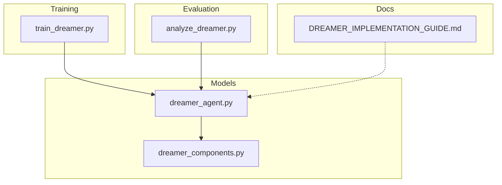
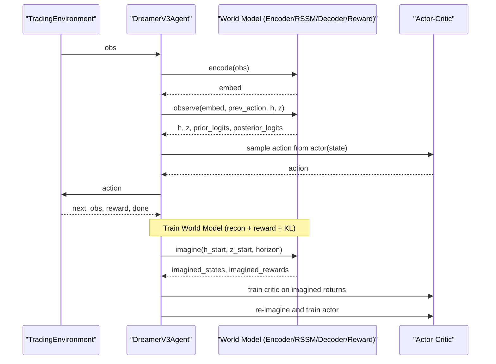
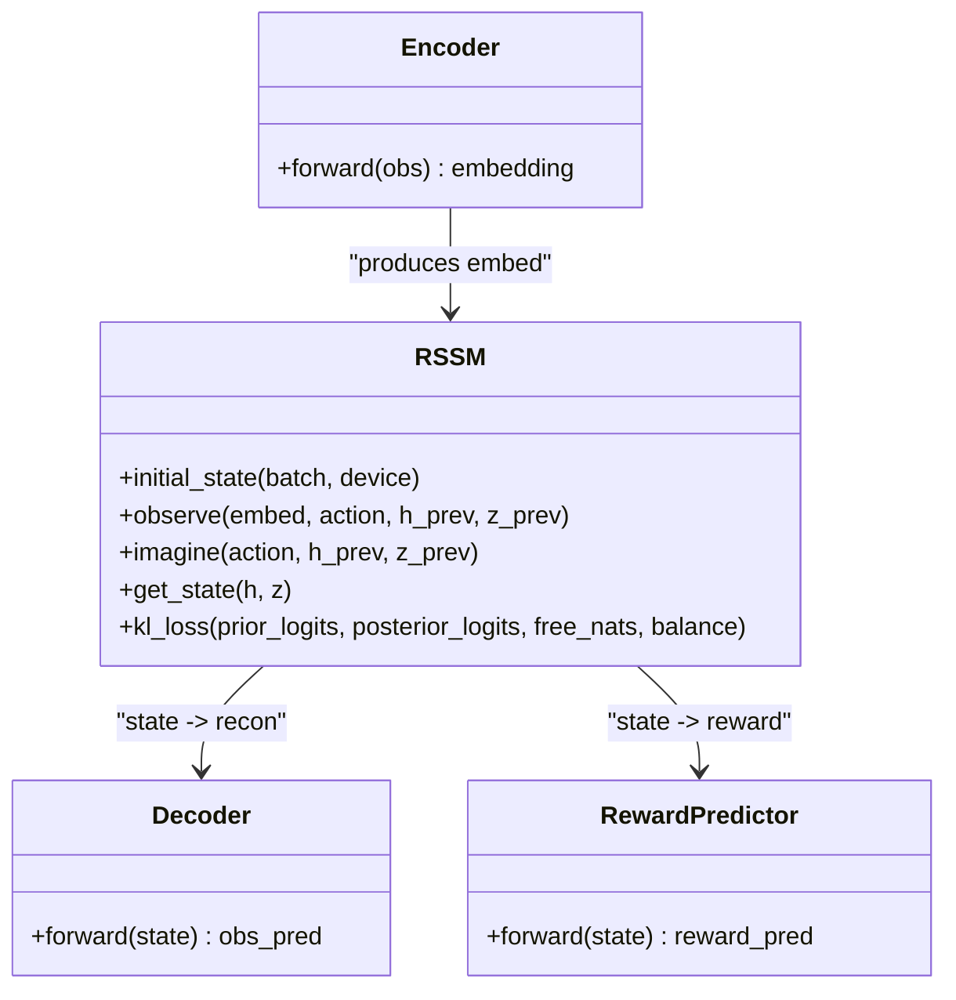
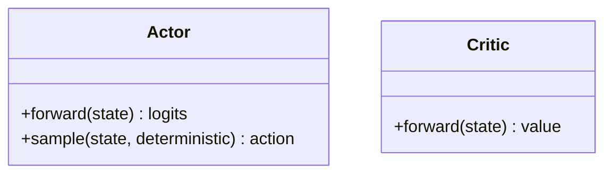
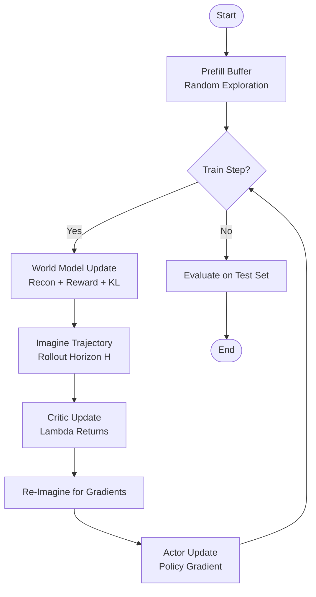
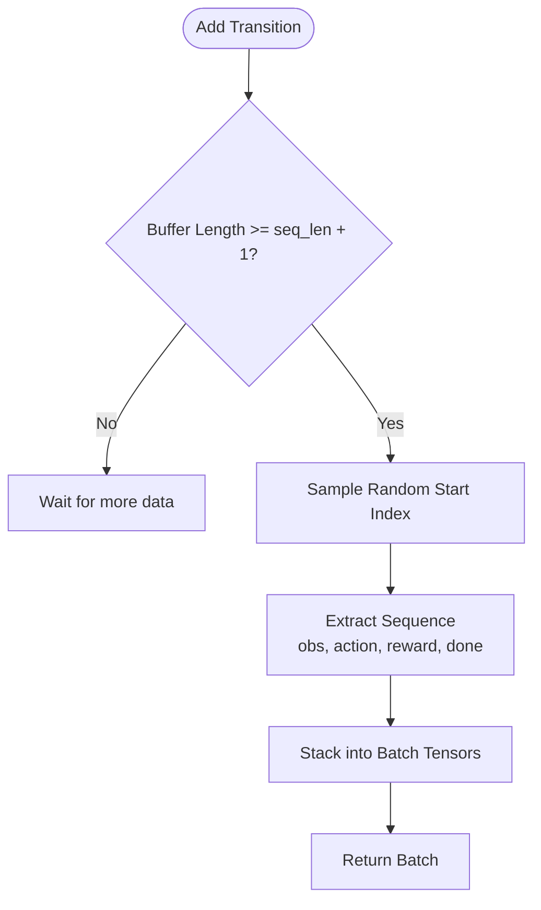
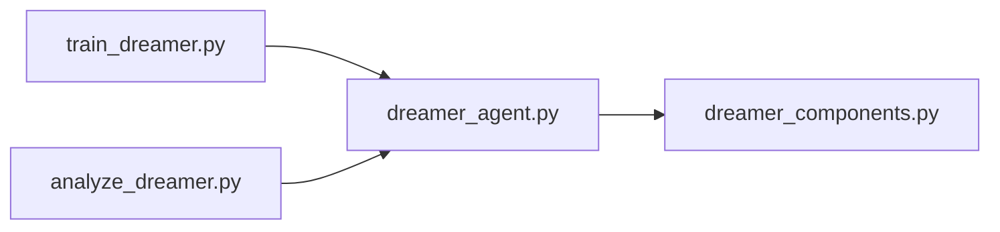

# Dreamer V3 Training

<cite>
**Referenced Files in This Document**
- [dreamer_agent.py](file://models/dreamer_agent.py)
- [dreamer_components.py](file://models/dreamer_components.py)
- [train_dreamer.py](file://train/train_dreamer.py)
- [analyze_dreamer.py](file://eval/analyze_dreamer.py)
- [DREAMER_IMPLEMENTATION_GUIDE.md](file://DREAMER_IMPLEMENTATION_GUIDE.md)
</cite>

## Table of Contents
1. [Introduction](#introduction)
2. [Project Structure](#project-structure)
3. [Core Components](#core-components)
4. [Architecture Overview](#architecture-overview)
5. [Detailed Component Analysis](#detailed-component-analysis)
6. [Dependency Analysis](#dependency-analysis)
7. [Performance Considerations](#performance-considerations)
8. [Troubleshooting Guide](#troubleshooting-guide)
9. [Conclusion](#conclusion)
10. [Appendices](#appendices)

## Introduction
This document explains the Dreamer V3 training pipeline implemented for autonomous trading. It covers the world model architecture (encoder, RSSM, decoder, reward predictor), imagination-based planning for long-term strategy optimization, and actor-critic policy learning. It also documents the training phases (world model pretraining via replay buffer, policy optimization), configuration options (complexity, horizon, rollout parameters), practical execution steps, monitoring and evaluation tools, debugging techniques, and advanced topics such as curriculum learning, domain adaptation, and transfer across market regimes.

## Project Structure
The implementation is organized into:
- Models: core components and agent orchestration
- Training: environment, data loading, and training loop
- Evaluation: diagnostics for reconstruction, reward prediction, latent space, and performance comparison
- Documentation: conceptual guide and usage instructions

**Diagram sources**
- [dreamer_components.py:1-338](file://models/dreamer_components.py#L1-L338)
- [dreamer_agent.py:1-460](file://models/dreamer_agent.py#L1-L460)
- [train_dreamer.py:1-331](file://train/train_dreamer.py#L1-L331)
- [analyze_dreamer.py:1-351](file://eval/analyze_dreamer.py#L1-L351)
- [DREAMER_IMPLEMENTATION_GUIDE.md:1-322](file://DREAMER_IMPLEMENTATION_GUIDE.md#L1-L322)

**Section sources**
- [dreamer_components.py:1-338](file://models/dreamer_components.py#L1-L338)
- [dreamer_agent.py:1-460](file://models/dreamer_agent.py#L1-L460)
- [train_dreamer.py:1-331](file://train/train_dreamer.py#L1-L331)
- [analyze_dreamer.py:1-351](file://eval/analyze_dreamer.py#L1-L351)
- [DREAMER_IMPLEMENTATION_GUIDE.md:1-322](file://DREAMER_IMPLEMENTATION_GUIDE.md#L1-L322)

## Core Components
- Encoder: compresses observations into embeddings with symlog stabilization.
- RSSM (Recurrent State-Space Model): learns market dynamics using a deterministic hidden state and stochastic categorical latent states; supports observe (posterior) and imagine (prior).
- Decoder: reconstructs observations from latent state to validate world model fidelity.
- Reward Predictor: predicts rewards in symlog space for stable training.
- Actor: outputs categorical action distribution over discrete actions (e.g., flat, long, short).
- Critic: estimates value of latent states to support policy improvement.
- ReplayBuffer: stores sequences and samples contiguous windows for training.

Key design choices:
- Symlog/symexp transformations stabilize gradients for large returns and predictions.
- Categorical latent variables improve stability and expressiveness for discrete market regimes.
- KL balancing and free nats prevent posterior collapse.
- Lambda returns combine TD and Monte Carlo signals for robust value estimation.

**Section sources**
- [dreamer_components.py:22-30](file://models/dreamer_components.py#L22-L30)
- [dreamer_components.py:71-90](file://models/dreamer_components.py#L71-L90)
- [dreamer_components.py:92-206](file://models/dreamer_components.py#L92-L206)
- [dreamer_components.py:208-295](file://models/dreamer_components.py#L208-L295)
- [dreamer_agent.py:24-82](file://models/dreamer_agent.py#L24-L82)

## Architecture Overview
Dreamer V3 alternates between learning a world model and optimizing a policy via imagination:
- World Model Learning: encoder → RSSM → decoder/reward predictor losses; KL regularization on prior vs posterior.
- Imagination: start from recent latent states, roll out policy in the learned world model for a fixed horizon, collect imagined states and rewards.
- Policy Optimization: train critic on imagined trajectories using lambda returns; re-imagine and train actor to maximize expected return.

**Diagram sources**
- [dreamer_agent.py:190-304](file://models/dreamer_agent.py#L190-L304)
- [dreamer_agent.py:306-403](file://models/dreamer_agent.py#L306-L403)
- [dreamer_components.py:92-206](file://models/dreamer_components.py#L92-L206)

**Section sources**
- [dreamer_agent.py:190-403](file://models/dreamer_agent.py#L190-L403)
- [dreamer_components.py:92-206](file://models/dreamer_components.py#L92-L206)

## Detailed Component Analysis

### World Model: Encoder, RSSM, Decoder, Reward Predictor
- Encoder applies symlog to inputs and maps to embedding space.
- RSSM maintains:
  - Deterministic hidden state h_t updated by GRU with previous stochastic state and action.
  - Stochastic categorical latent state z_t sampled from posterior during observe and prior during imagine.
  - KL loss with free nats and balancing to avoid posterior collapse.
- Decoder reconstructs observations from concatenated latent state.
- Reward Predictor outputs symlog-transformed reward estimates.

**Diagram sources**
- [dreamer_components.py:71-90](file://models/dreamer_components.py#L71-L90)
- [dreamer_components.py:92-206](file://models/dreamer_components.py#L92-L206)
- [dreamer_components.py:208-244](file://models/dreamer_components.py#L208-L244)

**Section sources**
- [dreamer_components.py:71-244](file://models/dreamer_components.py#L71-L244)

### Actor and Critic
- Actor outputs logits over discrete actions; sampling supports exploration or greedy selection.
- Critic estimates values in symlog space; used to compute lambda returns and advantages for policy gradient updates.

**Diagram sources**
- [dreamer_components.py:246-295](file://models/dreamer_components.py#L246-L295)

**Section sources**
- [dreamer_components.py:246-295](file://models/dreamer_components.py#L246-L295)

### Training Loop and Phases
- Phase 1: Prefill replay buffer with random exploration to gather diverse experiences.
- Phase 2: Alternating updates:
  - World Model: minimize reconstruction, reward prediction, and KL divergence losses.
  - Imagination: roll out policy in world model for a fixed horizon to generate imagined trajectories.
  - Critic: train on imagined returns using lambda returns.
  - Actor: re-imagine and optimize policy via REINFORCE-style loss with baseline.
- Phase 3: Evaluation on test set to measure equity growth and trading statistics.

**Diagram sources**
- [train_dreamer.py:210-292](file://train/train_dreamer.py#L210-L292)
- [dreamer_agent.py:190-304](file://models/dreamer_agent.py#L190-L304)
- [dreamer_agent.py:306-403](file://models/dreamer_agent.py#L306-L403)

**Section sources**
- [train_dreamer.py:210-292](file://train/train_dreamer.py#L210-L292)
- [dreamer_agent.py:190-403](file://models/dreamer_agent.py#L190-L403)

### Experience Replay Buffer Management
- Stores transitions (obs, action, reward, done) in a deque with capacity and sequence length.
- Samples contiguous sequences of fixed length for efficient batch training.
- Ensures sufficient history before sampling to support sequence modeling.

**Diagram sources**
- [dreamer_agent.py:24-82](file://models/dreamer_agent.py#L24-L82)

**Section sources**
- [dreamer_agent.py:24-82](file://models/dreamer_agent.py#L24-L82)

## Dependency Analysis
- dreamer_agent.py depends on dreamer_components.py for all neural modules and utilities.
- train_dreamer.py orchestrates environment interaction, data loading, and training loop, importing the agent and feature generation utilities.
- analyze_dreamer.py loads trained checkpoints and performs diagnostics using the agent’s encoder, RSSM, decoder, and reward predictor.

**Diagram sources**
- [train_dreamer.py:1-331](file://train/train_dreamer.py#L1-L331)
- [dreamer_agent.py:1-460](file://models/dreamer_agent.py#L1-L460)
- [dreamer_components.py:1-338](file://models/dreamer_components.py#L1-L338)
- [analyze_dreamer.py:1-351](file://eval/analyze_dreamer.py#L1-L351)

**Section sources**
- [train_dreamer.py:1-331](file://train/train_dreamer.py#L1-L331)
- [dreamer_agent.py:1-460](file://models/dreamer_agent.py#L1-L460)
- [dreamer_components.py:1-338](file://models/dreamer_components.py#L1-L338)
- [analyze_dreamer.py:1-351](file://eval/analyze_dreamer.py#L1-L351)

## Performance Considerations
- Memory:
  - Increase batch size cautiously; reduce hidden/embed dimensions if out-of-memory occurs.
  - Replay buffer capacity influences memory footprint; adjust based on available RAM/GPU memory.
- Stability:
  - Use symlog/symexp for rewards and predictions to mitigate exploding gradients.
  - Apply gradient clipping to world model and actor/critic networks.
- Planning Horizon:
  - Longer horizons improve lookahead but increase computation and potential error accumulation.
  - Tune gamma and lambda to balance long-term credit assignment.
- Data Quality:
  - Ensure clean features and returns; handle NaNs/Infs before feeding into models.

[No sources needed since this section provides general guidance]

## Troubleshooting Guide
Common issues and remedies specific to Dreamer V3:
- World Model Collapse:
  - Symptoms: KL loss too low, posterior collapses to prior, poor reconstruction.
  - Remedies: Adjust free_nats and kl_balance; verify observation scaling; ensure sufficient diversity in replay buffer.
- Poor Imagination Quality:
  - Symptoms: Imagined trajectories diverge quickly; policy fails to improve.
  - Remedies: Reduce horizon; check decoder reconstruction error; tune RSSM capacity (hidden_dim, stoch_dim, num_categories); verify reward predictor accuracy.
- Convergence Issues:
  - Symptoms: Losses oscillate or explode; policy stagnates.
  - Remedies: Lower learning rates; increase gradient clipping thresholds; ensure proper batching and sequence lengths; validate data integrity.
- CUDA Out of Memory:
  - Reduce batch_size, hidden_dim, or embed_dim; switch to CPU or MPS if necessary.
- Agent Only Takes One Action:
  - Increase exploration during prefill; verify action space configuration; ensure reward signal is not too sparse.

Practical diagnostics:
- Reconstruction Error: Monitor average reconstruction error; lower indicates better world model fidelity.
- Reward Prediction Correlation: High correlation implies accurate reward modeling; low suggests misalignment.
- Latent Space Visualization: PCA plots reveal regime clustering; look for meaningful separation aligned with positions/rewards.

**Section sources**
- [DREAMER_IMPLEMENTATION_GUIDE.md:242-262](file://DREAMER_IMPLEMENTATION_GUIDE.md#L242-L262)
- [analyze_dreamer.py:23-69](file://eval/analyze_dreamer.py#L23-L69)
- [analyze_dreamer.py:72-142](file://eval/analyze_dreamer.py#L72-L142)
- [analyze_dreamer.py:145-216](file://eval/analyze_dreamer.py#L145-L216)

## Conclusion
The Dreamer V3 implementation integrates a robust world model with imagination-based planning to learn effective trading policies. The modular architecture separates representation, dynamics, and decision-making, enabling scalable experimentation. With careful tuning of complexity, planning horizon, and rollout parameters, the system can achieve strong sample efficiency and interpretability through latent regime discovery. Evaluation tools provide actionable insights into model quality and policy performance.

[No sources needed since this section summarizes without analyzing specific files]

## Appendices

### Configuration Options
- World Model Complexity:
  - embed_dim: controls embedding capacity.
  - hidden_dim: RSSM hidden state size.
  - stoch_dim and num_categories: define categorical latent structure.
- Planning Horizon and Rollout:
  - horizon: number of imagined steps per update.
  - gamma: discount factor for future rewards.
  - lambda_: GAE parameter for lambda returns.
- Regularization:
  - free_nats: threshold below which KL is not penalized.
  - kl_balance: mixing coefficient for KL terms.
- Learning Rates:
  - lr_world_model, lr_actor, lr_critic: separate optimizers for stability.

**Section sources**
- [dreamer_agent.py:91-143](file://models/dreamer_agent.py#L91-L143)
- [DREAMER_IMPLEMENTATION_GUIDE.md:143-186](file://DREAMER_IMPLEMENTATION_GUIDE.md#L143-L186)

### Practical Execution Examples
- Training:
  - Run the training script to prefill the buffer, train the world model and policy, and evaluate on test data.
  - Monitor logs for world model loss components and policy/value losses.
- Monitoring:
  - Use analysis scripts to inspect reconstruction errors, reward prediction correlation, and latent space structure.
- Debugging:
  - Validate data preprocessing; check for NaNs/Infs; adjust hyperparameters iteratively based on diagnostics.

**Section sources**
- [train_dreamer.py:128-331](file://train/train_dreamer.py#L128-L331)
- [analyze_dreamer.py:278-351](file://eval/analyze_dreamer.py#L278-L351)

### Advanced Topics
- Curriculum Learning Strategies:
  - Gradually increase horizon or complexity as the world model stabilizes.
  - Start with simpler environments or shorter sequences, then scale up.
- Domain Adaptation Techniques:
  - Fine-tune encoder and RSSM on new markets while keeping world model priors stable.
  - Use domain-specific features (macro indicators) to improve regime detection.
- Transfer Learning Between Market Conditions:
  - Pretrain on broad datasets, then adapt to specific regimes (trending vs ranging).
  - Leverage latent regime representations to align distributions across domains.

[No sources needed since this section provides general guidance]