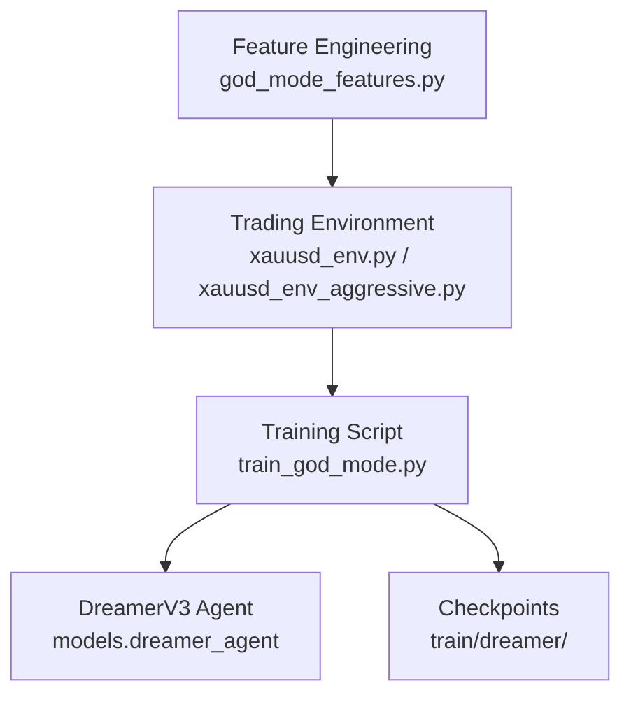
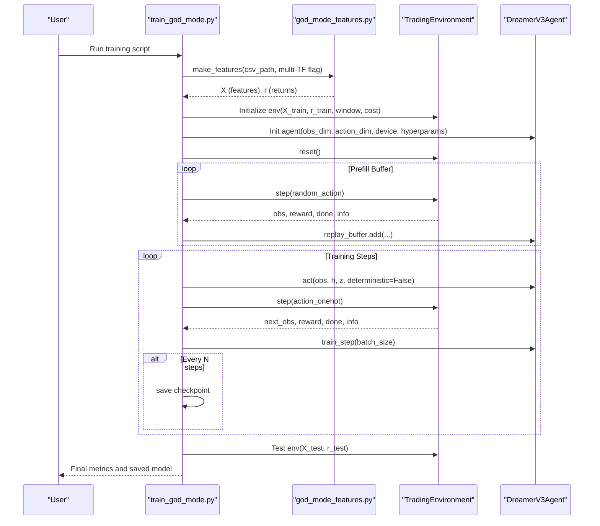
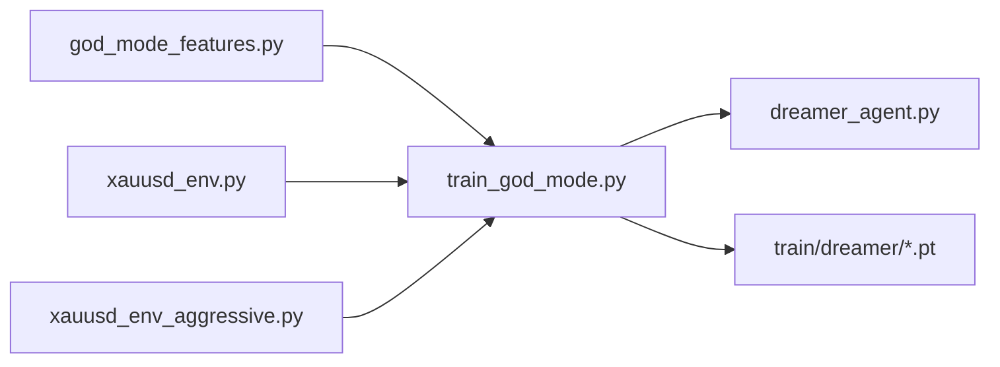

# God Mode Training

<cite>
**Referenced Files in This Document**
- [features/god_mode_features.py](file://features/god_mode_features.py)
- [train/train_god_mode.py](file://train/train_god_mode.py)
- [env/xauusd_env.py](file://env/xauusd_env.py)
- [env/xauusd_env_aggressive.py](file://env/xauusd_env_aggressive.py)
- [train/train_ppo.py](file://train/train_ppo.py)
- [train/train_ultimate_150.py](file://train/train_ultimate_150.py)
- [README.md](file://README.md)
</cite>

## Table of Contents
1. [Introduction](#introduction)
2. [Project Structure](#project-structure)
3. [Core Components](#core-components)
4. [Architecture Overview](#architecture-overview)
5. [Detailed Component Analysis](#detailed-component-analysis)
6. [Dependency Analysis](#dependency-analysis)
7. [Performance Considerations](#performance-considerations)
8. [Troubleshooting Guide](#troubleshooting-guide)
9. [Conclusion](#conclusion)
10. [Appendices](#appendices)

## Introduction
This document explains the God Mode training approach designed for rapid experimentation and reduced computational requirements. It focuses on a streamlined feature set, simplified environment configuration, accelerated training cadence, and practical workflows for quick strategy validation, hyperparameter sweeps, and prototyping new trading approaches. It also covers trade-offs between speed and accuracy, when to use God Mode versus full feature sets, and how to transition from God Mode results to production-ready models. Finally, it provides troubleshooting guidance for common issues such as overfitting on simplified features and performance degradation when scaling up to richer feature sets.

## Project Structure
The God Mode workflow integrates three primary areas:
- Feature engineering module that computes a focused set of technical indicators and price-based features
- A lightweight training script that uses DreamerV3 with a compact observation window and frequent checkpointing
- Trading environments that define the observation space, action space, and reward structure

**Diagram sources**
- [features/god_mode_features.py:291-379](file://features/god_mode_features.py#L291-L379)
- [env/xauusd_env.py:21-56](file://env/xauusd_env.py#L21-L56)
- [env/xauusd_env_aggressive.py:20-63](file://env/xauusd_env_aggressive.py#L20-L63)
- [train/train_god_mode.py:134-240](file://train/train_god_mode.py#L134-L240)

**Section sources**
- [features/god_mode_features.py:291-379](file://features/god_mode_features.py#L291-L379)
- [train/train_god_mode.py:134-240](file://train/train_god_mode.py#L134-L240)
- [env/xauusd_env.py:21-56](file://env/xauusd_env.py#L21-L56)
- [env/xauusd_env_aggressive.py:20-63](file://env/xauusd_env_aggressive.py#L20-L63)

## Core Components
- God Mode Features: A curated subset of technical indicators and price-based features computed per timeframe and optionally across multiple timeframes. The module exposes functions to compute RSI, ATR, moving averages, MACD, Bollinger Band position, volume ratios, support/resistance distances, cross-timeframe alignment, momentum cascade, volatility regime, macro correlations, and economic calendar placeholders.
- Training Script (God Mode): Loads data, constructs God Mode features, splits train/test by date, initializes a DreamerV3 agent, pre-fills replay buffer via random exploration, trains with periodic updates and frequent checkpoints, and evaluates on test data.
- Environments: Two Gymnasium environments are available:
  - Standard long-only environment with turnover penalties, flat penalty, and hold bonus
  - Aggressive environment with short/flat/long actions, leverage, stop-loss logic, and truncated episodes on stop-out

Key configuration highlights:
- Observation window size controls the flattened input dimension
- Cost per trade penalizes position changes
- Episode termination or truncation can be controlled by max episode steps
- Checkpoint frequency is configurable for rapid iteration

**Section sources**
- [features/god_mode_features.py:23-131](file://features/god_mode_features.py#L23-L131)
- [features/god_mode_features.py:134-191](file://features/god_mode_features.py#L134-L191)
- [features/god_mode_features.py:194-232](file://features/god_mode_features.py#L194-L232)
- [features/god_mode_features.py:235-288](file://features/god_mode_features.py#L235-L288)
- [features/god_mode_features.py:291-379](file://features/god_mode_features.py#L291-L379)
- [train/train_god_mode.py:42-131](file://train/train_god_mode.py#L42-L131)
- [train/train_god_mode.py:134-240](file://train/train_god_mode.py#L134-L240)
- [env/xauusd_env.py:21-56](file://env/xauusd_env.py#L21-L56)
- [env/xauusd_env_aggressive.py:20-63](file://env/xauusd_env_aggressive.py#L20-L63)

## Architecture Overview
The God Mode training pipeline follows a clear sequence:
1. Data loading and feature computation using God Mode feature functions
2. Train/test split by date
3. Environment initialization with a fixed lookback window and cost parameters
4. DreamerV3 agent initialization with world model and policy/critic networks
5. Replay buffer prefill via random exploration
6. Training loop with periodic updates and frequent checkpointing
7. Test evaluation and reporting

**Diagram sources**
- [train/train_god_mode.py:134-240](file://train/train_god_mode.py#L134-L240)
- [train/train_god_mode.py:256-333](file://train/train_god_mode.py#L256-L333)
- [train/train_god_mode.py:339-367](file://train/train_god_mode.py#L339-L367)
- [features/god_mode_features.py:291-379](file://features/god_mode_features.py#L291-L379)

## Detailed Component Analysis

### God Mode Features
- Single-timeframe features include returns, rolling volatility, momentum at multiple horizons, fast/slow moving averages, trend signal, RSI, MACD difference normalized by price, ATR percentage, Bollinger Band position, volume ratio, and distance to recent high/low.
- Cross-timeframe features align higher timeframes to the base timeframe and compute trend alignment scores, momentum cascade, and volatility regime indicators.
- Macro features compute log returns and momentum for DXY, SPX, US10Y, plus rolling correlations with gold returns.
- Economic calendar features add placeholders for event proximity and impact flags; optional integration exists but defaults to safe values if unavailable.
- The main entry function composes these components into a single feature matrix and aligned returns series.

Complexity considerations:
- Multi-timeframe mode resamples OHLCV to H4 and D1, computes features per timeframe, and aligns them to H1, increasing memory and compute usage compared to single-timeframe mode.
- Rolling windows and correlation computations scale with the number of samples and feature count.

Practical tips:
- Use single-timeframe mode for faster iteration during early experiments
- Enable multi-timeframe only after validating baseline behavior
- Ensure macro columns exist to avoid warnings and default zeros

**Section sources**
- [features/god_mode_features.py:23-131](file://features/god_mode_features.py#L23-L131)
- [features/god_mode_features.py:134-191](file://features/god_mode_features.py#L134-L191)
- [features/god_mode_features.py:194-232](file://features/god_mode_features.py#L194-L232)
- [features/god_mode_features.py:235-288](file://features/god_mode_features.py#L235-L288)
- [features/god_mode_features.py:291-379](file://features/god_mode_features.py#L291-L379)

### Training Script (God Mode)
- Configuration constants define window size, cost per trade, train/test split date, batch size, prefill steps, total training steps, training frequency, and checkpoint interval.
- Data loading calls the God Mode feature builder and reads timestamps for temporal splitting.
- Environment instantiation uses the training portion of features and returns.
- Agent initialization sets observation/action dimensions and core hyperparameters including learning rates, discount factor, horizon, and latent dimensions.
- Prefill phase populates the replay buffer with random actions to stabilize early training.
- Training loop alternates between acting in the environment, storing transitions, periodic training updates, and saving checkpoints.
- Evaluation runs the trained agent deterministically on test data and reports equity, return, trades, and time-long percentage.

Accelerated convergence techniques:
- Random exploration prefill improves sample diversity before learning begins
- Frequent training updates every few environment steps
- Regular checkpointing enables resume and rapid iteration

Episode length control:
- The internal environment tracks time steps and terminates when reaching dataset end; truncation can be enforced via max episode steps in alternative environments

**Section sources**
- [train/train_god_mode.py:27-40](file://train/train_god_mode.py#L27-L40)
- [train/train_god_mode.py:42-131](file://train/train_god_mode.py#L42-L131)
- [train/train_god_mode.py:134-240](file://train/train_god_mode.py#L134-L240)
- [train/train_god_mode.py:256-333](file://train/train_god_mode.py#L256-L333)
- [train/train_god_mode.py:339-367](file://train/train_god_mode.py#L339-L367)

### Environments
Standard Environment:
- Discrete long-only actions (flat, long)
- Reward includes PnL from previous position minus trade costs, turnover penalty, flat penalty, and hold bonus
- Observation is flattened window of features plus current position
- Terminates at dataset end; supports optional max episode steps for truncation

Aggressive Environment:
- Actions map to short (-1), flat (0), long (1)
- Leverage scales PnL
- Stop-loss triggers heavy penalty and truncation to teach safety
- No participation trophies; enforces realistic cost modeling

Comparison to other training scripts:
- PPO training uses parallel environments and chunked learning with periodic saves
- Ultimate 150 training uses a larger feature set and similar DreamerV3 setup but with more extensive feature engineering

**Section sources**
- [env/xauusd_env.py:21-56](file://env/xauusd_env.py#L21-L56)
- [env/xauusd_env.py:59-118](file://env/xauusd_env.py#L59-L118)
- [env/xauusd_env_aggressive.py:20-63](file://env/xauusd_env_aggressive.py#L20-L63)
- [env/xauusd_env_aggressive.py:66-144](file://env/xauusd_env_aggressive.py#L66-L144)
- [train/train_ppo.py:11-23](file://train/train_ppo.py#L11-L23)
- [train/train_ultimate_150.py:33-46](file://train/train_ultimate_150.py#L33-L46)

## Dependency Analysis
The God Mode training flow depends on:
- Feature module for computing a focused set of technical and macro features
- Environment modules defining state transitions and rewards
- DreamerV3 agent implementation for world model and policy learning
- Optional PPO and Ultimate 150 pipelines for comparison and scaling

**Diagram sources**
- [features/god_mode_features.py:291-379](file://features/god_mode_features.py#L291-L379)
- [train/train_god_mode.py:134-240](file://train/train_god_mode.py#L134-L240)
- [env/xauusd_env.py:21-56](file://env/xauusd_env.py#L21-L56)
- [env/xauusd_env_aggressive.py:20-63](file://env/xauusd_env_aggressive.py#L20-L63)

**Section sources**
- [features/god_mode_features.py:291-379](file://features/god_mode_features.py#L291-L379)
- [train/train_god_mode.py:134-240](file://train/train_god_mode.py#L134-L240)
- [env/xauusd_env.py:21-56](file://env/xauusd_env.py#L21-L56)
- [env/xauusd_env_aggressive.py:20-63](file://env/xauusd_env_aggressive.py#L20-L63)

## Performance Considerations
- Feature dimensionality: God Mode reduces the observation space relative to the Ultimate 150 feature set, enabling faster training cycles and lower memory usage.
- Window size: Larger windows increase observation dimensionality and computational load; start small and scale gradually.
- Batch size: Increase batch size when GPU resources allow to improve throughput; monitor memory constraints.
- Training frequency: Updating every few environment steps accelerates learning but may require careful tuning to avoid instability.
- Checkpointing: Frequent saves enable rapid iteration and resume capability; choose intervals appropriate to your experiment cadence.
- Episode length: Shorter episodes can accelerate convergence in early experiments; longer episodes provide more context for planning.

[No sources needed since this section provides general guidance]

## Troubleshooting Guide
Common issues and remedies:
- Missing macro data: If macro columns are absent, macro features default to zeros; ensure required columns exist to avoid unintended behavior.
- Overfitting on simplified features: Validate on out-of-sample periods and crisis scenarios; consider adding minimal macro signals cautiously.
- Performance degradation when scaling up: When moving from God Mode to full feature sets, re-tune learning rates, batch size, and training frequency; monitor loss curves and reward stability.
- Environment mismatch: Ensure consistent observation window and cost parameters across training and evaluation to avoid distribution shifts.
- Checkpoint not found: Verify paths and filenames when resuming training; confirm that the intended checkpoint exists.

Operational checks:
- Confirm data file path and expected columns before running training
- Validate feature shapes and return alignment prior to environment creation
- Monitor training logs for loss trends and reward progression
- Evaluate on test data after each checkpoint to track generalization

**Section sources**
- [features/god_mode_features.py:194-232](file://features/god_mode_features.py#L194-L232)
- [features/god_mode_features.py:235-288](file://features/god_mode_features.py#L235-L288)
- [train/train_god_mode.py:182-210](file://train/train_god_mode.py#L182-L210)
- [train/train_god_mode.py:242-250](file://train/train_god_mode.py#L242-L250)
- [env/xauusd_env.py:21-56](file://env/xauusd_env.py#L21-L56)

## Conclusion
God Mode training offers a pragmatic pathway for rapid experimentation in algorithmic trading. By focusing on essential technical indicators and price-based features, it reduces computational overhead while preserving enough signal to learn robust policies. The streamlined environment and frequent checkpointing facilitate quick iteration, hyperparameter sweeps, and prototyping. As you mature strategies, consider transitioning to richer feature sets and more complex environments, carefully re-tuning hyperparameters and validating generalization. Use God Mode as a fast feedback loop to identify promising directions before investing in heavier training runs.

[No sources needed since this section summarizes without analyzing specific files]

## Appendices

### Practical Workflows
- Quick strategy validation:
  - Use single-timeframe God Mode features
  - Set moderate window size and cost parameters
  - Run short training runs with frequent checkpoints
  - Evaluate on test data and iterate

- Hyperparameter sweeps:
  - Vary learning rates, batch sizes, and training frequencies
  - Use automated sweeps with different seeds
  - Track metrics across checkpoints to select robust configurations

- Prototyping new trading approaches:
  - Start with long-only environment to isolate signal quality
  - Introduce aggressive environment once baseline is stable
  - Add minimal macro features to assess incremental value

### Transitioning to Production
- Gradually expand feature set toward Ultimate 150 while monitoring performance
- Re-tune hyperparameters for increased dimensionality
- Validate on unseen periods and stress-test during crises
- Implement risk management overlays and realistic execution costs
- Deploy incrementally with paper trading and continuous monitoring

[No sources needed since this section provides general guidance]