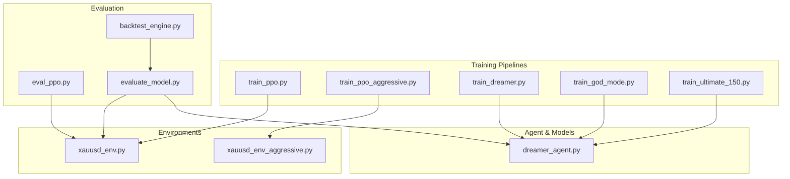
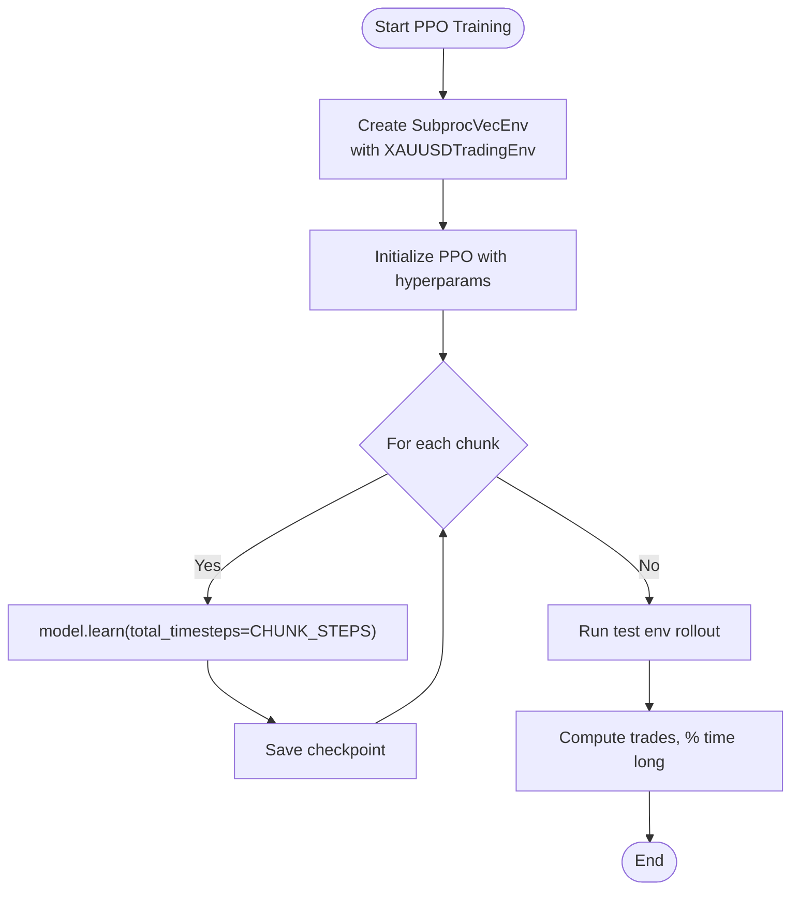
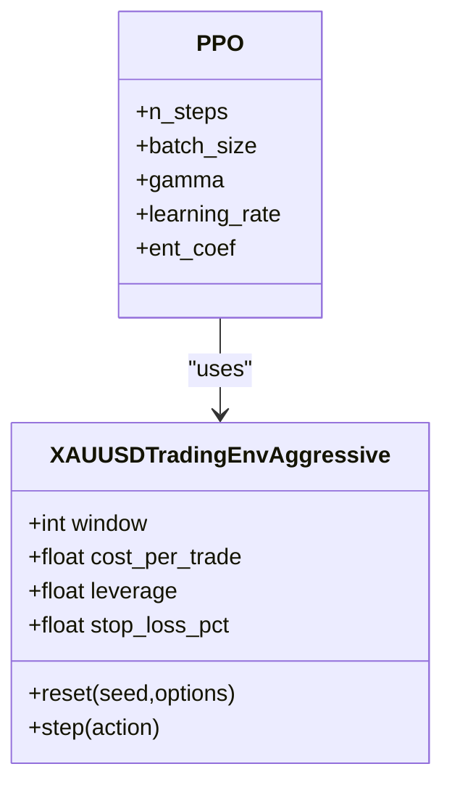
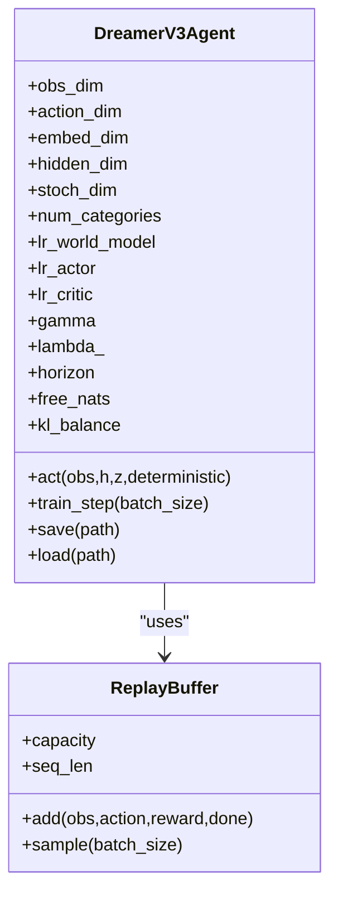
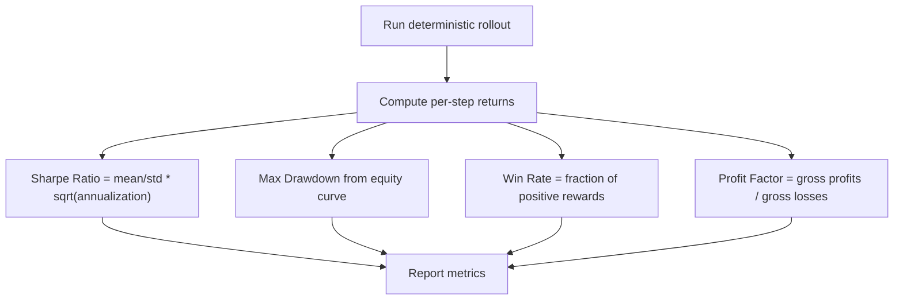
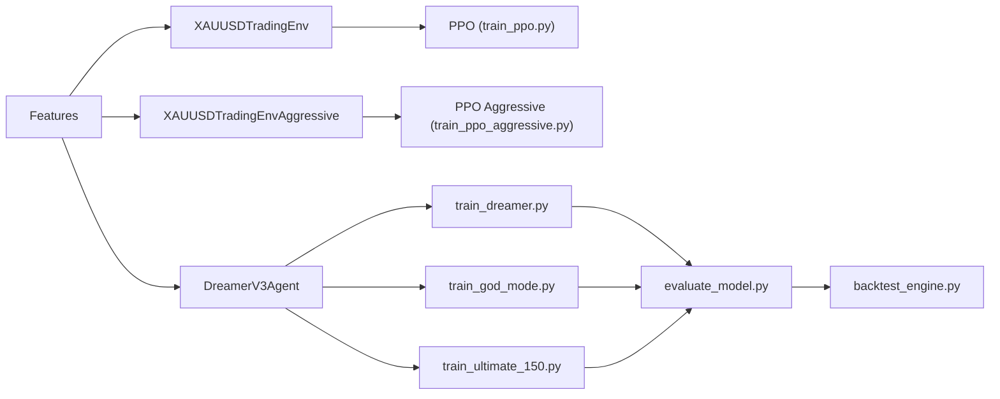

# Hyperparameter Optimization

<cite>
**Referenced Files in This Document**
- [train_ppo.py](file://train/train_ppo.py)
- [train_dreamer.py](file://train/train_dreamer.py)
- [train_god_mode.py](file://train/train_god_mode.py)
- [train_ultimate_150.py](file://train/train_ultimate_150.py)
- [train_ppo_aggressive.py](file://train/train_ppo_aggressive.py)
- [dreamer_agent.py](file://models/dreamer_agent.py)
- [xauusd_env.py](file://env/xauusd_env.py)
- [xauusd_env_aggressive.py](file://env/xauusd_env_aggressive.py)
- [eval_ppo.py](file://eval/eval_ppo.py)
- [evaluate_model.py](file://evaluate_model.py)
- [backtest_engine.py](file://backtest/backtest_engine.py)
</cite>

## Table of Contents
1. Introduction
2. Project Structure
3. Core Components
4. Architecture Overview
5. Detailed Component Analysis
6. Dependency Analysis
7. Performance Considerations
8. Troubleshooting Guide
9. Conclusion
10. Appendices

## Introduction
This document explains hyperparameter optimization strategies across all training pipelines in the repository. It covers key hyperparameters (learning rates, batch sizes, network architectures, and algorithm-specific parameters), automated search methodologies (grid, random, Bayesian), evaluation metrics for selection (Sharpe ratio, maximum drawdown, win rate, profit factor), practical sweep setup and experiment tracking guidance, computational constraints and resource allocation, interpretation of results, avoiding overfitting to validation sets, ensuring generalization across market regimes, and best practices for reproducibility (seeds, configuration versioning, logging standards).

## Project Structure
The project organizes training scripts per algorithm and feature set:
- PPO pipelines: train_ppo.py, train_ppo_aggressive.py
- DreamerV3 pipelines: train_dreamer.py, train_god_mode.py, train_ultimate_150.py
- Agent core: models/dreamer_agent.py
- Environments: env/xauusd_env.py, env/xauusd_env_aggressive.py
- Evaluation and backtesting: eval/eval_ppo.py, evaluate_model.py, backtest/backtest_engine.py



**Diagram sources**
- [train_ppo.py:1-93](file://train/train_ppo.py#L1-L93)
- [train_ppo_aggressive.py:1-124](file://train/train_ppo_aggressive.py#L1-L124)
- [train_dreamer.py:1-331](file://train/train_dreamer.py#L1-L331)
- [train_god_mode.py:1-393](file://train/train_god_mode.py#L1-L393)
- [train_ultimate_150.py:1-331](file://train/train_ultimate_150.py#L1-L331)
- [dreamer_agent.py:1-460](file://models/dreamer_agent.py#L1-L460)
- [xauusd_env.py:1-118](file://env/xauusd_env.py#L1-L118)
- [xauusd_env_aggressive.py:1-144](file://env/xauusd_env_aggressive.py#L1-L144)
- [eval_ppo.py:1-94](file://eval/eval_ppo.py#L1-L94)
- [evaluate_model.py:1-306](file://evaluate_model.py#L1-L306)
- [backtest_engine.py:237-386](file://backtest/backtest_engine.py#L237-L386)

**Section sources**
- [train_ppo.py:1-93](file://train/train_ppo.py#L1-L93)
- [train_dreamer.py:1-331](file://train/train_dreamer.py#L1-L331)
- [train_god_mode.py:1-393](file://train/train_god_mode.py#L1-L393)
- [train_ultimate_150.py:1-331](file://train/train_ultimate_150.py#L1-L331)
- [train_ppo_aggressive.py:1-124](file://train/train_ppo_aggressive.py#L1-L124)
- [dreamer_agent.py:1-460](file://models/dreamer_agent.py#L1-L460)
- [xauusd_env.py:1-118](file://env/xauusd_env.py#L1-L118)
- [xauusd_env_aggressive.py:1-144](file://env/xauusd_env_aggressive.py#L1-L144)
- [eval_ppo.py:1-94](file://eval/eval_ppo.py#L1-L94)
- [evaluate_model.py:1-306](file://evaluate_model.py#L1-L306)
- [backtest_engine.py:237-386](file://backtest/backtest_engine.py#L237-L386)

## Core Components
- PPO pipelines use Stable Baselines3 with vectorized environments and chunked learning schedules. Key tunables include n_steps, batch_size, gamma, learning_rate, and environment window/costs.
- DreamerV3 pipelines implement a world model + actor-critic with separate optimizers and distinct learning rates for world model, actor, and critic. Tunables include embed_dim, hidden_dim, stoch_dim, num_categories, lr_world_model, lr_actor, lr_critic, gamma, lambda_, horizon, free_nats, kl_balance, replay buffer size, prefill steps, and training frequency.
- Environments define observation windows, action spaces, costs, leverage, stop-loss logic, and reward shaping that directly influence optimal hyperparameters.
- Evaluation computes Sharpe ratio, max drawdown, win rate, total/annual return, and profit factor for metric-driven selection.

Key hyperparameters by pipeline:
- PPO: n_steps, batch_size, gamma, learning_rate, entropy coefficient (in aggressive variant), environment window and cost.
- DreamerV3: architecture dims (embed, hidden, stochastic, categories), optimizer LR per component, discount and GAE lambda, imagination horizon, KL regularization terms, batch size, prefill steps, training cadence.

**Section sources**
- [train_ppo.py:46-54](file://train/train_ppo.py#L46-L54)
- [train_ppo_aggressive.py:50-59](file://train/train_ppo_aggressive.py#L50-L59)
- [dreamer_agent.py:91-143](file://models/dreamer_agent.py#L91-L143)
- [xauusd_env.py:21-56](file://env/xauusd_env.py#L21-L56)
- [xauusd_env_aggressive.py:20-63](file://env/xauusd_env_aggressive.py#L20-L63)
- [evaluate_model.py:128-159](file://evaluate_model.py#L128-L159)
- [backtest_engine.py:237-386](file://backtest/backtest_engine.py#L237-L386)

## Architecture Overview
The training loop integrates environment interaction, experience collection, and model updates. For DreamerV3, the agent alternates between world model learning and policy/value updates on imagined trajectories. PPO uses standard rollout and update steps via SB3.

```mermaid
sequenceDiagram
participant Train as "Training Script"
participant Env as "Trading Environment"
participant Agent as "DreamerV3Agent"
participant Buffer as "ReplayBuffer"
participant Opt as "Optimizers"
Train->>Env : reset()
loop Training Steps
Train->>Agent : act(obs, h, z, deterministic=False)
Agent-->>Train : action, (h, z)
Train->>Env : step(action_onehot)
Env-->>Train : next_obs, reward, done, info
Train->>Buffer : add(obs, action, reward, done)
alt every N steps
Train->>Agent : train_step(batch_size)
Agent->>Buffer : sample(batch_size)
Agent->>Opt : optimize world model losses
Agent->>Opt : imagine trajectories
Agent->>Opt : optimize value/policy losses
end
end
```

**Diagram sources**
- [train_dreamer.py:246-287](file://train/train_dreamer.py#L246-L287)
- [dreamer_agent.py:190-304](file://models/dreamer_agent.py#L190-L304)
- [dreamer_agent.py:306-338](file://models/dreamer_agent.py#L306-L338)
- [dreamer_agent.py:340-403](file://models/dreamer_agent.py#L340-L403)

**Section sources**
- [train_dreamer.py:246-287](file://train/train_dreamer.py#L246-L287)
- [dreamer_agent.py:190-403](file://models/dreamer_agent.py#L190-L403)

## Detailed Component Analysis

### PPO Training Pipeline
- Hyperparameters: n_steps, batch_size, gamma, learning_rate, entropy coefficient (aggressive variant), environment window and cost.
- Vectorized parallel environments improve sample efficiency; chunked learning enables long-horizon training with periodic checkpoints.
- Evaluation prints equity curve and position statistics for quick validation.



**Diagram sources**
- [train_ppo.py:34-67](file://train/train_ppo.py#L34-L67)
- [train_ppo.py:69-87](file://train/train_ppo.py#L69-L87)

**Section sources**
- [train_ppo.py:11-23](file://train/train_ppo.py#L11-L23)
- [train_ppo.py:46-67](file://train/train_ppo.py#L46-L67)
- [train_ppo.py:69-87](file://train/train_ppo.py#L69-L87)

### PPO Aggressive Pipeline
- Adds leverage, stop-loss logic, and three-action space (short/flat/long) via an aggressive environment.
- Hyperparameters include larger n_steps and batch_size, plus entropy coefficient to encourage exploration.



**Diagram sources**
- [xauusd_env_aggressive.py:20-63](file://env/xauusd_env_aggressive.py#L20-L63)
- [train_ppo_aggressive.py:50-59](file://train/train_ppo_aggressive.py#L50-L59)

**Section sources**
- [train_ppo_aggressive.py:11-23](file://train/train_ppo_aggressive.py#L11-L23)
- [train_ppo_aggressive.py:50-84](file://train/train_ppo_aggressive.py#L50-L84)
- [xauusd_env_aggressive.py:86-144](file://env/xauusd_env_aggressive.py#L86-L144)

### DreamerV3 Training Pipelines
- Three variants: basic features, God Mode (multi-timeframe + macro + calendar), Ultimate 150+ features.
- Shared agent implements world model (encoder, RSSM, decoder, reward predictor) and actor-critic with separate optimizers and LRs.
- Hyperparameters include architecture dimensions, learning rates per component, discount/GAE lambda, imagination horizon, KL regularization, batch size, prefill steps, and training cadence.



**Diagram sources**
- [dreamer_agent.py:24-143](file://models/dreamer_agent.py#L24-L143)
- [dreamer_agent.py:148-188](file://models/dreamer_agent.py#L148-L188)
- [dreamer_agent.py:190-304](file://models/dreamer_agent.py#L190-L304)

**Section sources**
- [train_dreamer.py:21-33](file://train/train_dreamer.py#L21-L33)
- [train_dreamer.py:192-208](file://train/train_dreamer.py#L192-L208)
- [train_god_mode.py:27-39](file://train/train_god_mode.py#L27-L39)
- [train_god_mode.py:221-240](file://train/train_god_mode.py#L221-L240)
- [train_ultimate_150.py:33-46](file://train/train_ultimate_150.py#L33-L46)
- [train_ultimate_150.py:221-229](file://train/train_ultimate_150.py#L221-L229)
- [dreamer_agent.py:91-143](file://models/dreamer_agent.py#L91-L143)

### Evaluation and Backtesting Metrics
- Equity curves, positions, and returns are collected during rollouts.
- Metrics computed include Sharpe ratio, maximum drawdown, win rate, total/annual return, and profit factor. These drive hyperparameter selection and model comparison.



**Diagram sources**
- [evaluate_model.py:128-159](file://evaluate_model.py#L128-L159)
- [backtest_engine.py:237-386](file://backtest/backtest_engine.py#L237-L386)

**Section sources**
- [eval_ppo.py:59-70](file://eval/eval_ppo.py#L59-L70)
- [evaluate_model.py:128-159](file://evaluate_model.py#L128-L159)
- [backtest_engine.py:237-386](file://backtest/backtest_engine.py#L237-L386)

## Dependency Analysis
- Training scripts depend on feature pipelines and environments; DreamerV3 scripts depend on the shared agent implementation.
- Evaluation depends on trained agents and environments; backtesting provides standardized metrics.



**Diagram sources**
- [train_ppo.py:8-9](file://train/train_ppo.py#L8-L9)
- [train_ppo_aggressive.py:8-9](file://train/train_ppo_aggressive.py#L8-L9)
- [train_dreamer.py:17-18](file://train/train_dreamer.py#L17-L18)
- [train_god_mode.py:23-24](file://train/train_god_mode.py#L23-L24)
- [train_ultimate_150.py:27-28](file://train/train_ultimate_150.py#L27-L28)
- [evaluate_model.py:21-22](file://evaluate_model.py#L21-L22)
- [backtest_engine.py:237-386](file://backtest/backtest_engine.py#L237-L386)

**Section sources**
- [train_ppo.py:8-9](file://train/train_ppo.py#L8-L9)
- [train_ppo_aggressive.py:8-9](file://train/train_ppo_aggressive.py#L8-L9)
- [train_dreamer.py:17-18](file://train/train_dreamer.py#L17-L18)
- [train_god_mode.py:23-24](file://train/train_god_mode.py#L23-L24)
- [train_ultimate_150.py:27-28](file://train/train_ultimate_150.py#L27-L28)
- [evaluate_model.py:21-22](file://evaluate_model.py#L21-L22)
- [backtest_engine.py:237-386](file://backtest/backtest_engine.py#L237-L386)

## Performance Considerations
- Parallelism: Use multiple vectorized environments for PPO to increase throughput; ensure OS-level process spawning is configured safely (e.g., spawn method on macOS).
- Batch sizing: Larger batches can stabilize DreamerV3 updates but require more memory; tune based on GPU/CPU capacity.
- Learning rate scheduling: Consider decaying learning rates or using warmup for stable convergence, especially for multi-component optimizers in DreamerV3.
- Horizon and GAE: Adjust imagination horizon and GAE lambda to balance bias-variance in policy/value updates.
- Cost modeling: Accurate transaction costs and penalties prevent over-optimistic policies; ensure consistent cost settings across training and evaluation.

[No sources needed since this section provides general guidance]

## Troubleshooting Guide
- Memory issues: Reduce batch size, sequence length, or observation window; monitor GPU/CPU usage.
- Instability: Lower learning rates, increase gradient clipping, or reduce horizon; verify reward scaling and KL regularization.
- Overfitting: Validate on out-of-sample periods; check drawdown and Sharpe stability; avoid tuning solely on one period.
- Reproducibility: Fix seeds for environments and sampling; log configurations and random states; use consistent data splits.

**Section sources**
- [dreamer_agent.py:256-263](file://models/dreamer_agent.py#L256-L263)
- [dreamer_agent.py:282-293](file://models/dreamer_agent.py#L282-L293)
- [evaluate_model.py:128-159](file://evaluate_model.py#L128-L159)
- [backtest_engine.py:237-386](file://backtest/backtest_engine.py#L237-L386)

## Conclusion
The repository provides robust training pipelines for PPO and DreamerV3 with clear levers for hyperparameter tuning. Evaluation metrics enable principled selection of configurations. By combining systematic sweeps, careful metric-based selection, and rigorous validation across market regimes, you can build models that generalize well and remain reproducible.

[No sources needed since this section summarizes without analyzing specific files]

## Appendices

### Automated Hyperparameter Search Methodologies
- Grid Search: Define discrete ranges for key hyperparameters (e.g., learning rates, batch sizes, horizon, architecture dims) and run exhaustive combinations. Use parallel workers where possible.
- Random Search: Sample hyperparameters uniformly or log-uniformly across plausible ranges; often more efficient than grid for high-dimensional spaces.
- Bayesian Optimization: Model performance as a function of hyperparameters and iteratively propose promising configurations; suitable when evaluations are expensive.

Practical setup tips:
- Parameterize training scripts via command-line arguments or config files to support automation.
- Track experiments with MLflow or similar tools: log hyperparameters, metrics (Sharpe, drawdown, win rate, profit factor), artifacts (checkpoints, plots), and run metadata.
- Use early stopping based on validation metrics to save compute.

[No sources needed since this section provides general guidance]

### Interpretation of Results and Avoiding Overfitting
- Prefer multi-period validation: split data into multiple non-overlapping periods and assess metric stability.
- Monitor risk metrics: Max drawdown and profit factor reveal tail risks and trade quality beyond raw returns.
- Stress tests: Evaluate under crisis periods and different market regimes; ensure robustness before deployment.

**Section sources**
- [evaluate_model.py:237-256](file://evaluate_model.py#L237-L256)
- [backtest_engine.py:237-386](file://backtest/backtest_engine.py#L237-L386)

### Computational Constraints and Resource Allocation
- Scale environments: Increase number of parallel environments for PPO; cap DreamerV3 batch size and sequence length to fit memory.
- Device selection: Auto-detect CUDA/MPS/CPU; prefer GPU for DreamerV3 due to heavy tensor operations.
- Checkpointing: Save frequent checkpoints to resume interrupted runs and compare intermediate performance.

**Section sources**
- [train_ppo.py:43-44](file://train/train_ppo.py#L43-L44)
- [train_dreamer.py:142-152](file://train/train_dreamer.py#L142-L152)
- [train_god_mode.py:152-162](file://train/train_god_mode.py#L152-L162)
- [train_ultimate_150.py:205-215](file://train/train_ultimate_150.py#L205-L215)

### Best Practices for Reproducibility
- Seed management: Set seeds for NumPy, PyTorch, and environment resets to ensure repeatable runs.
- Configuration versioning: Store hyperparameters and data versions alongside checkpoints; use structured configs (YAML/JSON) and commit to version control.
- Logging standards: Log metrics, hyperparameters, and artifacts consistently; include timestamps and run IDs for traceability.

**Section sources**
- [train_dreamer.py:142-152](file://train/train_dreamer.py#L142-L152)
- [train_god_mode.py:152-162](file://train/train_god_mode.py#L152-L162)
- [evaluate_model.py:218-227](file://evaluate_model.py#L218-L227)