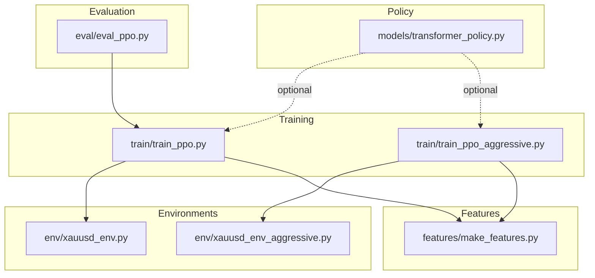
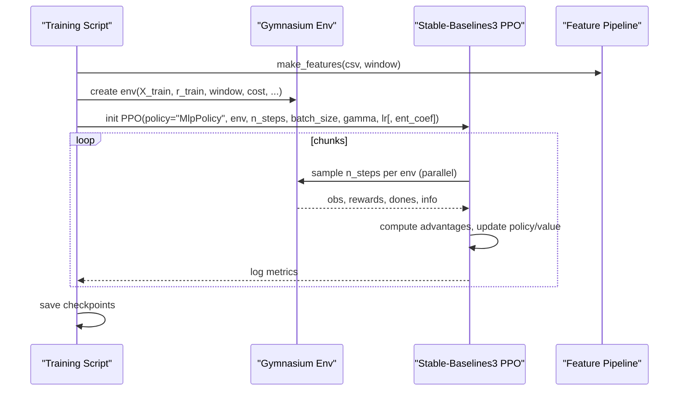
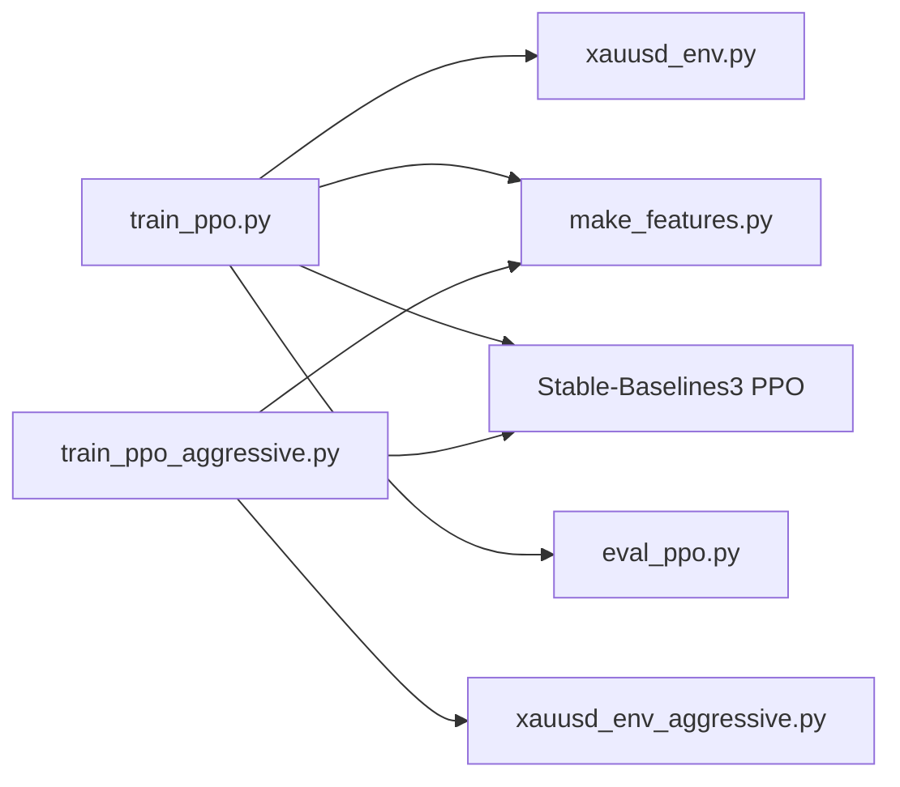

# PPO Training Variants

<cite>
**Referenced Files in This Document**
- [train_ppo.py](file://train/train_ppo.py)
- [train_ppo_aggressive.py](file://train/train_ppo_aggressive.py)
- [xauusd_env.py](file://env/xauusd_env.py)
- [xauusd_env_aggressive.py](file://env/xauusd_env_aggressive.py)
- [transformer_policy.py](file://models/transformer_policy.py)
- [make_features.py](file://features/make_features.py)
- [eval_ppo.py](file://eval/eval_ppo.py)
</cite>

## Table of Contents
1. Introduction
2. Project Structure
3. Core Components
4. Architecture Overview
5. Detailed Component Analysis
6. Dependency Analysis
7. Performance Considerations
8. Troubleshooting Guide
9. Conclusion
10. Appendices

## Introduction
This document explains the PPO training variants available in the system, focusing on:
- Standard PPO for conservative trading strategies (long-only)
- Aggressive PPO variant with short-selling and risk controls
- Differences in hyperparameters, reward shaping, and environment design
- Transformer-based policy architecture with attention mechanisms
- Configuration options including learning rate schedules, clipping, entropy regularization, and advantage normalization
- Practical guidance to select a variant based on objectives, risk tolerance, and market conditions
- Performance optimization techniques such as parallel environments and notes on gradient accumulation and mixed precision

## Project Structure
The PPO variants are implemented via two training scripts that pair Stable-Baselines3’s PPO with different Gymnasium environments and feature pipelines. A transformer-based policy is provided for advanced sequence modeling.

**Diagram sources**
- [train_ppo.py:25-67](file://train/train_ppo.py#L25-L67)
- [train_ppo_aggressive.py:25-84](file://train/train_ppo_aggressive.py#L25-L84)
- [xauusd_env.py:7-118](file://env/xauusd_env.py#L7-L118)
- [xauusd_env_aggressive.py:6-144](file://env/xauusd_env_aggressive.py#L6-L144)
- [make_features.py:18-83](file://features/make_features.py#L18-L83)
- [transformer_policy.py:67-249](file://models/transformer_policy.py#L67-L249)
- [eval_ppo.py:16-94](file://eval/eval_ppo.py#L16-L94)

**Section sources**
- [train_ppo.py:25-67](file://train/train_ppo.py#L25-L67)
- [train_ppo_aggressive.py:25-84](file://train/train_ppo_aggressive.py#L25-L84)
- [make_features.py:18-83](file://features/make_features.py#L18-L83)
- [eval_ppo.py:16-94](file://eval/eval_ppo.py#L16-L94)

## Core Components
- Standard PPO (conservative): Uses a long-only discrete action space (flat or long), moderate cost and turnover penalties, and a smaller observation window. Optimized for stability and lower turnover.
- Aggressive PPO: Adds short positions, wider windows, leverage, stop-loss enforcement, and no flat penalty to force economically justified trades. Designed for higher risk tolerance and more active trading.

Key differences:
- Action space: 2 actions (flat/long) vs 3 actions (short/flat/long)
- Observation window: 64 vs 120–128
- Costs and penalties: Conservative includes small flat penalty and hold bonus; aggressive removes flat penalty and adds stop-loss truncation
- Hyperparameters: Larger batch size and steps in aggressive variant; explicit entropy coefficient set in aggressive script

**Section sources**
- [xauusd_env.py:7-118](file://env/xauusd_env.py#L7-L118)
- [xauusd_env_aggressive.py:6-144](file://env/xauusd_env_aggressive.py#L6-L144)
- [train_ppo.py:46-59](file://train/train_ppo.py#L46-L59)
- [train_ppo_aggressive.py:50-59](file://train/train_ppo_aggressive.py#L50-L59)

## Architecture Overview
Both variants use Stable-Baselines3’s PPO with vectorized environments for parallel rollout collection. The standard variant uses an MLP policy by default; the aggressive variant also uses MLP but can be adapted to the transformer policy module.

**Diagram sources**
- [train_ppo.py:28-67](file://train/train_ppo.py#L28-L67)
- [train_ppo_aggressive.py:28-84](file://train/train_ppo_aggressive.py#L28-L84)
- [xauusd_env.py:65-118](file://env/xauusd_env.py#L65-L118)
- [xauusd_env_aggressive.py:73-144](file://env/xauusd_env_aggressive.py#L73-L144)

## Detailed Component Analysis

### Standard PPO Variant (Conservative)
- Environment: Long-only discrete actions (flat/long). Reward includes PnL minus trade costs, turnover penalty, small flat penalty, and hold bonus to encourage stable exposure.
- Features: Windowed features plus current position appended to observation. Normalization applied during feature creation.
- Training: Parallel environments (SubprocVecEnv), chunked learning with periodic saves. Default MLP policy.

Configuration highlights:
- Learning rate: 3e-4
- Discount factor: 0.99
- Steps per update: 1024 per env
- Batch size: 256
- Cost per trade: 0.0001
- Turnover coefficient: 0.0002
- Flat penalty: 0.00002
- Hold bonus: 0.00002
- Max episode steps: 20,000
- Window: 64

Reward function behavior:
- Encourages staying invested in trending markets while penalizing excessive churn and being flat too often.

**Section sources**
- [xauusd_env.py:21-118](file://env/xauusd_env.py#L21-L118)
- [train_ppo.py:11-59](file://train/train_ppo.py#L11-L59)
- [make_features.py:18-83](file://features/make_features.py#L18-L83)

### Aggressive PPO Variant (Higher Risk Tolerance)
- Environment: Three-way discrete actions (short/flat/long). No flat penalty to avoid “participation trophies.” Leverage multiplies PnL. Stop-loss triggers heavy penalty and truncates episode when breached.
- Features: Wider window (120–128) to capture longer-term context; macro-aware data path supported.
- Training: Larger batch size and steps per update; explicit entropy coefficient to maintain exploration.

Configuration highlights:
- Learning rate: 3e-4
- Discount factor: 0.99
- Steps per update: 2048 per env
- Batch size: 512
- Entropy coefficient: 0.01
- Cost per trade: 0.0002
- Leverage: 1.0 (configurable)
- Stop-loss percentage: 0.001 (configurable)
- Max episode steps: 5,000
- Window: 120–128

Reward function behavior:
- Purely economic: PnL scaled by leverage minus costs and turnover. Stop-loss enforced via truncation and penalty to teach safety.

**Section sources**
- [xauusd_env_aggressive.py:20-144](file://env/xauusd_env_aggressive.py#L20-L144)
- [train_ppo_aggressive.py:11-59](file://train/train_ppo_aggressive.py#L11-L59)

### Transformer-Based Policy Implementation
The transformer policy provides:
- Positional encoding to model temporal order
- Multi-head self-attention layers to capture temporal dependencies and feature interactions
- Separate actor and critic networks with shared architectural patterns
- Sequence buffering to feed recent observations into the transformer

Key elements:
- PositionalEncoding: sinusoidal encodings added to embeddings
- TransformerActor: embedding -> positional encoding -> transformer encoder -> last-token pooling -> action logits
- TransformerCritic: same structure producing scalar value estimates
- TransformerAgentWrapper: maintains a sliding buffer of states and produces actions using softmax over logits

Complexity considerations:
- Attention scales quadratically with sequence length; choose seq_len conservatively for memory constraints
- Hidden dimension and number of heads should be balanced with available compute

Integration note:
- The provided transformer modules are standalone and can replace MLP policies if wrapped appropriately with the RL framework used.

**Section sources**
- [transformer_policy.py:34-163](file://models/transformer_policy.py#L34-L163)
- [transformer_policy.py:166-249](file://models/transformer_policy.py#L166-L249)
- [transformer_policy.py:252-373](file://models/transformer_policy.py#L252-L373)

### Feature Pipeline and Data Preparation
- Computes technical indicators (returns, volatility, momentum, moving averages, RSI, MACD)
- Optionally integrates macro features (DXY, SPX, US10Y) and correlations
- Normalizes features using rolling statistics and fills NaNs

Implications:
- Consistent normalization across train/test improves generalization
- Macro features enable regime awareness (risk-on/risk-off, rates, dollar strength)

**Section sources**
- [make_features.py:18-83](file://features/make_features.py#L18-L83)

### Evaluation Workflow
- Loads trained PPO model and runs out-of-sample rollouts
- Compares equity curves against baselines (buy-and-hold, simple moving average crossover)
- Reports trades, time in long/short, and final equity

**Section sources**
- [eval_ppo.py:16-94](file://eval/eval_ppo.py#L16-L94)

## Dependency Analysis

**Diagram sources**
- [train_ppo.py:28-67](file://train/train_ppo.py#L28-L67)
- [train_ppo_aggressive.py:28-84](file://train/train_ppo_aggressive.py#L28-L84)
- [make_features.py:18-83](file://features/make_features.py#L18-L83)
- [eval_ppo.py:16-94](file://eval/eval_ppo.py#L16-L94)

**Section sources**
- [train_ppo.py:28-67](file://train/train_ppo.py#L28-L67)
- [train_ppo_aggressive.py:28-84](file://train/train_ppo_aggressive.py#L28-L84)

## Performance Considerations
- Parallel environment execution: Both scripts use SubprocVecEnv to collect samples from multiple environments concurrently, improving throughput and sample efficiency.
- Gradient accumulation: Not explicitly implemented in these scripts; could be added by accumulating gradients over multiple mini-batches before optimizer step to simulate larger effective batch sizes under memory constraints.
- Mixed precision training: Not enabled in these scripts; can be integrated via PyTorch AMP when using custom training loops or compatible wrappers.
- Advantage normalization: Provided by Stable-Baselines3’s PPO implementation; ensure consistent scaling by normalizing features and rewards as done in the feature pipeline.
- Sequence length trade-offs: For transformer policies, reduce seq_len or hidden_dim to fit GPU memory; increase num_layers or hidden_dim cautiously.

[No sources needed since this section provides general guidance]

## Troubleshooting Guide
Common issues and remedies:
- Divergence or unstable training:
  - Reduce learning rate or clip range; add entropy regularization to maintain exploration
  - Normalize features and consider reward scaling
- Overfitting to specific regimes:
  - Use macro features and multi-timeframe inputs; evaluate across different periods
- High turnover or whipsaw:
  - Increase turnover penalty or hold bonus; adjust max episode steps to limit frequent flips
- Stop-loss triggering too often:
  - Tune stop_loss_pct; verify return scaling and leverage settings

**Section sources**
- [xauusd_env.py:75-118](file://env/xauusd_env.py#L75-L118)
- [xauusd_env_aggressive.py:86-144](file://env/xauusd_env_aggressive.py#L86-L144)

## Conclusion
The system offers two primary PPO variants tailored to different risk profiles:
- Standard PPO: Conservative, long-only, stable exposure, suitable for moderate risk tolerance and trend-following strategies
- Aggressive PPO: Full directional control with leverage and stop-loss, suited for active traders comfortable with higher risk

Transformer-based policies provide a powerful alternative for capturing temporal dependencies and feature interactions, though they require careful tuning of sequence length and model capacity.

Selecting a variant depends on objectives, risk tolerance, and market conditions. Evaluate performance across regimes using the provided evaluation workflow and iterate on hyperparameters systematically.

[No sources needed since this section summarizes without analyzing specific files]

## Appendices

### Variant Selection Guide
- Choose Standard PPO when:
  - You prefer simplicity and lower turnover
  - Markets exhibit persistent trends
  - Capital preservation is prioritized
- Choose Aggressive PPO when:
  - You want to exploit both directions (long/short)
  - You can tolerate higher drawdowns and need active management
  - You have robust risk controls (stop-loss, leverage limits)

[No sources needed since this section provides general guidance]

### Hyperparameter Tuning Checklist
- Learning rate schedule: Start at 3e-4; reduce if unstable
- Clipping parameters: Adjust clip_range to balance stability and learning speed
- Entropy regularization: Increase to encourage exploration; decrease to focus exploitation
- Advantage normalization: Rely on SB3 defaults; validate by checking variance of advantages
- Batch size and steps: Scale with hardware; larger batches improve stability but require more memory

[No sources needed since this section provides general guidance]

### Practical Examples
- Conservative strategy in trending markets:
  - Use Standard PPO with moderate cost and turnover penalties
  - Monitor % time long and trade frequency
- Aggressive strategy in volatile regimes:
  - Use Aggressive PPO with tuned stop-loss and leverage
  - Emphasize out-of-sample evaluation and crisis validation

[No sources needed since this section provides general guidance]