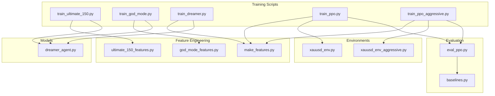
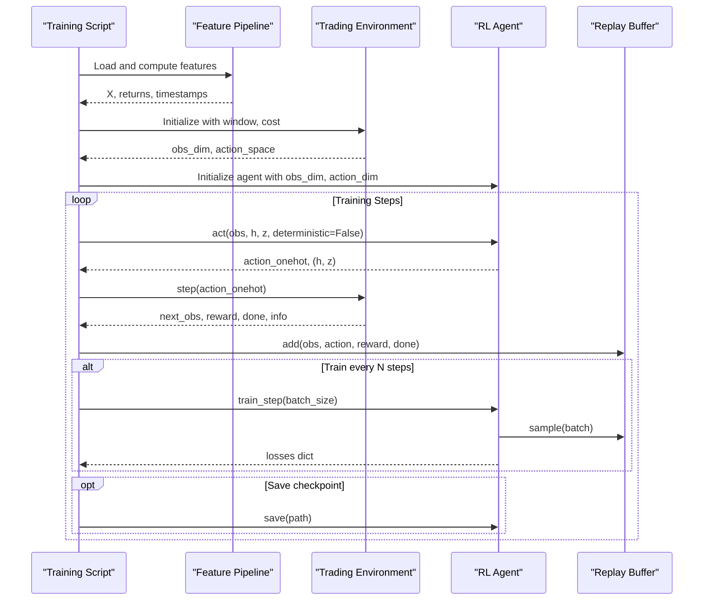
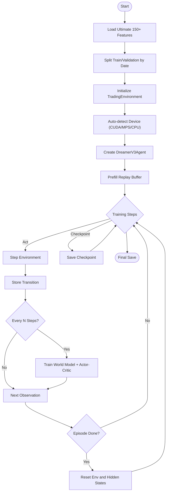
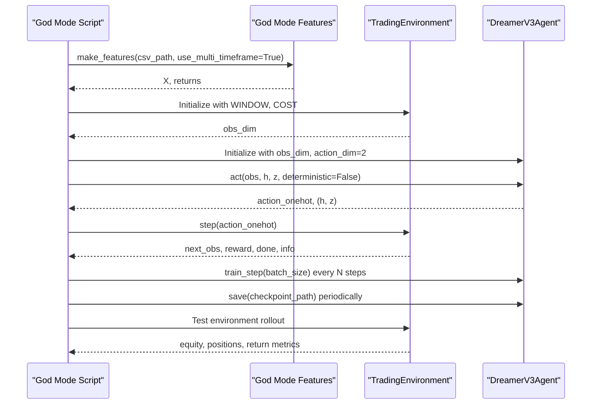
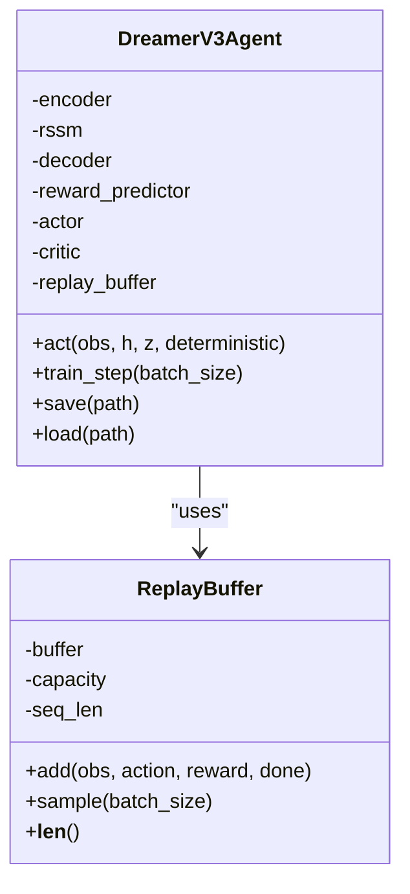
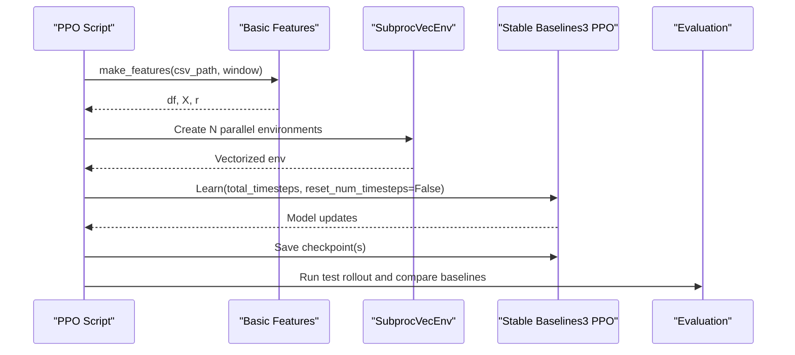
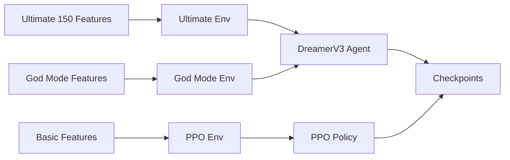

# Training Pipelines

<cite>
**Referenced Files in This Document**
- [train_ultimate_150.py](file://train/train_ultimate_150.py)
- [train_god_mode.py](file://train/train_god_mode.py)
- [train_dreamer.py](file://train/train_dreamer.py)
- [train_ppo.py](file://train/train_ppo.py)
- [train_ppo_aggressive.py](file://train/train_ppo_aggressive.py)
- [ultimate_150_features.py](file://features/ultimate_150_features.py)
- [god_mode_features.py](file://features/god_mode_features.py)
- [make_features.py](file://features/make_features.py)
- [dreamer_agent.py](file://models/dreamer_agent.py)
- [xauusd_env.py](file://env/xauusd_env.py)
- [xauusd_env_aggressive.py](file://env/xauusd_env_aggressive.py)
- [eval_ppo.py](file://eval/eval_ppo.py)
- [baselines.py](file://eval/baselines.py)
</cite>

## Table of Contents
1. [Introduction](#introduction)
2. [Project Structure](#project-structure)
3. [Core Components](#core-components)
4. [Architecture Overview](#architecture-overview)
5. [Detailed Component Analysis](#detailed-component-analysis)
6. [Dependency Analysis](#dependency-analysis)
7. [Performance Considerations](#performance-considerations)
8. [Troubleshooting Guide](#troubleshooting-guide)
9. [Conclusion](#conclusion)
10. [Appendices](#appendices)

## Introduction
This document explains the training pipelines for multiple strategies and algorithms across different feature sets and risk profiles:
- Ultimate 150+ features pipeline with DreamerV3 (maximum performance, multi-timeframe, macro, calendar, microstructure).
- God Mode pipeline with reduced feature set for faster experimentation while still integrating multi-timeframe and macro signals.
- Dreamer V3 baseline training on basic features.
- PPO training variants: conservative long-only and aggressive long/short with macro-aware data.

It covers data preprocessing, environment setup, model configuration, execution examples, monitoring, saving/loading models, and performance optimization techniques such as GPU acceleration, parallel environments, checkpointing, and distributed training considerations.

## Project Structure
The repository organizes training scripts under train/, feature engineering under features/, RL agents under models/, trading environments under env/, and evaluation utilities under eval/. Each training script composes a consistent flow: load features, split train/test, build an environment, initialize agent or policy, run training loop with periodic checkpoints, and optionally evaluate on test data.

**Diagram sources**
- [train_ultimate_150.py:1-331](file://train/train_ultimate_150.py#L1-L331)
- [train_god_mode.py:1-393](file://train/train_god_mode.py#L1-L393)
- [train_dreamer.py:1-331](file://train/train_dreamer.py#L1-L331)
- [train_ppo.py:1-93](file://train/train_ppo.py#L1-L93)
- [train_ppo_aggressive.py:1-124](file://train/train_ppo_aggressive.py#L1-L124)
- [ultimate_150_features.py:1-294](file://features/ultimate_150_features.py#L1-L294)
- [god_mode_features.py:1-433](file://features/god_mode_features.py#L1-L433)
- [make_features.py:1-83](file://features/make_features.py#L1-L83)
- [dreamer_agent.py:1-460](file://models/dreamer_agent.py#L1-L460)
- [xauusd_env.py:1-118](file://env/xauusd_env.py#L1-L118)
- [xauusd_env_aggressive.py:1-144](file://env/xauusd_env_aggressive.py#L1-L144)
- [eval_ppo.py:1-94](file://eval/eval_ppo.py#L1-L94)
- [baselines.py:1-54](file://eval/baselines.py#L1-L54)

**Section sources**
- [train_ultimate_150.py:1-331](file://train/train_ultimate_150.py#L1-L331)
- [train_god_mode.py:1-393](file://train/train_god_mode.py#L1-L393)
- [train_dreamer.py:1-331](file://train/train_dreamer.py#L1-L331)
- [train_ppo.py:1-93](file://train/train_ppo.py#L1-L93)
- [train_ppo_aggressive.py:1-124](file://train/train_ppo_aggressive.py#L1-L124)
- [ultimate_150_features.py:1-294](file://features/ultimate_150_features.py#L1-L294)
- [god_mode_features.py:1-433](file://features/god_mode_features.py#L1-L433)
- [make_features.py:1-83](file://features/make_features.py#L1-L83)
- [dreamer_agent.py:1-460](file://models/dreamer_agent.py#L1-L460)
- [xauusd_env.py:1-118](file://env/xauusd_env.py#L1-L118)
- [xauusd_env_aggressive.py:1-144](file://env/xauusd_env_aggressive.py#L1-L144)
- [eval_ppo.py:1-94](file://eval/eval_ppo.py#L1-L94)
- [baselines.py:1-54](file://eval/baselines.py#L1-L54)

## Core Components
- Feature pipelines:
  - Ultimate 150+: combines timeframe features, cross-timeframe, macro correlations, economic calendar, and microstructure into a unified dataset aligned to a base timeframe.
  - God Mode: integrates multi-timeframe analysis, macro correlations, and calendar awareness; supports single-timeframe mode for speed.
  - Basic features: technical indicators and optional macro features with normalization.
- Environments:
  - Long-only discrete action space with cost, turnover, flat penalty, and hold bonus shaping rewards.
  - Aggressive environment supporting short positions, leverage, stop-loss truncation, and wider observation windows.
- Agents:
  - DreamerV3 agent implementing world model learning (encoder, RSSM, decoder, reward predictor), actor-critic training via imagined trajectories, and sequence replay buffer.
  - PPO using Stable Baselines3 with vectorized environments for parallel training.

**Section sources**
- [ultimate_150_features.py:27-226](file://features/ultimate_150_features.py#L27-L226)
- [god_mode_features.py:291-413](file://features/god_mode_features.py#L291-L413)
- [make_features.py:18-83](file://features/make_features.py#L18-L83)
- [xauusd_env.py:7-118](file://env/xauusd_env.py#L7-L118)
- [xauusd_env_aggressive.py:6-144](file://env/xauusd_env_aggressive.py#L6-L144)
- [dreamer_agent.py:84-427](file://models/dreamer_agent.py#L84-L427)
- [train_ppo.py:25-93](file://train/train_ppo.py#L25-L93)

## Architecture Overview
The training architecture follows a modular design:
- Data ingestion and feature computation produce time-aligned feature matrices and returns.
- A training environment wraps features and returns to provide observations, actions, and rewards.
- The agent learns either via model-based planning (DreamerV3) or policy optimization (PPO).
- Checkpoints are saved periodically; final models are evaluated on out-of-sample data.

**Diagram sources**
- [train_ultimate_150.py:154-331](file://train/train_ultimate_150.py#L154-L331)
- [train_god_mode.py:134-393](file://train/train_god_mode.py#L134-L393)
- [train_dreamer.py:128-331](file://train/train_dreamer.py#L128-L331)
- [dreamer_agent.py:148-304](file://models/dreamer_agent.py#L148-L304)
- [xauusd_env.py:70-118](file://env/xauusd_env.py#L70-L118)
- [xauusd_env_aggressive.py:81-144](file://env/xauusd_env_aggressive.py#L81-L144)

## Detailed Component Analysis

### Ultimate 150+ Features Training Pipeline
- Purpose: Maximum-performance training using 152 features from multiple sources and timeframes.
- Data preprocessing:
  - Loads timeframe features across M5/M15/H1/H4/D1/W1.
  - Computes cross-timeframe features, macro correlations, economic calendar features, and microstructure features.
  - Aligns all features to a base timeframe and fills NaNs/infs; computes target returns from close prices.
- Environment setup:
  - Custom TradingEnvironment with a sliding window of features plus current position; long-only actions; cost per trade; episode termination at end of series.
- Model training:
  - DreamerV3 agent configured with encoder, RSSM, decoder, reward predictor, actor, critic.
  - Prefill replay buffer with random exploration.
  - Training loop alternates between acting, stepping environment, storing transitions, and periodic training steps.
  - Periodic checkpointing and final model save.

**Diagram sources**
- [train_ultimate_150.py:154-331](file://train/train_ultimate_150.py#L154-L331)
- [ultimate_150_features.py:27-226](file://features/ultimate_150_features.py#L27-L226)
- [dreamer_agent.py:148-304](file://models/dreamer_agent.py#L148-L304)

**Section sources**
- [train_ultimate_150.py:154-331](file://train/train_ultimate_150.py#L154-L331)
- [ultimate_150_features.py:27-226](file://features/ultimate_150_features.py#L27-L226)
- [dreamer_agent.py:148-304](file://models/dreamer_agent.py#L148-L304)

### God Mode Training Approach
- Purpose: Faster experimentation with a reduced but powerful feature set including multi-timeframe and macro signals.
- Data preprocessing:
  - Reads OHLCV with macro columns (DXY, SPX, US10Y).
  - Computes timeframe features for H1/H4/D1, cross-timeframe alignment, macro correlations, and placeholder calendar features.
  - Returns normalized features and log returns.
- Environment setup:
  - Similar to Ultimate but tailored for God Mode feature dimensions; long-only actions; cost per trade; episode termination at end of series.
- Model training:
  - DreamerV3 agent initialized with specific hyperparameters for world model and policy learning.
  - Prefill buffer, training loop with periodic logging of losses, checkpointing, and final save.
  - Includes evaluation phase on test set with metrics reporting.

**Diagram sources**
- [train_god_mode.py:134-393](file://train/train_god_mode.py#L134-L393)
- [god_mode_features.py:382-413](file://features/god_mode_features.py#L382-L413)
- [dreamer_agent.py:148-304](file://models/dreamer_agent.py#L148-L304)

**Section sources**
- [train_god_mode.py:134-393](file://train/train_god_mode.py#L134-L393)
- [god_mode_features.py:291-413](file://features/god_mode_features.py#L291-L413)
- [dreamer_agent.py:148-304](file://models/dreamer_agent.py#L148-L304)

### Dreamer V3 Training with Basic Features
- Purpose: Baseline DreamerV3 training on simpler feature set without full macro integration.
- Data preprocessing:
  - Uses basic features (returns, volatility, momentum, moving averages, RSI, MACD) and optional macro if available.
  - Normalizes features and computes log returns.
- Environment setup:
  - Simple TradingEnvironment with windowed observations and long-only actions.
- Model training:
  - DreamerV3 agent with world model and actor-critic training; prefilled replay buffer; periodic logging and checkpointing; test evaluation.

**Diagram sources**
- [dreamer_agent.py:24-427](file://models/dreamer_agent.py#L24-L427)

**Section sources**
- [train_dreamer.py:128-331](file://train/train_dreamer.py#L128-L331)
- [make_features.py:18-83](file://features/make_features.py#L18-L83)
- [dreamer_agent.py:24-427](file://models/dreamer_agent.py#L24-L427)

### PPO Training Variants
- Conservative PPO (long-only):
  - Uses basic features and standard environment with long-only actions.
  - Parallel environments via SubprocVecEnv; chunked training with periodic checkpoints; quick test evaluation.
- Aggressive PPO (long/short):
  - Uses macro-aware features and aggressive environment supporting short positions, leverage, and stop-loss truncation.
  - Larger batch sizes and more steps; reports detailed position distribution on test set.

**Diagram sources**
- [train_ppo.py:25-93](file://train/train_ppo.py#L25-L93)
- [train_ppo_aggressive.py:25-124](file://train/train_ppo_aggressive.py#L25-L124)
- [eval_ppo.py:16-94](file://eval/eval_ppo.py#L16-L94)
- [baselines.py:1-54](file://eval/baselines.py#L1-L54)

**Section sources**
- [train_ppo.py:25-93](file://train/train_ppo.py#L25-L93)
- [train_ppo_aggressive.py:25-124](file://train/train_ppo_aggressive.py#L25-L124)
- [eval_ppo.py:16-94](file://eval/eval_ppo.py#L16-L94)
- [baselines.py:1-54](file://eval/baselines.py#L1-L54)

## Dependency Analysis
- Feature dependencies:
  - Ultimate 150+ depends on timeframe, cross-timeframe, macro, calendar, and microstructure modules; aligns to base timeframe and computes returns.
  - God Mode depends on multi-timeframe resampling and macro correlation computations; supports single-timeframe mode.
  - Basic features depend on OHLCV loading and optional macro columns; normalizes features.
- Environment dependencies:
  - Both environments rely on feature matrices and returns; define observation spaces based on window size and feature count; implement reward shaping and episode termination.
- Agent dependencies:
  - DreamerV3 agent depends on encoder, RSSM, decoder, reward predictor, actor, critic; uses replay buffer for sequence sampling; implements training loops for world model and policy.
- Training scripts:
  - Compose features, environments, and agents; manage device selection, hyperparameters, checkpointing, and evaluation.

**Diagram sources**
- [ultimate_150_features.py:27-226](file://features/ultimate_150_features.py#L27-L226)
- [god_mode_features.py:291-413](file://features/god_mode_features.py#L291-L413)
- [make_features.py:18-83](file://features/make_features.py#L18-L83)
- [xauusd_env.py:7-118](file://env/xauusd_env.py#L7-L118)
- [xauusd_env_aggressive.py:6-144](file://env/xauusd_env_aggressive.py#L6-L144)
- [dreamer_agent.py:84-427](file://models/dreamer_agent.py#L84-L427)
- [train_ppo.py:25-93](file://train/train_ppo.py#L25-L93)

**Section sources**
- [ultimate_150_features.py:27-226](file://features/ultimate_150_features.py#L27-L226)
- [god_mode_features.py:291-413](file://features/god_mode_features.py#L291-L413)
- [make_features.py:18-83](file://features/make_features.py#L18-L83)
- [xauusd_env.py:7-118](file://env/xauusd_env.py#L7-L118)
- [xauusd_env_aggressive.py:6-144](file://env/xauusd_env_aggressive.py#L6-L144)
- [dreamer_agent.py:84-427](file://models/dreamer_agent.py#L84-L427)
- [train_ppo.py:25-93](file://train/train_ppo.py#L25-L93)

## Performance Considerations
- GPU acceleration:
  - Auto-detection of CUDA/MPS/CPU devices in training scripts; ensure drivers and libraries are installed for optimal performance.
- Parallel training:
  - PPO uses SubprocVecEnv to run multiple environments concurrently; adjust N_ENVS based on hardware capacity.
- Batch sizing:
  - Increase batch sizes for GPU utilization; DreamerV3 scripts recommend larger batches for better throughput.
- Checkpointing:
  - Periodic saves enable resume training and safe experimentation; store best checkpoints based on episode reward or validation metrics.
- Distributed training:
  - For large-scale experiments, consider distributing environment rollouts and model updates across multiple GPUs or nodes; adapt batch sizes and communication strategies accordingly.
- Memory management:
  - Use float32 features; limit replay buffer capacity; avoid excessive window sizes that inflate observation dimensions.

[No sources needed since this section provides general guidance]

## Troubleshooting Guide
- Memory constraints:
  - Reduce observation window or feature dimensionality; lower batch size; decrease replay buffer capacity; ensure data types are float32.
- Convergence problems:
  - Adjust learning rates for world model, actor, and critic; tune GAE lambda and horizon; increase prefill steps to stabilize exploration; monitor loss trends and clip gradients.
- Data loading bottlenecks:
  - Precompute and cache features; ensure CSV files exist and have required columns; handle missing macro data gracefully; verify index alignment when combining multi-timeframe features.
- Environment issues:
  - Validate action spaces and observation shapes; ensure episode termination logic is correct; check cost parameters and reward shaping for stability.
- Evaluation discrepancies:
  - Compare against baselines (buy & hold, moving average crossover); ensure test splits are consistent; plot equity curves and position histories to diagnose behavior.

**Section sources**
- [train_ultimate_150.py:154-331](file://train/train_ultimate_150.py#L154-L331)
- [train_god_mode.py:134-393](file://train/train_god_mode.py#L134-L393)
- [train_dreamer.py:128-331](file://train/train_dreamer.py#L128-L331)
- [train_ppo.py:25-93](file://train/train_ppo.py#L25-L93)
- [train_ppo_aggressive.py:25-124](file://train/train_ppo_aggressive.py#L25-L124)
- [eval_ppo.py:16-94](file://eval/eval_ppo.py#L16-L94)
- [baselines.py:1-54](file://eval/baselines.py#L1-L54)

## Conclusion
The training pipelines provide a flexible framework for experimenting with different strategies and algorithms:
- Use Ultimate 150+ for maximum performance with comprehensive features and DreamerV3.
- Use God Mode for faster iteration with multi-timeframe and macro signals.
- Use Dreamer V3 baseline for quick validation on basic features.
- Use PPO variants for robust policy learning; choose conservative or aggressive environments based on risk profile.

Select the appropriate pipeline based on data availability, computational resources, and desired risk tolerance. Monitor training progress via logs and checkpoints; evaluate on out-of-sample data to validate performance. Optimize performance through GPU acceleration, parallel environments, and careful hyperparameter tuning.

[No sources needed since this section summarizes without analyzing specific files]

## Appendices

### Practical Execution Examples
- Ultimate 150+ DreamerV3:
  - Execute training script with configurable steps, batch size, device, and base timeframe; resume from checkpoint if needed; monitor logs for feature loading, environment setup, and training progress; checkpoints saved periodically; final model saved at completion.
- God Mode DreamerV3:
  - Ensure macro data file exists; run training with multi-timeframe enabled; monitor loss breakdown; checkpoints saved; final model saved; evaluate on test set and report metrics.
- PPO:
  - Run conservative or aggressive training; adjust number of parallel environments and chunk steps; checkpoints saved; evaluate on test set and compare with baselines.

**Section sources**
- [train_ultimate_150.py:154-331](file://train/train_ultimate_150.py#L154-L331)
- [train_god_mode.py:134-393](file://train/train_god_mode.py#L134-L393)
- [train_dreamer.py:128-331](file://train/train_dreamer.py#L128-L331)
- [train_ppo.py:25-93](file://train/train_ppo.py#L25-L93)
- [train_ppo_aggressive.py:25-124](file://train/train_ppo_aggressive.py#L25-L124)
- [eval_ppo.py:16-94](file://eval/eval_ppo.py#L16-L94)

### Hyperparameter Configuration
- DreamerV3:
  - Embedding and hidden dimensions, stochastic dimensions, number of categories, learning rates for world model, actor, and critic, discount factor, GAE lambda, imagination horizon, free nats, KL balance.
- PPO:
  - Number of steps per environment, batch size, gamma, learning rate, entropy coefficient; chunked training schedule for long runs.

**Section sources**
- [dreamer_agent.py:91-143](file://models/dreamer_agent.py#L91-L143)
- [train_ppo.py:46-59](file://train/train_ppo.py#L46-L59)
- [train_ppo_aggressive.py:50-59](file://train/train_ppo_aggressive.py#L50-L59)

### Monitoring Training Progress
- Logs:
  - Feature loading summaries, environment dimensions, device usage, replay buffer size, training losses, episode rewards, and checkpoint paths.
- Metrics:
  - Equity curves, trade counts, percentage time in positions, and comparison with baselines during evaluation.

**Section sources**
- [train_ultimate_150.py:154-331](file://train/train_ultimate_150.py#L154-L331)
- [train_god_mode.py:134-393](file://train/train_god_mode.py#L134-L393)
- [train_dreamer.py:128-331](file://train/train_dreamer.py#L128-L331)
- [eval_ppo.py:16-94](file://eval/eval_ppo.py#L16-L94)
- [baselines.py:1-54](file://eval/baselines.py#L1-L54)

### Saving and Loading Trained Models
- Checkpoints:
  - Saved at regular intervals with step numbers; final model saved separately; resume training by loading checkpoint path.
- Evaluation:
  - Load trained models for testing; compute metrics and visualize equity curves and positions.

**Section sources**
- [train_ultimate_150.py:305-327](file://train/train_ultimate_150.py#L305-L327)
- [train_god_mode.py:324-333](file://train/train_god_mode.py#L324-L333)
- [train_dreamer.py:283-292](file://train/train_dreamer.py#L283-L292)
- [train_ppo.py:57-67](file://train/train_ppo.py#L57-L67)
- [train_ppo_aggressive.py:72-84](file://train/train_ppo_aggressive.py#L72-L84)
- [eval_ppo.py:24-27](file://eval/eval_ppo.py#L24-L27)