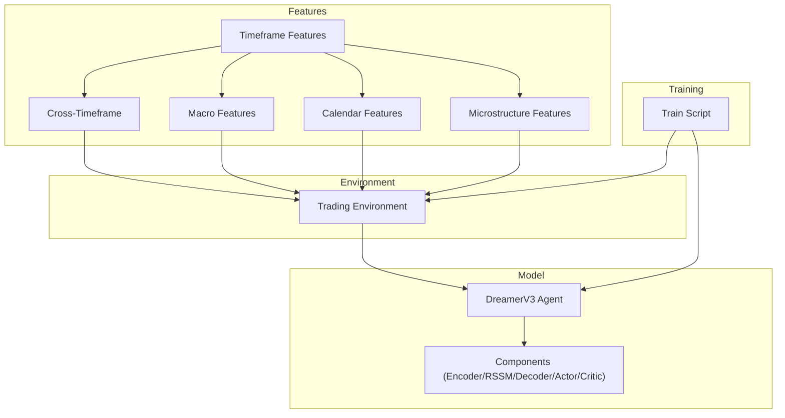
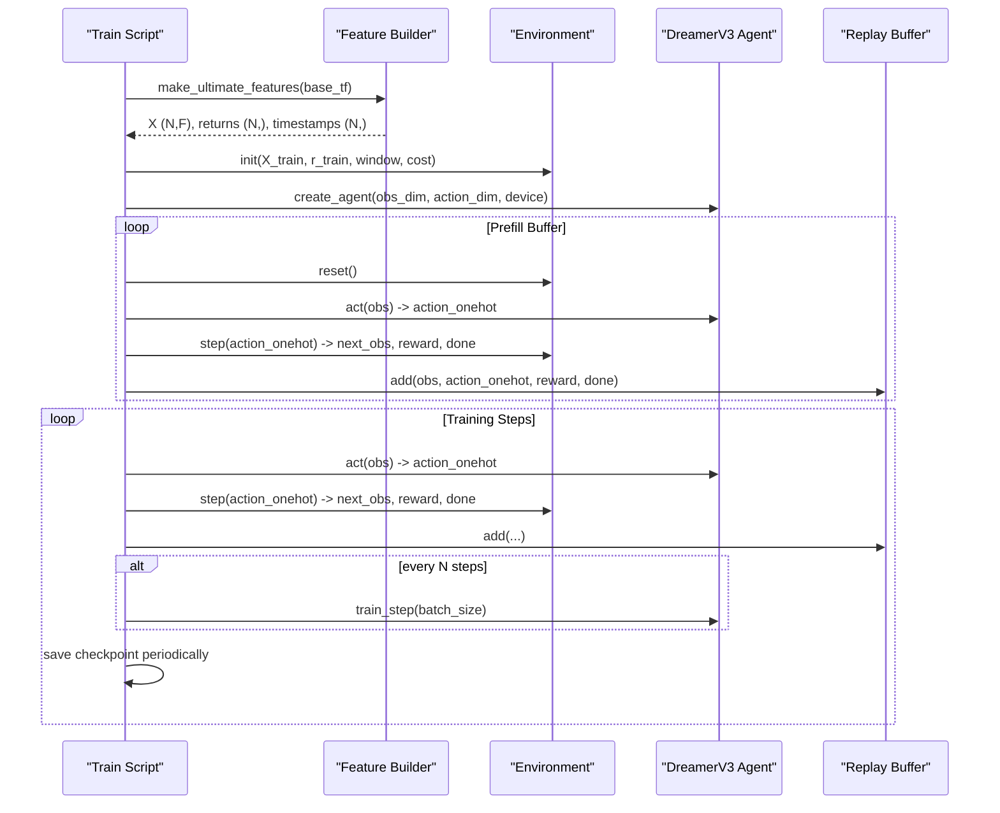
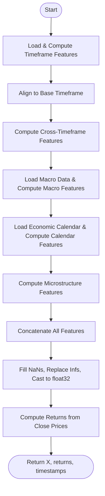
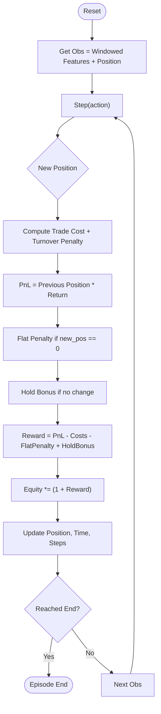
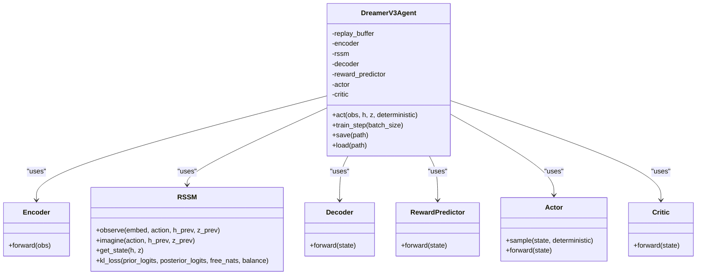
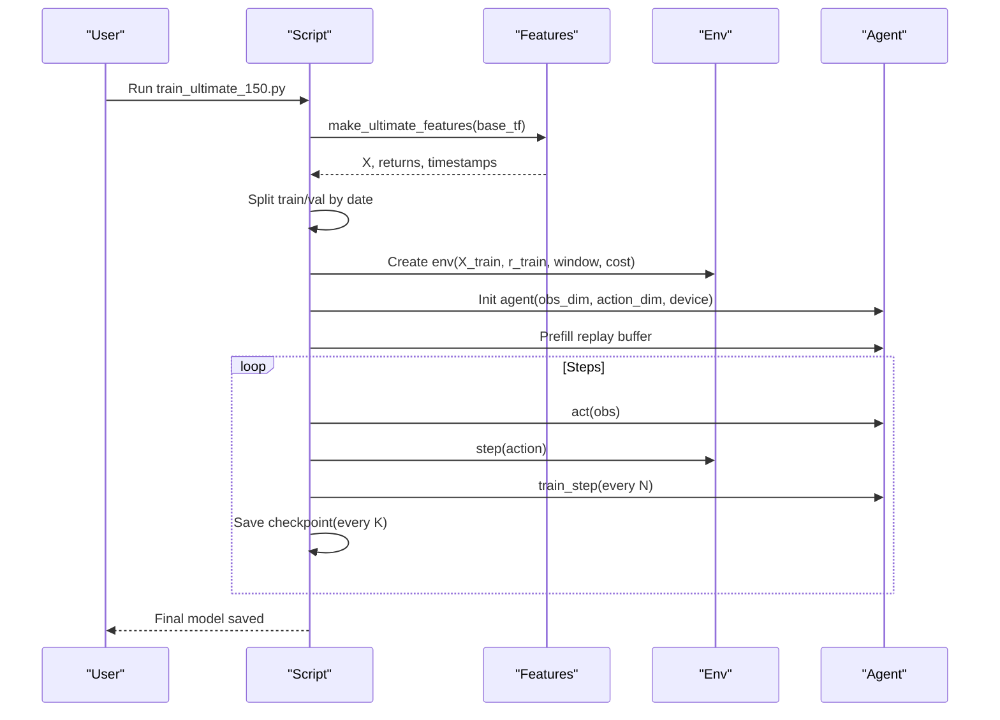
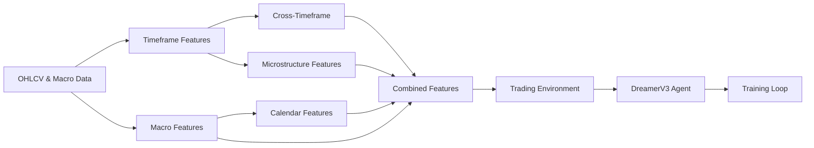

# Ultimate 150 Training

<cite>
**Referenced Files in This Document**
- [train_ultimate_150.py](file://train/train_ultimate_150.py)
- [ultimate_150_features.py](file://features/ultimate_150_features.py)
- [timeframe_features.py](file://features/timeframe_features.py)
- [cross_timeframe.py](file://features/cross_timeframe.py)
- [macro_features.py](file://features/macro_features.py)
- [calendar_features.py](file://features/calendar_features.py)
- [microstructure_features.py](file://features/microstructure_features.py)
- [load_data.py](file://data/load_data.py)
- [xauusd_env.py](file://env/xauusd_env.py)
- [dreamer_agent.py](file://models/dreamer_agent.py)
- [dreamer_components.py](file://models/dreamer_components.py)
- [colab_train_ultimate_150.ipynb](file://colab_train_ultimate_150.ipynb)
- [README.md](file://README.md)
</cite>

## Table of Contents
1. [Introduction](#introduction)
2. [Project Structure](#project-structure)
3. [Core Components](#core-components)
4. [Architecture Overview](#architecture-overview)
5. [Detailed Component Analysis](#detailed-component-analysis)
6. [Dependency Analysis](#dependency-analysis)
7. [Performance Considerations](#performance-considerations)
8. [Troubleshooting Guide](#troubleshooting-guide)
9. [Conclusion](#conclusion)
10. [Appendices](#appendices)

## Introduction
This document explains the Ultimate 150 training pipeline that builds a comprehensive 150+ feature set for gold (XAUUSD) trading and trains a DreamerV3 agent to learn an optimal long-only policy. It covers:
- Data preprocessing across multiple timeframes (M5, M15, H1, H4, D1, W1), cross-timeframe intelligence, macro correlations, economic calendar events, and market microstructure features.
- Environment setup with realistic cost modeling, action space configuration, and reward function tuning.
- Agent architecture and hyperparameters optimized for the ultimate feature set.
- Practical execution steps, checkpointing, and evaluation guidance.
- Performance considerations including GPU acceleration, memory optimization, and distributed training options.

## Project Structure
The project is organized into modular components:
- Features: multi-timeframe indicators, cross-timeframe signals, macro correlations, calendar events, and microstructure features.
- Environment: Gym-style trading environment with position-aware rewards and costs.
- Models: DreamerV3 agent and its components (encoder, RSSM world model, decoder, reward predictor, actor, critic).
- Training: orchestration script to load features, build environment, prefill replay buffer, train, and save checkpoints.
- Utilities: data loading helpers and Colab notebook for easy setup and execution.

**Diagram sources**
- [ultimate_150_features.py:27-226](file://features/ultimate_150_features.py#L27-L226)
- [xauusd_env.py:7-118](file://env/xauusd_env.py#L7-L118)
- [dreamer_agent.py:84-427](file://models/dreamer_agent.py#L84-L427)
- [dreamer_components.py:71-295](file://models/dreamer_components.py#L71-L295)
- [train_ultimate_150.py:154-327](file://train/train_ultimate_150.py#L154-L327)

**Section sources**
- [README.md:418-471](file://README.md#L418-L471)

## Core Components
- Ultimate Feature Builder: Aggregates timeframe features, cross-timeframe signals, macro correlations, calendar events, and microstructure features into a unified observation matrix aligned to a base timeframe.
- Trading Environment: Discrete long-only actions (flat/long), step-wise PnL computation with transaction costs, turnover penalties, flat penalty, and hold bonus; returns normalized equity progression.
- DreamerV3 Agent: World model learning via encoder + RSSM + decoder + reward predictor; actor-critic trained on imagined trajectories; replay buffer stores sequences for efficient sampling.
- Training Orchestration: Loads ultimate features, splits train/validation by date, constructs environment, initializes device, creates agent, prefills buffer, runs training loop with periodic saving.

**Section sources**
- [ultimate_150_features.py:27-226](file://features/ultimate_150_features.py#L27-L226)
- [xauusd_env.py:7-118](file://env/xauusd_env.py#L7-L118)
- [dreamer_agent.py:84-427](file://models/dreamer_agent.py#L84-L427)
- [train_ultimate_150.py:154-327](file://train/train_ultimate_150.py#L154-L327)

## Architecture Overview
The training pipeline integrates multi-source features into a single high-dimensional observation window per timestep, feeds it into a DreamerV3 agent that learns a latent world model and improves policy through imagination-based planning.

**Diagram sources**
- [train_ultimate_150.py:172-327](file://train/train_ultimate_150.py#L172-L327)
- [ultimate_150_features.py:27-226](file://features/ultimate_150_features.py#L27-L226)
- [dreamer_agent.py:148-304](file://models/dreamer_agent.py#L148-L304)

## Detailed Component Analysis

### Ultimate Feature Pipeline
- Timeframe Features: Computes 16 features per timeframe (returns, volatility, momentum, moving averages, trend direction, RSI, MACD, ATR, Bollinger Band position, volume ratio, distance to recent high/low). Aligns all timeframes to a base timeframe using forward-fill.
- Cross-Timeframe Features: Captures trend alignment, momentum cascade, volatility regime, and pattern confluence across M5/M15/H1/H4/D1.
- Macro Features: Integrates DXY, SPX, US10Y, VIX, Oil, Bitcoin, EURUSD, Silver/GLD; computes returns, momentum, and rolling correlations with gold; aligns daily macro series to intraday timestamps via forward-fill.
- Calendar Features: Encodes hours to next event, days since last event, event density, high-impact flags, event windows, expected volatility multiplier, and specific event type flags (NFP, FOMC).
- Microstructure Features: Session effects (Asian/London/NY/overlap), time-of-day/week/month effects, volume profile and imbalance, spread proxy and liquidity regime.
- Alignment and Cleaning: All feature sets are reindexed to the base timeframe index, NaNs filled with zeros, infinities replaced, and converted to float32 for memory efficiency. Returns computed from base timeframe close prices.

**Diagram sources**
- [ultimate_150_features.py:47-226](file://features/ultimate_150_features.py#L47-L226)
- [timeframe_features.py:22-304](file://features/timeframe_features.py#L22-L304)
- [cross_timeframe.py:205-249](file://features/cross_timeframe.py#L205-L249)
- [macro_features.py:363-445](file://features/macro_features.py#L363-L445)
- [calendar_features.py:111-249](file://features/calendar_features.py#L111-L249)
- [microstructure_features.py:170-225](file://features/microstructure_features.py#L170-L225)

**Section sources**
- [timeframe_features.py:22-304](file://features/timeframe_features.py#L22-L304)
- [cross_timeframe.py:205-249](file://features/cross_timeframe.py#L205-L249)
- [macro_features.py:363-445](file://features/macro_features.py#L363-L445)
- [calendar_features.py:111-249](file://features/calendar_features.py#L111-L249)
- [microstructure_features.py:170-225](file://features/microstructure_features.py#L170-L225)
- [ultimate_150_features.py:47-226](file://features/ultimate_150_features.py#L47-L226)

### Trading Environment
- Observation Space: Flattened sliding window of features plus current position indicator.
- Action Space: Discrete {0=Flat, 1=Long}.
- Reward Function: PnL from previous position over current bar minus trade cost and turnover penalty, with small flat penalty to encourage exposure and small hold bonus to reduce flip-flopping. Equity updated multiplicatively.
- Episode Termination: When reaching end of dataset or optional max episode steps.

**Diagram sources**
- [xauusd_env.py:59-118](file://env/xauusd_env.py#L59-L118)

**Section sources**
- [xauusd_env.py:7-118](file://env/xauusd_env.py#L7-L118)

### DreamerV3 Agent and Components
- Encoder: Maps high-dimensional observations to embeddings with symlog transformation for stability.
- RSSM (World Model): Recurrent State-Space Model with deterministic hidden state h and stochastic latent z; uses prior/posterior networks and GRU dynamics; KL regularization prevents posterior collapse.
- Decoder: Reconstructs observations from latent state.
- Reward Predictor: Predicts rewards in latent space using symlog transformation.
- Actor: Outputs categorical action distribution over discrete actions.
- Critic: Estimates value function in latent space.
- Replay Buffer: Stores sequences of transitions for batched training.

**Diagram sources**
- [dreamer_agent.py:84-427](file://models/dreamer_agent.py#L84-L427)
- [dreamer_components.py:71-295](file://models/dreamer_components.py#L71-L295)

**Section sources**
- [dreamer_agent.py:84-427](file://models/dreamer_agent.py#L84-L427)
- [dreamer_components.py:71-295](file://models/dreamer_components.py#L71-L295)

### Training Orchestration
- Feature Loading: Calls make_ultimate_features to produce X, returns, timestamps.
- Train/Val Split: Uses timestamp cutoff to split training data.
- Environment Creation: Builds TradingEnvironment with window size and cost parameters.
- Device Setup: Auto-detects CUDA/MPS/CPU.
- Agent Initialization: Configures obs/action dimensions and network sizes.
- Replay Buffer Prefill: Random exploration to populate buffer with sequences.
- Training Loop: Selects actions, steps environment, stores transitions, trains agent periodically, saves checkpoints, tracks best reward.

**Diagram sources**
- [train_ultimate_150.py:154-327](file://train/train_ultimate_150.py#L154-L327)

**Section sources**
- [train_ultimate_150.py:154-327](file://train/train_ultimate_150.py#L154-L327)

## Dependency Analysis
- Feature modules depend on raw OHLCV data and external macro datasets; they align to a base timeframe and compute derived signals.
- The environment depends on features and returns to construct observations and compute rewards.
- The agent depends on the environment’s observation and action spaces and uses a replay buffer for sequence sampling.
- The training script orchestrates feature generation, environment creation, agent initialization, and training loops.

**Diagram sources**
- [ultimate_150_features.py:47-226](file://features/ultimate_150_features.py#L47-L226)
- [xauusd_env.py:7-118](file://env/xauusd_env.py#L7-L118)
- [dreamer_agent.py:84-427](file://models/dreamer_agent.py#L84-L427)
- [train_ultimate_150.py:154-327](file://train/train_ultimate_150.py#L154-L327)

**Section sources**
- [ultimate_150_features.py:47-226](file://features/ultimate_150_features.py#L47-L226)
- [xauusd_env.py:7-118](file://env/xauusd_env.py#L7-L118)
- [dreamer_agent.py:84-427](file://models/dreamer_agent.py#L84-L427)
- [train_ultimate_150.py:154-327](file://train/train_ultimate_150.py#L154-L327)

## Performance Considerations
- GPU Acceleration: Use CUDA or MPS based on availability; larger batch sizes on GPU improve throughput.
- Memory Optimization: Features are cast to float32; windowed observations reduce per-step memory; replay buffer capacity limits memory usage.
- Distributed Training: While not explicitly implemented here, DreamerV3’s sequence-based training can benefit from parallel environments or data-parallel setups; consider batching and gradient accumulation for large feature matrices.
- Training Efficiency: Prefill buffer ensures sufficient sequences for stable updates; training every few steps reduces compute overhead while maintaining learning progress.

[No sources needed since this section provides general guidance]

## Troubleshooting Guide
- Missing Data Files: Ensure required OHLCV files exist for each timeframe; macro files are optional but missing ones will be skipped with warnings.
- Timezone Alignment: Macro data normalization handles timezone conversion; ensure indices are sorted and aligned before concatenation.
- NaN/Inf Handling: All features fill NaNs with zeros and replace infinities; check logs for counts to verify cleaning.
- Device Issues: Auto-detection selects CUDA/MPS/CPU; verify torch backend availability if errors occur.
- Checkpoint Resume: Provide path to a saved .pt file to resume training from a specific step.

**Section sources**
- [timeframe_features.py:236-304](file://features/timeframe_features.py#L236-L304)
- [macro_features.py:26-75](file://features/macro_features.py#L26-L75)
- [ultimate_150_features.py:156-183](file://features/ultimate_150_features.py#L156-L183)
- [train_ultimate_150.py:205-235](file://train/train_ultimate_150.py#L205-L235)

## Conclusion
The Ultimate 150 training pipeline integrates a rich, multi-source feature set to provide deep market context for gold trading. By combining multi-timeframe indicators, cross-timeframe intelligence, macro correlations, economic calendar awareness, and microstructure signals, the system equips a DreamerV3 agent with comprehensive observations. The environment models realistic trading costs and rewards, while the agent learns a world model and improves policy through imagination-based planning. With careful configuration, GPU acceleration, and robust data handling, this pipeline enables high-performance training and deployment-ready models.

[No sources needed since this section summarizes without analyzing specific files]

## Appendices

### Practical Execution Examples
- Local Training:
  - Mac (MPS): python train/train_ultimate_150.py --steps 1000000 --device mps --batch-size 64
  - NVIDIA GPU: python train/train_ultimate_150.py --steps 1000000 --device cuda --batch-size 128
  - CPU: python train/train_ultimate_150.py --steps 1000000 --device cpu --batch-size 32
- Google Colab:
  - Upload notebook and run cells to install dependencies, verify GPU, test features, start training, resume from checkpoints, and download models.

**Section sources**
- [README.md:328-361](file://README.md#L328-L361)
- [colab_train_ultimate_150.ipynb:165-241](file://colab_train_ultimate_150.ipynb#L165-L241)

### Monitoring and Evaluation
- Monitor training progress via console logs and checkpoints saved every fixed interval.
- Evaluate trained models using backtesting scripts and crisis validation to assess performance on unseen data and during market stress periods.

**Section sources**
- [train_ultimate_150.py:305-327](file://train/train_ultimate_150.py#L305-L327)
- [README.md:587-610](file://README.md#L587-L610)